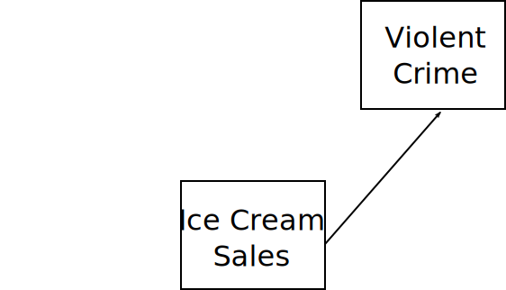
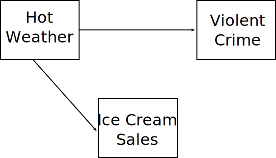
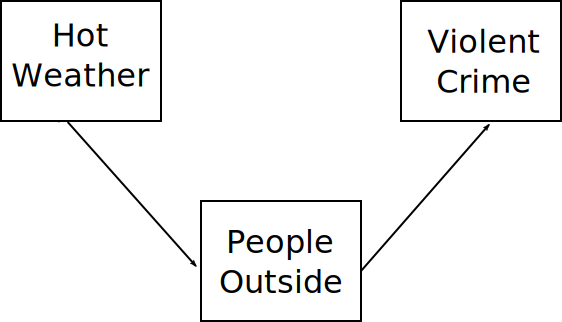
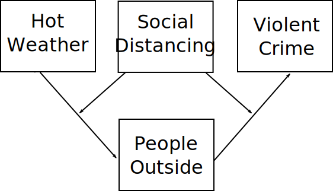

# What is Criminology?

Sutherland: "The study of making of laws, the breaking of laws, and reacting to the breaking of laws."

--

* Making Laws: *Sociology of Law*

* Breaking Laws: *Criminology*

* Reacting to Law Breaking: *Sociology of Criminal Justice*

???

* These are interrelated: laws determine what counts as crime and also the response
* Assumptions about causes of crime shape reactions to breaking the law and legality of things in first place

---

# Who am I?

Chuck Lanfear

* Instructor (not professor)

* 6th Year Sociology PhD student

Research:

* Neighborhood Social Control 
* Broken Windows and Criminal Opportunity
* Racial Bias in Policing

---

# Objectives of Course

* Provide you with an understanding of basic theories, concepts, and methods used by criminologists.

--

* Show you how criminological theories apply to real-world phenomena and current events.

--

* Make you a critical consumer of claims about crime and crime policies in the news, social media, and political campaigns.

--

* Develop your critical and analytical skills through discussion and written exams.

???

Theories usually underlie policies

Immediately relevant topics today: how do we control crime? How do we control abuse by police?


---
class: inverse
# Course Structure


---
# Daily Schedule

Two parts:

1. Lecture

2. Discussion

???

Should virtually always end early.

---
# Content

```{r, echo=FALSE, message=FALSE, warning=FALSE}
library(tidyverse)
course_outline <- readxl::read_excel("../../ignore/course_workbook.xlsx", sheet=1) %>% filter(Ignore!=1)
course_readings <- readxl::read_excel("../../ignore/course_workbook.xlsx", sheet=2) %>% filter(Ignore!=1) %>%
  select(Lecture, Citation)
```

.small[
```{r, echo=FALSE, message=FALSE, warning=FALSE, eval=TRUE}
course_outline %>%
  select(Week, Lecture, Date, Topic) %>%
  filter(!is.na(Lecture)) %>%
  select(-Lecture) %>%
  group_by(Date) %>%
  summarize(Topic = first(Topic)) %>%
  mutate_at(vars(-Date), ~ ifelse(is.na(.), "", .)) %>%
  arrange(Date) %>%
  mutate(date_orig = Date, Date = format(Date, "%b %e")) %>%
  mutate(Date = ifelse(lead(Topic) == Topic, paste0(Date,"-", str_extract(lead(Date), "[0-9]+")), Date)) %>%
  group_by(Topic) %>%
  slice(1L) %>%
  ungroup() %>%
  arrange(date_orig) %>%
  select(-date_orig) %>%
  gt::gt()
```
]

---
class: inverse
## Course Requirements

---
# Grading

| Item                   | Number | Percent of Grade |
|:----------------------:|:------:|:----------------:|
| Course Participation   | 18     |     10           |
| Discussion Questions   | 17     |     20           |
| Midterm Exams          |  2     |     40           |
| Final Exam             |  1     |     30           |

* 95% or higher is a 4.0  

* Each 2.5% corresponds to a .1 final grade difference 

   + e.g. 90/100 is a 3.8

   + This is rounded down<sup>1</sup>: 92/100 is also 3.8

.footnote[[1] I'll bump you up if you're *real close*.]

---
# Participation

Components:

* Active participation in class
   + Attendance $\neq$ Participation

* Demonstration of having read the material

If unable to attend, you can submit a 1-page reading and discussion responses *prior to scheduled discussion*.

* This option must be preapproved by me via email

* Responses which are not preapproved will not be accepted

???

Contact me if you will always or usually be unable to attend lectures

---
# Discussion Questions

2 (or more) discussion questions
   + Submit via Canvas
   + Due 6 PM the day prior to lecture
   + Questions address different readings unless there is only one
   
Example: 

"Harcourt suggests that broken windows policing is based on extending the concept of harm to include disorderly conduct in public spaces. How does this relate to controlling language or writing that is perceived as harmful or violent?"

???

Questions should be open ended

Extensions or new applications for the material

Comparisons to other readings

---
# Exams

**2 Midterms**

**1 Final**

Structure:
* Open-book, at least one day to work.
* Only short-answer and essay questions
* Citations expected:
   + ex: "Shaw & McKay (1942) proposed delinquent subcultures as a mechanism for stability in neighborhood crime rates."
   + Material from *outside* course must have an entry in **Works Cited**
   + Assigned class material can just be author(s) and date
   + Any major format (e.g. ASA) acceptable but be consistent

*Emphases of exams is demonstrating understanding, critical thinking, and application of concepts, not regurgitation of facts, names, and dates.*

---
## Course Texts and Readings

Two books:

* *Short* and *accessible* yet *major contributions* to criminology
* Available as eBooks through the UW library but affordable in print

--

[Ruth D. Peterson & Lauren J. Krivo (2010) *Divergent Social Worlds*](https://alliance-primo.hosted.exlibrisgroup.com/permalink/f/kjtuig/CP71175976510001451)
  
   + An analysis of urban neighborhood crime from a structural theory of racial-spatial inequality.

--

[John Hagan & Wenona Rymond-Richmond (2009) *Darfur and the Crime of Genocide* ](https://alliance-primo.hosted.exlibrisgroup.com/permalink/f/kjtuig/CP71240618630001451) 
   
   + An analysis of the Darfur genocide from a differential social organization theory of collective racial violence.

--

If you need a supplementary reference text:

1. Kubrin, Stucky, & Krohn. (2009) *Researching Theories of Crime and Deviance.*

2. Crutchfield, Kubrin, Bridges & Weis. (2008) *Crime: Readings*


---
# The Approach

1. Context

   * Conditions of life
   * Responses and critiques

--

2. Theoretical Assumptions

   * Basis for theory
   * "If this is the case, then..."

--

3. Policy Implications

   * Causes imply interventions

--

4. Evidence

   * Quantitative
   * Qualitative

---
class: inverse
# Some Metatheory

---
# Causal Models

All theories either imply or explicitly state a causal model.

--

Theories consist of:

1. Assumptions: Taken for granted statements

   + *The foundations of theories*
   
--

2. Propositions: Testable hypotheses or predictions of interest

   + *These typically emerge from assumptions*

--

In criminology, the key assumptions are often about human nature...

+ e.g. *Humans are rational utility maximizers* (Homo economicus)

--

...or mechanisms...

+ e.g. *Disorder signals that a neighborhood is out of control.*

Assumptions are often fiercely contested and sometimes untestable.

---
# Causal Graphs

Scientists often use **causal graphs** to depict models.

<br>

.image-75[

]

---
# Key Issues


* Reverse Causality

   + $Y$ may cause $X$ instead
   + We typically rely on *assumptions* about directionality

--

* Spuriousness

   + $X$ falsely appears to cause $Y$
   + Instead $X$ and $Y$ are both caused by another factor (e.g. $Z$)

--

* Mediation

  + Complete mediation means $X$ *only* effects $Y$ through $Z$.
  + Partial mediation means $X$ effects $Y$ directly *and* through $Z$.
  
--

* Moderation

  + $X$ causes $Y$, but it depends on $Z$.

---
# Ice *Crime*

<br>

.image-75[

]


---
# Spuriousness

<br>

.image-75[

]

---
# Mediation

<br>

.image-75[

]

---
# Moderation

<br>

.image-75[

]
---
# It Gets Complicated

<br>


---
# Using Graphs

Many of the theories in this course will be depicted with causal graphs.

--

All claims (propositions) about the world imply a theory (with assumptions).

--

When you encounter new claims, it can be clarifying to sketch the implied causal graph.

If the causal relationships don't make sense, it may reveal a flawed theory:

* Outcomes which happen before their causes (reverse causality)

* Obvious causes left out (spuriousness)

* Ambiguous or nonsensical mechanisms

* Unwarranted assumptions

*Be critical consumers of theories*

---
class:inverse
# Discussion

---
# For Next Time

### Readings: 

* Trevino (1996) "Cesare Beccaria: Legal Reformer" in *The Sociology of Law*

* Radzinowicz (1966) "The Liberal Position" in *Ideology and Crime*

### Things to pay attention to:

1. The context the classical school emerged from

2. The assumptions of the classical school--human nature, the role of government
   + The assumed causes of crime
   + The proposed ideal responses which emerge from those assumptions