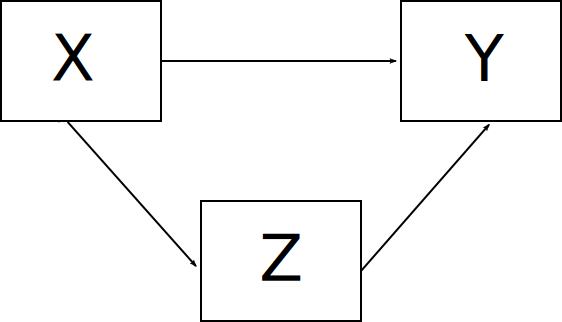
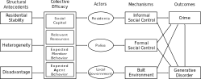

# What is Criminology?

Sutherland: "The study of making of laws, the breaking of laws, and reacting to the breaking of laws."

Making Laws: Sociology of Law
Breaking Laws: Criminology
Reacting to Law Breaking: Sociology of Criminal Justice

---

???

* These are interrelated: laws determine what counts as crime and also the response
* Assumptions about causes of crime shape reactions to breaking the law and legality of things in first place

---

# Who am I?

Chuck Lanfear

* Instructor (not professor)

* 6th Year Sociology PhD student

Research:

* Neighborhood Social Control 
* Racial Bias in Policing
* Broken Windows and Criminal Opportunity

---

# Objectives of Course

* Provide you with an understanding of basic theories, concepts, and methods used by criminologists.

* Show you how criminological theories apply to real-world phenomena and current events.

* Make you a critical consumer of claims about crime and crime policies in the news, social media, and political campaigns.

* Develop your critical and analytical skills through discussion and written exams.

???

Maybe one slide for each?

---

# Marketable Skills?

---
class: inverse
# Course Structure


---
# Daily Schedule

Two parts:

1. Lecture

2. Discussion

---
# Content

```{r, echo=FALSE, message=FALSE, warning=FALSE}
library(tidyverse)
course_outline <- readxl::read_excel("../../ignore/course_workbook.xlsx", sheet=1) %>% filter(Ignore!=1)
course_readings <- readxl::read_excel("../../ignore/course_workbook.xlsx", sheet=2) %>% filter(Ignore!=1) %>%
  select(Lecture, Citation)
```

.small[
```{r, echo=FALSE, message=FALSE, warning=FALSE, eval=TRUE}
course_outline %>%
  select(Week, Lecture, Date, Topic) %>%
  filter(!is.na(Lecture)) %>%
  select(-Lecture) %>%
  group_by(Date) %>%
  summarize(Topic = first(Topic)) %>%
  mutate_at(vars(-Date), ~ ifelse(is.na(.), "", .)) %>%
  arrange(Date) %>%
  mutate(date_orig = Date, Date = format(Date, "%b %e")) %>%
  mutate(Date = ifelse(lead(Topic) == Topic, paste0(Date,"-", str_extract(lead(Date), "[0-9]+")), Date)) %>%
  group_by(Topic) %>%
  slice(1L) %>%
  ungroup() %>%
  arrange(date_orig) %>%
  select(-date_orig) %>%
  gt::gt()
```
]

---
# The Approach

1. Context

2. Theoretical Assumptions

3. Policy Implications

4. Evidence

---
# Causal Models

All theories either imply or explicitly state a causal model.

Theories consist of:

1. Assumptions: Taken for granted statements
   + *The foundations of theories*
2. Propositions: Testable hypotheses or predictions 
   + *These emerge from assumptions*

In criminology, the key assumptions are about human nature.

+ e.g. *Humans are rational utility maximizers* (Homo economicus)

Assumptions are fiercely contested and frequently untestable.

---
# Causal Graphs

Scientists often use **graphs** to depict models.

.image-75[

]

"X causes Y"

"X causes Z, which causes Y"

---
# It Gets Complicated


---
# Deriving a Graph

When you someone makes a claim

---
class: inverse
## Course Requirements

---
# Grading

| Item                   | Number | Percent of Grade |
|:----------------------:|:------:|:----------------:|
| Course Participation   | 18     |     10           |
| Discussion Questions   | 16     |     20           |
| Midterm Exams          |  2     |     40           |
| Final Exam             |  1     |     30           |

* 95% or higher is a 4.0  
* Each 2.5% corresponds to a .1 difference 
   + e.g. 90/100 is a 3.8
   + Rounded down: 92/100 is also 3.8
* 

---
# Participation

Components:

* Reading
* Discussion

These are evaluated based on your participation in-class.

If unable to attend, you can arrange for and submit a 1-page reading and discussion responses *prior to scheduled discussion*.

---
### Discussion Questions

2 (or more) discussion questions
   + Submit via Canvas
   + Due 6 PM the day prior to lecture
   + Questions address different readings unless there is only one
   
Example: !!!

---
# Exams

* 2 Midterms
* 1 Final

Structure:
* Open-book, at least one day to work.
* Multiple short answers
* One or more short essay
* Citations expected
   + ex: "Shaw & McKay (1942) proposed delinquent subcultures as a mechanism for stability in neighborhood crime rates."
   + Material from *outside* course must have an entry in **Works Cited** section
   + Assigned class material can just be author(s) and date
   + Any major format (e.g. ASA, APA, Harvard) acceptable but be consistent

*Emphases of exams is demonstrating understanding, critical thinking, and application of concepts, not regurgitation of facts, names, and dates.*

---
## Course Texts and Readings

* No Textbook
* Two--short but important--books:
   + [Divergent Social Worlds (2010) Ruth D. Peterson & Lauren J. Krivo](https://alliance-primo.hosted.exlibrisgroup.com/permalink/f/kjtuig/CP71175976510001451)
   + [Darfur and the Crime of Genocide (2009) John Hagan & Wenona Rymond-Richmond](https://alliance-primo.hosted.exlibrisgroup.com/permalink/f/kjtuig/CP71240618630001451) 
   + Both available as eBooks through the UW library but affordable in print.

---
# Discussion

---
# For Next Time

* Trevino (1996) "Cesare Beccaria: Legal Reformer" in *The Sociology of Law*

* Radnowitz (1966) "The Liberal Position" in *Ideology and Crime*

Things to pay attention to:

(1) The context the classical school emerged from.

(2) The assumptions of the classical school--human nature, the role of government.

(3) The 