```{r setup, include = FALSE}
library(tidyverse)
```

# Overview

1. Crime Trends

* Age Distribution
* The Great Decline
* Race
* Immigration

2. Incarceration Trends

* Race
* Drug Offenses

3. Gun Trends

* Trends in possession
* Public opinion and gun control

---
class: inverse
#  Crime Trends

---
# National Trends

Primary sources:

* Uniform Crime Report (UCR)

   + Crimes known to police
   + Departments covering over 90% of population
   + Handled by FBI

???

Crimes known to police are not the majority of crimes

More serious crimes are more reliably reported; homicides, robberies, serious thefts (insurance)

Participation is not mandatory, so some places no covered

UCR reporting sometimes inconsistent--better to compare within locality than between them


--

* National Crime Victimization Survey (NCVS)

   + Personal victimization
   + Survey of 50-80 thousand per year
   + US Census Bureau

???

NCVS leverages expertise of census bureau with stratified multistage cluster sample.

Interviews entire household every 6 months over three year period.

Problem: Domestic violence

Disadvantage: Sample means smaller area estimates not representative or reliable; insufficient power

---
# Homicide, Robbery, GTA

The most serious crimes peaked in the early 1990s
 * The "Great Crime Decline" refers to steady drop occurring after this peak

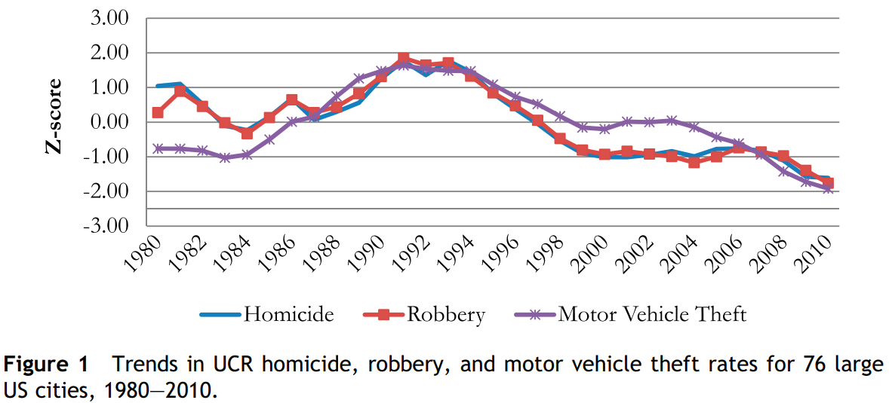

.footnote[Source: Baumer & Wolff (2014)]

???

This is UCR--usually very accurate for these crime types

The crime peak was somewhat highly concentrated in city centers

Heavily weighted toward gun violence related to drug sales and gangs; racially disparate

Homicide rates now look like early 1960s--a bit higher than 1950s which were an all-time low while stats tracked

---
# Burglary, Theft

Other forms of crime had little or no early 1990s spike
* Continuous downward trend since 1980
* Slowed in recent years with some rebounding


.footnote[Source: Baumer & Wolff (2014)]

???

UCR does not capture these crime types accurately, so this is NCVS

Thefts higher than 1960s but otherwise similar--we're at nearly an all-time low

---
# The Crime Decline

Crime declined rapidly after early 1990s high

Some theorized reasons:

* Fewer 15-25 year olds
* Economic growth: Lower joblessness, higher wages
* Crack market decline
* Roe v Wade: Fewer crime prone after 1974, fewer 20-25
* Police and incarceration (deterrence / incapacitation)
* Sharkey: Rise of community organizations
* Reduced involvement in risky behaviors
* Gentrification: "Retaking" of city centers
  
---
# Decomposing Trends

```{r, echo=FALSE, message=FALSE, warning = FALSE}
year <- 1980:2010
crime <- 400-(0.5*(year - 1992)^2) + (year-1980)*5
city <- c("a", "b", "c", "d", "e")

year_dev <- rnorm(length(year), 0, 20)
city_dev <- rnorm(length(city), 1, 0.5)

crime_year <- crime + year_dev
crime_city_year <- rep(crime_year, each=5) * city_dev
crime_city_year <- crime_city_year + rnorm(length(crime_city_year), 0, 10)


ml_data <- data.frame(crime = crime_city_year, city = rep(city, length.out = length(crime_city_year)), year = rep(year, each = 5))

ml_data$residual <- residuals(lm(crime ~ poly(year,2), data=ml_data))
ml_data$fitted <- fitted(lm(crime ~ poly(year,2), data=ml_data))


left_plot <- ggplot(ml_data, aes(x = year, y = crime)) + 
  geom_line(aes(group = city, color = city)) + theme_minimal(base_size = 18) + geom_smooth(method = "lm", formula = y ~ poly(x,2)) + 
  ggtitle("Crime by Year in Five Cities", subtitle = "Observed data") + 
  xlab("Year") + ylab("Crime") + theme(panel.grid = element_blank())

right_plot <- ggplot(ml_data, aes(x = year, y = residual)) + geom_line(aes(group = city, color = city)) + theme_minimal(base_size = 18) +
    ggtitle("Crime by Year in Five Cities", subtitle = "With overall trend removed") + 
  xlab("Year") + ylab("Crime") + theme(panel.grid = element_blank())

```

.pull-left[
```{r, echo=FALSE, message=FALSE, warning = FALSE}
left_plot
```
]

.pull-right[
```{r, echo=FALSE, message=FALSE, warning = FALSE}
right_plot
```
]

All cities here actually follow the same general trend

???

Decomposition is a fancy word for separating out different sources of variation

In this simple case, every city has a different average level of crime, and every point has random variation

But once you remove the shared change they all experienced, all that remains is that different base and random variation

Be skeptical of politicians taking credit for crime declines when the trends are similar elsewhere--and even if they aren't, they probably didn't do it either.

---

.image-full[

]

???

Slightly misleading as there was another trough at the start here--but stats not well kept then.

Prohibition kept rates up high until 1930s

War and post-war period were unique with full employment, massive economic expansion

---
# Age-Crime Curve

Involvement in crime follows an age-crime curve
* Violent crime peaks later (~20) than property crime (~16)
* Male crime $\geq$ 5 times female crime
   + Wider for violent, narrower for (some) property

.image-shorter[

]

???

Crime in general peaks around 16-21.

This is a stable empirical reality pretty much everywhere and throughout time

All theories of crime must address this to be relevant

---
# Homicide by Age

.pull-left[
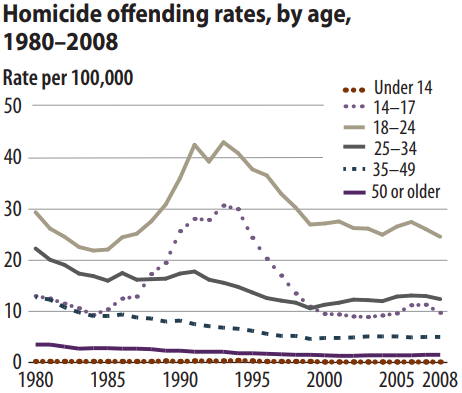
]
.pull-right[
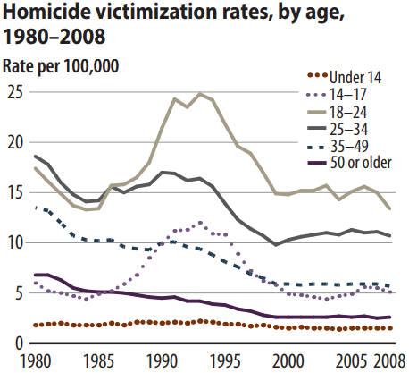
]

* Strong overlap between offenders and victims.

* Offending more strongly concentrated in youth than victimization

.footnote[Source: Bureau of Justice Statistics]

???

The average age of victims is about 32, of offenders about 28

About 50% of homicide victims know their offender; drastically higher for children


---
# Age Distribution

Because age is related to crime, changes in age distribution impact crime:

* Population Booms
* Large Scale Mortality Events
* Fertility Declines

These can cause massive changes in crime rates many years after they occur.

*A large increase in births will produce a large increase in crime almost 20 years later*

---
# Baby Booms

.image-full[
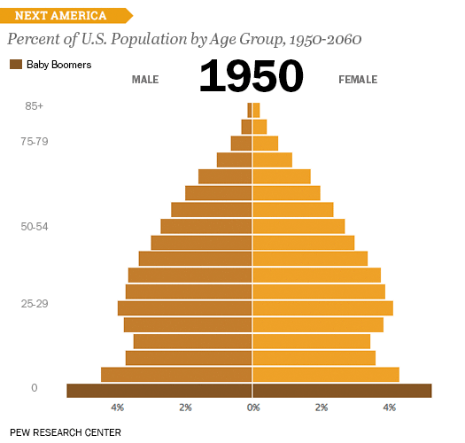
]

.footnote[Source: [*The Atlantic](https://www.theatlantic.com/international/archive/2014/06/the-shifting-shape-of-age-around-the-world/373638/)]

---
# Change Over Time

There is evidence the curve itself is changing too.

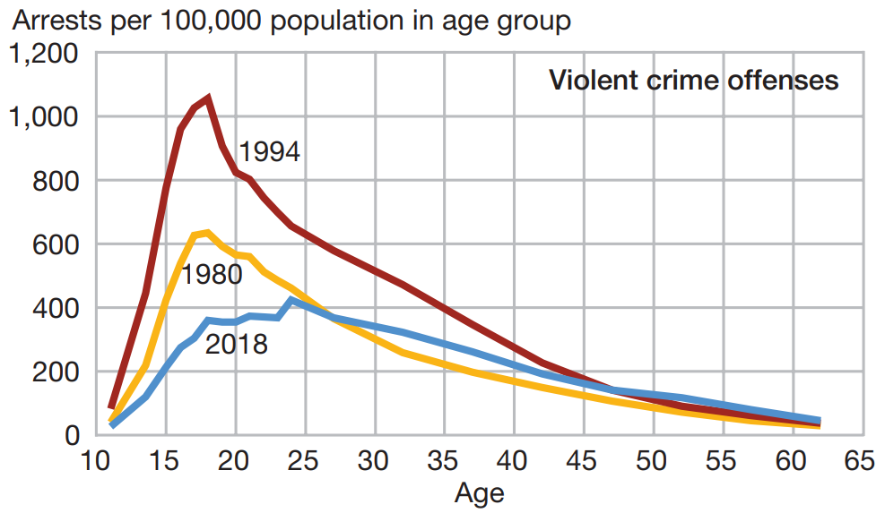

.footnote[Source: Official of Juvenile Justice and Delinquency Prevention]

???

This is Office of Juvenile Justice and Delinquency Prevention data

Arrests not same as participation; majority of crimes, especially minor, go unnoticed.

May represent changes in policy as well as underlying rates.

---
# Homicide by Sex

.pull-left[
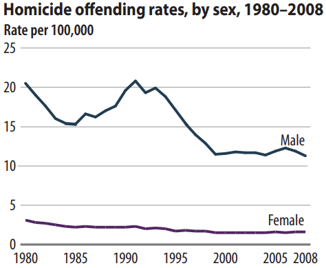
]
.pull-right[

]

.footnote[Source: Bureau of Justice Statistics]

???

Vast majority of murders are committed by men

Most victims are also male

Nearly all homicides of women are done by men, however

---
# Homicide by Race

.pull-left[

]
.pull-right[

]

.footnote[Source: Bureau of Justice Statistics]

???

Homicide offending and victimization is highly concentrated in young black male population

This is aprticularly the case in the early 1990s

We'll get more of a handle on this later when we read Divergent Social Worlds

---
# Intra- / Inter-racial Offending

.image-full[
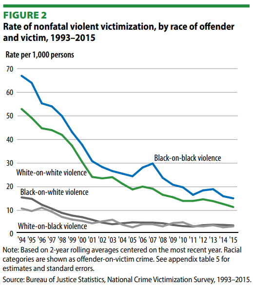
]

.footnote[Source: Bureau of Justice Statistics]

???

The vast majority of violence occurs between people who are acquainted

People typically know others like themselves

Violence is more concentrated in more segregated areas and among more segregated people (i.e. poorer)

---
class: inverse
# Incarceration Trends

---

.image-full[
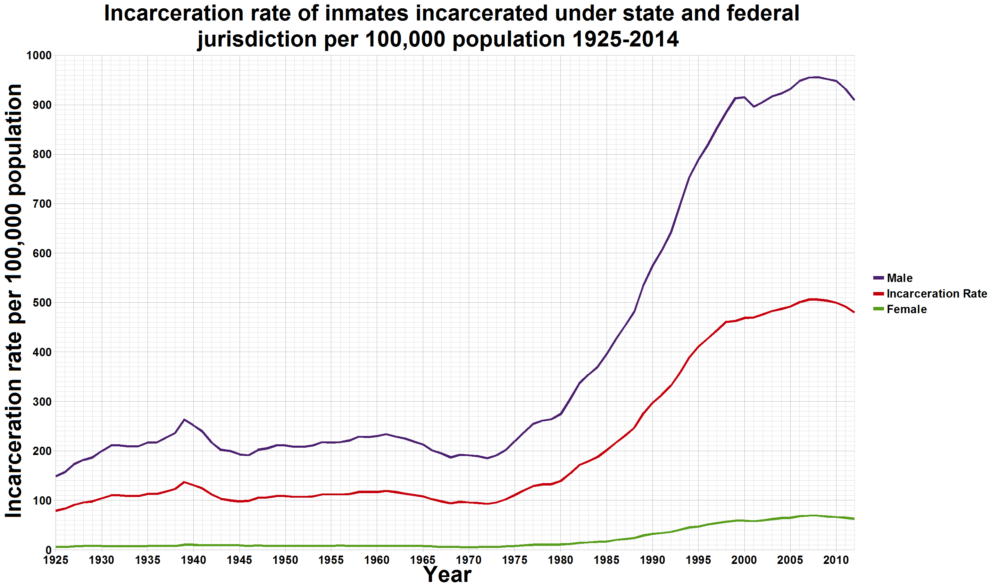
]

.footnote[Source: [Smallman12q, Wikimedia Commons](https://commons.wikimedia.org/wiki/File:U.S._incarceration_rates_1925_onwards.png)]

---
# International Comparison

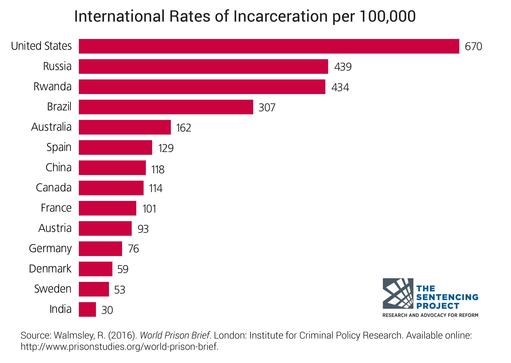

???

We have the highest officially reported incarceration rate in the world

It is unlikely that all countries accurately report incarceration statistics, so take them with a grain of salt

---

.image-full[
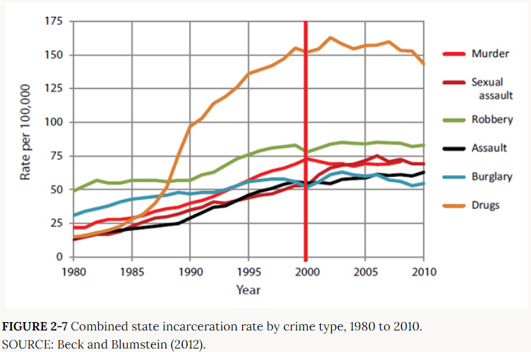
]

.footnote[Source: National Academies (2014) *The Growth of Incarceration in the United States: Exploring Causes and Consequences (2014)*]

???

This looks pretty bad, but keep in mind it lumps together all drug crimes while disaggregating violence and not including theft, the most common property crime.

---
# Race / Ethnicity

.image-short[
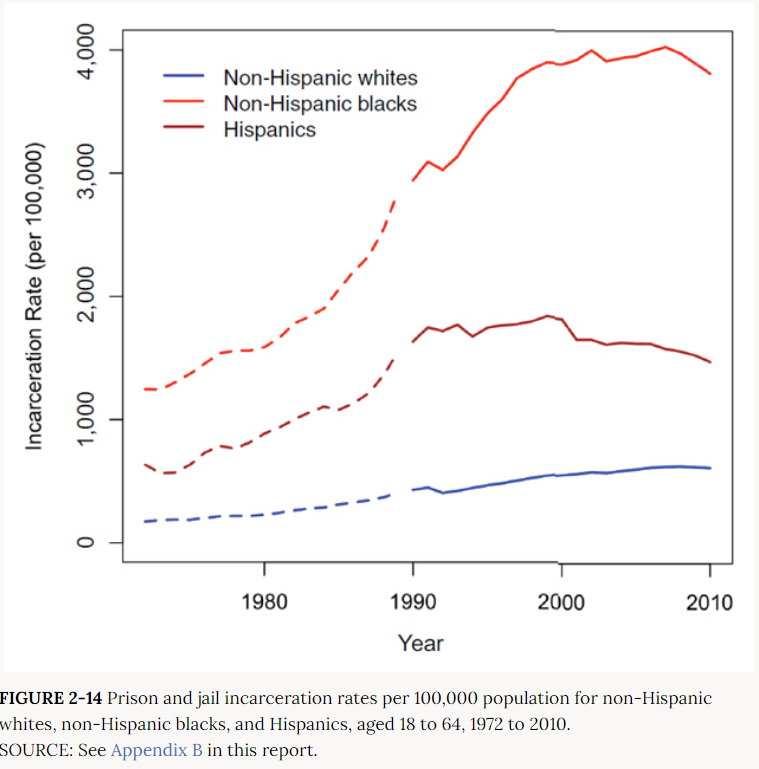
]

.footnote[Source: National Academies (2014) *The Growth of Incarceration in the United States: Exploring Causes and Consequences (2014)*]

???

Increase in incarceration was larger for black and hispanic populations, though whites did see a more than doubling.

That's comparable proportional increase for whites and hispanics, but much higher for black.

---

.image-tall[
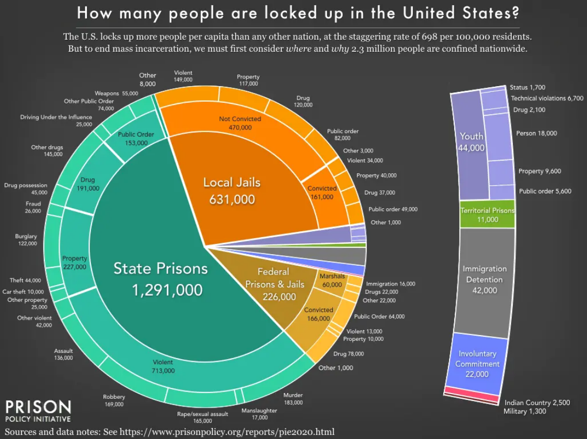
]

???

Despite war on drugs, current prison population is not dominated by drug offenders

Drug offenses often have shorter sentences--more turnover than for violent crimes

Increase in incarcerated population due mainly to general increase in sentences across the board

---
# Drug Arrest Trends by Race

.image-short[
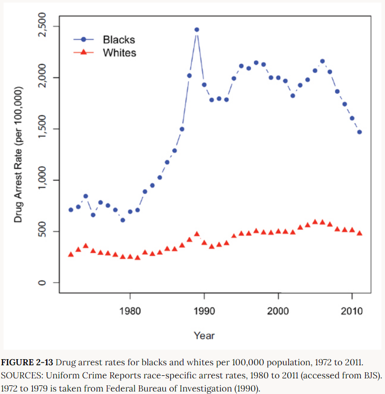
]

.footnote[Source: National Academies (2014) *The Growth of Incarceration in the United States: Exploring Causes and Consequences (2014)*]

???

Massive increase in arrests mainly seen for black individuals

Some of this due to targeting of inner city drug markets

---
# Drug Use by Race

.image-full[
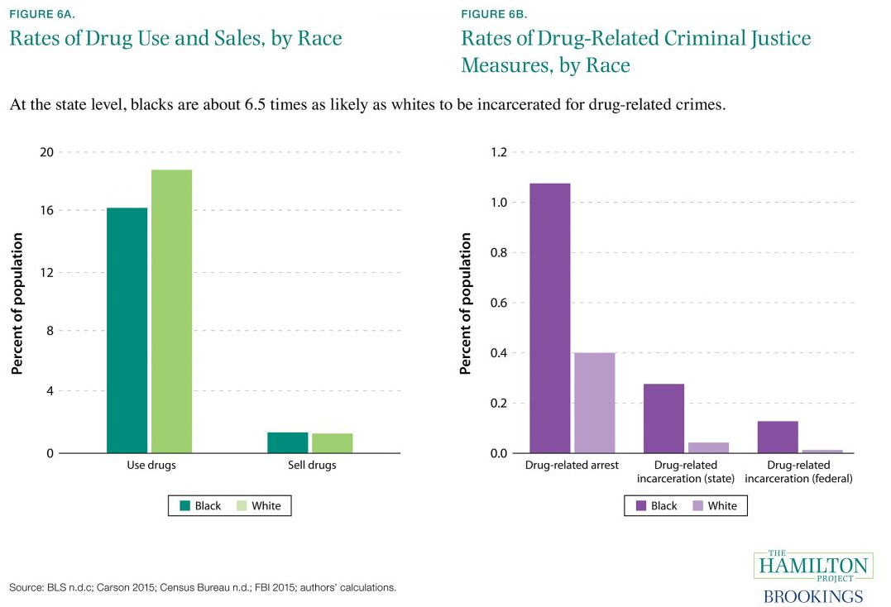
]

.footnote[Source: [The Hamilton Project](https://www.hamiltonproject.org/charts/rates_of_drug_use_and_sales_by_race_rates_of_drug_related_criminal_justice)]

???

Substance use tends to be somewhat higher for whites than blacks

Highest groups typically AINA; Hispanic lower than black, Asian lowest

Pattern of arrest and incarceration follows concentration of police attention more than patterns in use or sales

---
class: inverse
# Guns

---
# Second amendment

"A well regulated Militia, being necessary to the security of a free State, the right of the people to keep and bear Arms, shall not be infringed."

---

# Gun homicides in US cities 

???

Gun ownership is a rural thing, but gun homicides are an urban thing

---
## Compared to Comparable Nations
[Maybe that piece done a while back on this?]

---
## Compared to High Violence Nations

---

```{r, include=FALSE}
library(gt)
gun_ownership <- read_csv("data/gun_ownership.csv")
```

.image-tall[
```{r, echo=FALSE}
gun_ownership %>%
  mutate(Population = pop2020*1000) %>%
  filter(Population > 10000000) %>%
  arrange(desc(firearmsRate)) %>%
  slice_head(n = 10) %>%
  select(Country = country, `Firearms per Capita`=firearmsRate, `Total Firearms` = totalFirearms, Population) %>%
  gt() %>%
  tab_header(title = "Gun Ownership Across Nations", subtitle = "Nations over 10 mil. population") %>%
  fmt_number(columns = c("Population", "Total Firearms"), decimals = 0, use_seps=TRUE) %>%
  tab_footnote(footnote = "Countries where guns outnumber people", locations = cells_body(columns =1, rows = 1)) %>%
  gtsave("gun_ownership.png")
```
]

???

US civilians own just shy of 400 million firearms, which is about 46% of all guns in the world

That's about three times the firearms held by all militaries in the world combined (133 million).

---
Gun Ownership Across States

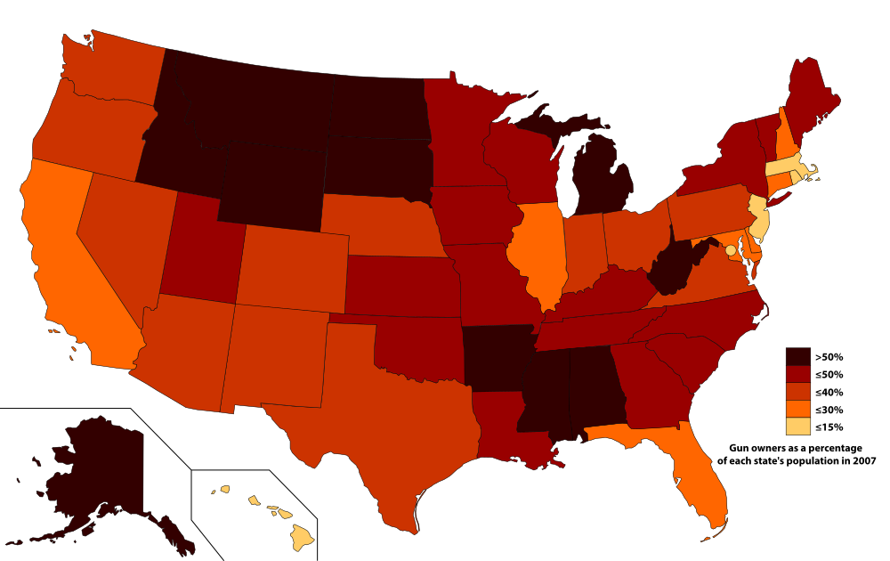

.footnote[Source: [Ali Zifan, Wikimedia Commons](https://en.wikipedia.org/wiki/File:Gun_owners_as_a_percentage_of_each_state%27s_population_in_2007.svg)]

---

.image-full[
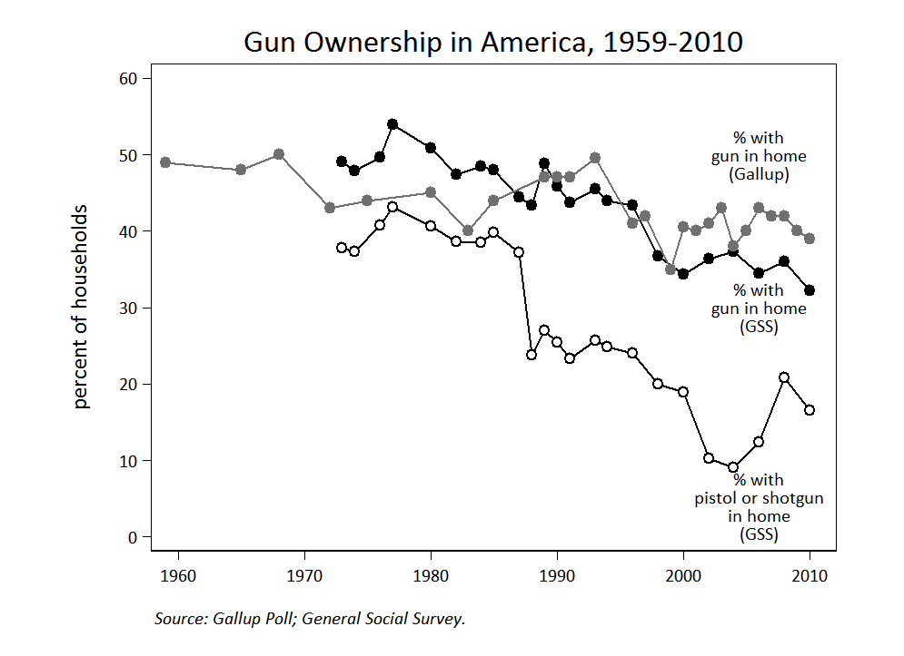
]

.footnote[Source: [Patrick Egan, Monkey Cage](https://themonkeycage.org/2012/07/the-declining-culture-of-guns-and-violence-in-the-united-states/)]

---

.image-tall[
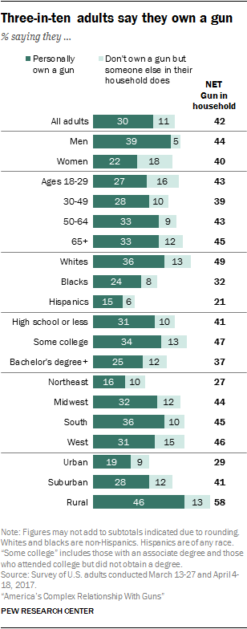
]

---
Homicides by weapon in US

.image-full[
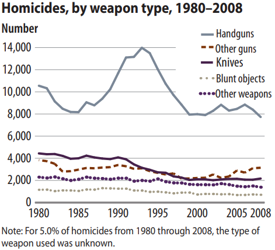
]

.footnote[Source: [Bureau of Justice Statistics](https://www.bjs.gov/content/pub/pdf/htus8008.pdf)]

---

# Assault Deaths in US vs. OECD

.image-full[
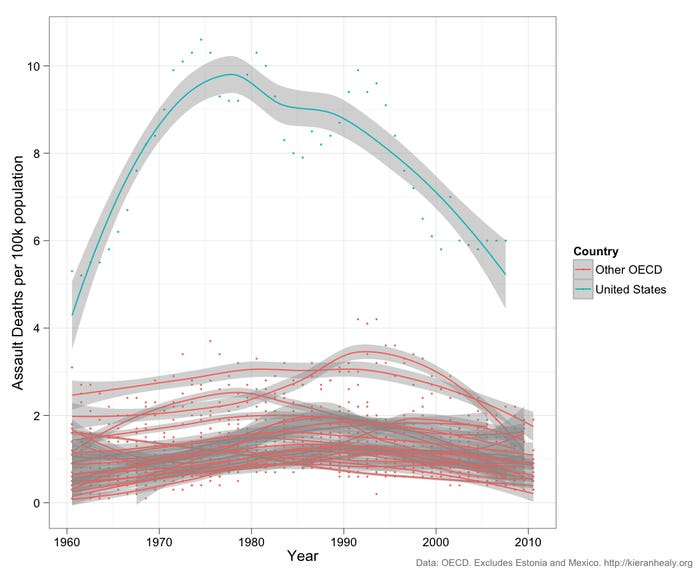
]

---

Assault Deaths by Region of US

.image-full[
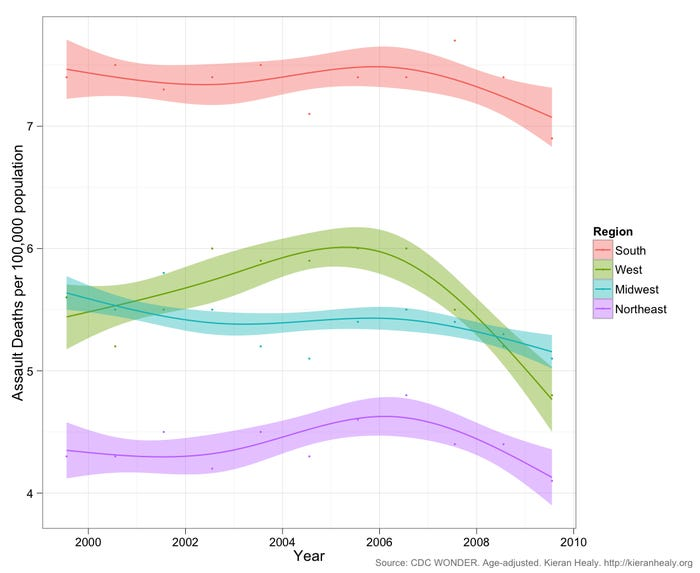
]
---

Mass shootings in US, legal vs illegal weapon

---
Attitudes toward control before and after shootings

---

Gun control opinions over time

---

Police shootings

---

Support for specific policies

---
# Guns as Facilitator

Firearms are most effective weapon available for most violence.

Handguns combine effectiveness with concealability

Ubiquity of firearms in US means maximally effective means are usually available

Vast majority of gun owners do not engage in violence

This is a public policy conundrum

---
# For Next Time

