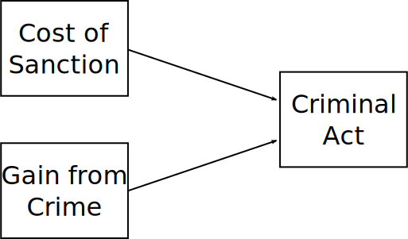
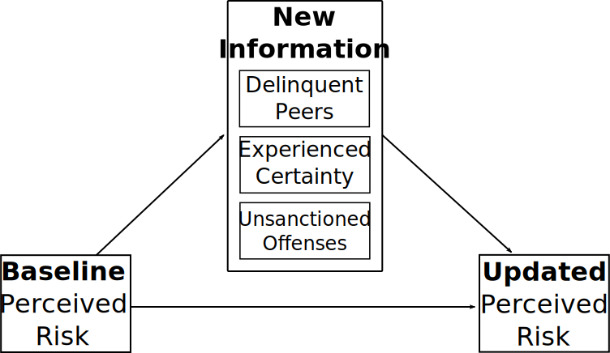
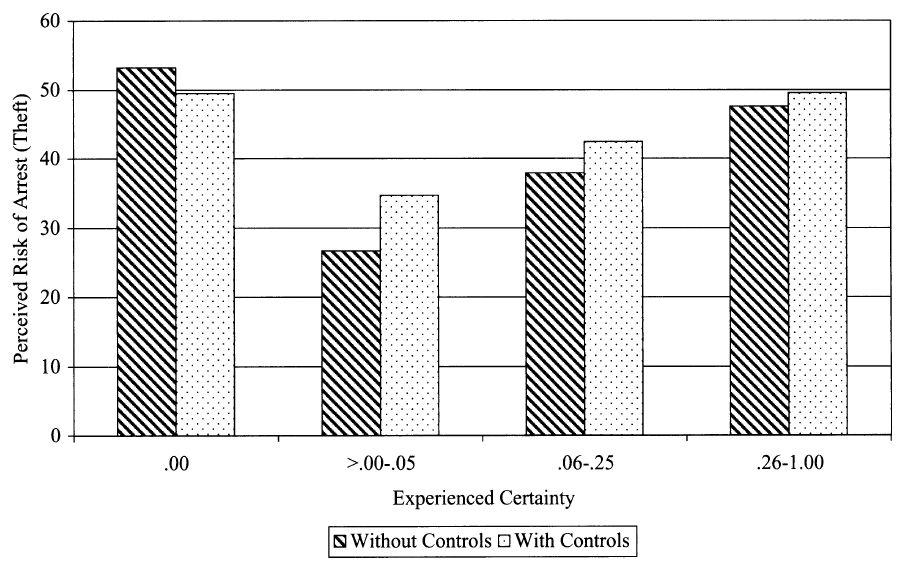
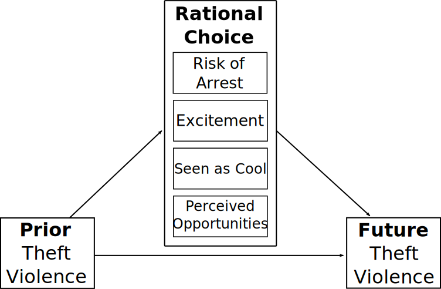

# Overview

1. Context for Deterrence and Rational Choice

2. Deterrence Theory

   * Certainty, Severity, Celerity
   * General vs. Specific

3. Rational Choice Theory

4. Matseuda, Kreager, & Huzinga (2006)

---
# Context

* Criticism of the classical school lead to rejection of rational actor

???

Went a little far--more structural, more deterministic theories--often called "oversocialized" perspectives.

--

* Criminology dominated by subcultural theories well into 1970s.
    + Crime as irrational behavior resulting from socialization

???

These include differential association, differential opportunity, strain theory, etc.

Subcultural theories usually focus on normative conflict or difference: Crime occurs because people are members of subcultures that reject conventional norms and have pro-crime norms.

--

* Attacks on rehabilitation in 70's and 80's

    + Focus on deterring crime rather than fixing criminals

???

Move toward rehabilitative model in 1960s and onward was not associated with dropping crime

People became pessimistic--"there's nothing to be done"--so just lock folks up and throw away key

--

* James Q. Wilson's (1975) *Thinking About Crime*

    + Respond harshly so those on fence don't get idea that crime pays.

???

James Q. Wilson was influential political scientist and policy writer. Focused on crime a lot.

Thinking About Crime introduced idea of incapacitation as mechanism for crime reduction in places with higher penalties.

Wrote original Broken Windows article with George Kelling and was pro War on Drugs on moral grounds.

--

*Rather than focus on the intervening work first, we begin at **deterrence**.*

???

Deterrence is still fundamental basis for most crime policy

---
# Deterrence and Rationality

Deterrence is framed now in terms of rational choice but has long been basis from criminal legal policy

* Classical school foundation

???

As seen in week 1, deterrence goes back to Beccaria and Bentham.

It entered US CJ policy at foundation of nation and hasn't gone anywhere. More or less same into Europe.

--

* Gary Becker's (1968) Economic Model of Crime

???

First well-known general utility model of crime.

Becker was focusing on optimal calibration of punishment in CJ system--mostly deterrence

--

* Bringing agency back in

???

Swinging pendulum back to actors as being decision-makers and away from deterministic cultural theories

--

* Rational choice reintroduced classical model in more realistic terms
    + People are *on average* rational
    + People respond to incentives
    + Structural position and context matter

???

People do not pick optimal choice every time but do on average

Key is that people respond to incentives

People's perceived rewards are idiosyncratic and taste-based; mainly just know that on average people want *more*

--

* Since criminal behavior seems irrational, it is a "hard test" for a theory of rational actors

???

If rational choice can explain criminality well, it can likely explain more rational things as well

---
#  Deterrence Doctrine

Deterrence is simply idea that punishment can impact crime.

   + People *respond to incentives*

--

Weaker assumptions than classical school

Rational actor assumptions:

* In **aggregate**, individuals act rationally

???

If you look at large groups together, on average they behave rationally

--

* At **margin**, individuals act rationally

???

People may not act perfectly rationally, but they do respond 

If punishment increases, people will commit less crime; if gains increase, more.

--

*Crime can be controlled by increasing its cost*

---
# Marginal vs. Absolute

* Absolute Deterrence

   + Deterrent effect of a penalty vs. no penalty
   + *Will decriminalizing drugs result in more drug use?*

???

This is question of whether *any penalty at all* has an effect on a behavior.

--

* Marginal Deterrence

   + Deterrent effect of a penalty compared to different penalty
   + *Does the death penalty reduce more crime than life sentences?*

???

This is if increasing or decreasing penalties increases or decreases behavior.

---
# Variables in Deterrence

* Certainty

   + Probability of being sanctioned
   + Objective Measures:
       * Arrest or clearance rate
       * Proportion of offenders prosecuted
   + Subjective Measures: Perceived punishment probability
   + Tittle's "Shell of Illusion"

???

Tittle's Shell of Illusion: Those never committing a crime--and thus never getting away with it--overestimate sanction risk.

This is related to the illusion most people have that certain types of law violation are incredibly rare; since at least Rome philosophers have stated that if people knew how often laws were broken, they too would break them.

--

* Severity

   + Severity of the sanction
   + This is the *cost*
   + Objective Measures: Sentence length; fine amount
   + Subjective Measure: Perceived suffering
   
???

Subjective usually involves asking people "how bad would it be to be arrested / incarcerated"

--

* Celerity (Swiftness)

   + Length of time between crime and sanction
   
???

Not often used

Time discounting in economics--a loss or gain in the future is worth less than one now

Not real relevant in US system due to everything being slow

The slowness may actually be a severity component too

---
class: inverse
# General vs. Specific Deterrence

---
# General Deterrence

*Does threat of punishment deter people from crime?*

   + Perceived threat of sanctions deters individuals from crime
   + Based on perception, not personal experience
   + Punish so that others see they too will be punished
   + About reducing *crime in general*

--

Research Approaches

   + Changes in crime rates before/after policy changes
   + Effects of perceived risk and severity

---
# Specific Deterrence

Does punishment deter punished people?

   + Experience of punishment deters individuals from future crime
   + Based on experience, occurs only after punishment
   + About reducing *recidivism*

--

Research Approaches

   + Compare incarcerated then released vs. probationers
       + But those sent to prison may be more crime prone
       + Experimental design: Need equivalent treatment and control groups
   + Randomly vary punishment
   + Look at marginal cases--natural experiments
       + Same crime probation vs. incarceration

---
# Rational Choice Model

Deterrence focuses on the sanctioning.

Rational choice is a *general* theory of behavior--not limited to crime.

--

Full rational choice models recognize variation in gains.
   
   + Includes material and psychic gains
   + e.g. Piliavin, Thornton, Gartner, & Matsueda (1986)

???

Article found better support for rational response to rewards than to formal deterrence

Later work often shows similar--may be due to low risk of apprehension

--

.image-50[

]

---
# Formalization

Rational choice models typically take a formal mathematical form.

$$
E(U) = (1-p)U(y)+pU(y-F)
$$
"Expected utility $E(U)$ is function of the value of crime $U(y)$, the likelihood of being caught $p$, and the penalty if caught $F$"

???

This is conventional economic utility model

Don't estimate exact values, but rather take advantage of basic properties

All else equal, reducing reward / increasing cost reduces value and thus likelihood of crime.

--

Becker (1968) introduced rational model of crime

   + Little impact in sociology or criminology.
   + Assumed full information
   + Material gains compared to gains from legitimate job

???

First major economic treatment of crime as rational behavior

Mainly focused on criminal justice policy

--

Short & Strodtbeck (1964) -- decision to join a gang fight

   + Subjective probability of harm
   + Bounded rationality
   + Status and psychic rewards

???

Mixed methods work revealing participation in gang fights as rational behavior

Gang leader decides whether or not to join a fight

If he decides not to, likely he will suffer small to medium, status loss

IF he does, small chance he will need to shoot someone and end up in jail -- large cost

Because likelihood of jail is small, he'll probably join fight--it is rational to do so

---
class: inverse
### Matsueda, Kreager, Huizinga. 2006. "Deterring Delinquents: A rational choice model of theft and violence." *American Sociological Review*

---
# Premise

Rational choice hypothesis: Perceived cost/benefit *impacts* future crime

* Crime = Pr $*$ Value(Reward) > Pr $*$ Value(Costs) 

???

That is, crime occurs when reward weighted by likelihood of getting it is higher than sanction risk weighted by likelihood.

--

Research Questions:

* How are perceived risks formed? 

* How do perceived risks and rewards influence crime?

--

&zwj;Data: Denver Youth Survey

* Annual panel survey of high-risk youth
* Self-reported delinquency and crime
* Perceived risk of arrest
* Perceived rewards of crime
* Wide range of crimes
   + Focus here is violence and theft

???

1526 youth surveyed over 10 waves--only first five have rat choice questions

Very detailed questions on involvement in crime, perceptions of it, background

---
# Perceived Risk Theory

&zwj;Deterrence: Perceptions should be rooted in reality

* Experiential Learning
    + Baseline estimate of perceived risk is overestimated (Tittle 1980)
    + New information used to update

???

Perceived risks come from real experiences

Those who have never committed a crime think they're likely to be caught

When they get away with it (or get punished), they update perceptions--this is a Bayesian updating model

--
      
* Measure for Perceived Arrest Risk
    + Experienced certainty: Arrests/Crimes for each person
    + Unsanctioned offenses: number of crimes for non-arrested
    + Crimes of peers

???

DYS has actual arrests and committed crimes for respondents

Know number of unsanctioned offenses

Also know crimes of their peers--we assume peers getting away with it (or being sanctioned) gives info

---
## Formation of Perceived Arrest Risk
    
.image-full[

]

???

Baseline risk is perceived risk of arrest at last survey

New info is unsanctioned offenses, arrests, and delinquency of peers *since last survey*.

Updated risk is current survey.

The model is somewhat more complicated: Preceding neighborhood and individual characteristics also predict all three.

---
# Perceived Risk of Arrest

.image-full[

]

???

Find support for shell of illusion: High risk perceived by those not comitting

Then risk increases with experienced certainty. Looks basically same for violence.

---
# Rational Choice Theory

* Rewards 

    + Excitement
    + Being seen as cool

???

Focus here on psychic gains, both direct (excitement) and from status (being seen as cool)

--
  
* Cost

    + Arrest

???

Main analyzed cost here is arrest but they also investigated trouble with parents, risk of ending up in jail or reform school

Similar but weaker effects compared to arrest

--

* Certainty (Probability)

    + "What are the chances of getting (excitement/coolness/arrested) for (theft/violence)?"
    
???

Measured as a percentage in 10 point increments

--

* Severity (Value)

    + "How good or bad is this?"

???

5 point scale

The cost or benefit ends up as a variable equal to the certainty times the value.
 
--

* Opportunity

???

Also address reality that crime can't be committed without the opportunity to do so
    
---
# Rational Choice and Crime

.image-full[

]

---
# Summary

* Small deterrent effect

   + 10% risk increase -> 3% theft, 5% violence reduction
   + 10% reduction in coolness -> 6% theft, 7% violence reduction

???

Evidence for modest deterrent effect, but relationship much stronger with rewards

--

* US already has high arrest and imprisonment rates

   + Would be draconian to increase substantially

???

Not practical to increase risk sufficiently to deter these crimes

--

* Some level of arrest and incarceration essential

???

Complete removal of threat likely to increase crime substantially

--

* Deterrence not a panacea for crime problem

???

Can't punish our way out of this. Better to address, in particular, psychic gains of crime.

---
class: inverse
# Discussion

---
# Some Questions 1

"[With regard to the US's "war on terror" foreign policy] ... Would telling the world where the U.S. has eyes and what it could do to would-be terrorists be more of a deterrent than keeping it secret? Or does the world's disapproval and condemnation of human rights abuses act as more of a deterrent on the U.S. and outweigh the benefits of being upfront?"

???

This is an interesting link given the note by Levitt about foreign policy. There's some power in knowing a threat exists but being unsure about it. Recent evidence suggest ambiguity about certainty is itself a deterrent.

--

"Knowing what we know about mass incarceration and capital punishment, what type of relationship with deterrence vs. incapacitation would we expect to see in a system of restorative justice over the current retributive model?"

--

"How do we factor in the encouragement and motivation of ex-felons in the U.S. to commit more crime due to the legal discrimination of people who were previously incarcerated? When considering criminal justice policies that will increase deterrence, should we also be looking at the ability of people to reintegrate into society as law-abiding citizens?"

???

Valid point and one of the issue with relying only on deterrence. There are second-order consequences all over.

---
# Some Questions 2

"How do we ensure that punishments don't deter citizens from the law? To be more specific, how do we make sure that punishments deter crime but aren't so severe that they deter citizens from respecting the social contract at hand and from not trusting the government to properly handle criminal justice? For example, we know for data that the death penalty isn't proven to be very effective on deterrence, but we continue to use it in many states: how does this reduce trust in the criminal justice system?"

--

"The second reading by Levitt says that if the payoff to crime is greater than any opportunity, a crime will likely be committed. How are the payoffs in today’s society variable due to various societal factors and how does this subjectivity impact the legitimacy of the deterrence theory?"

---
# Some Clarifications 1

Levitt notes that factor like economic fluctuation made it hard to establish causality for deterrence through the 1990s. If replicated this research now, would we expect similar results?

???

Research has been largely consistent in the recent period. External fluctuations in society are never absent or stable--these are always problems. Research must also grapple with how to isolate effects and it is never easy.

--

"Does the racial differences in conviction, bail amounts, and sentencing play into deterrence? ... It seems like the consequences of committing a crime is higher for black/brown people."

???

Deterrence can account for this, and does, in form of different perceptions of apprehension and costs. There's a recognition in qualitative work that an arrest or any police contact can be much more dangerous for POC. A lot of work on police avoidance for people of color with no criminal involvement. May have reversal effect if you think you're going to be hassled by police either way--lower cost to involvement.

--

"Part of deterrence is the "expected punishment." However, the sentence length of a single crime isn't always uniform across the offenders. How does that affect the effectiveness of deterrence?"

???

On the one hand, evidence indicates people don't have a good idea of sentences for crimes they are committing. On the other, deterrence typically most focused on the aggregate rather than individuals. Main issue of interest is if increasing (or decreasing) penalties causes--on average--people to alter criminal behavior. They don't need an accurate view of punishment, just needs to be monotonic.

--

"How would one prove that one would be deterred from committing a crime because of consequences rather than another outside factor of them deciding not to commit the crime."

???

Answer is that it is quite hard for individuals. Easier in groups, particularly in quasi-experiment. Trick is figuring out how to isolate a difference in perceived costs from everything else. You never truly know for sure but you can make very convincing arguments by ruling out alternate explanations.

---
# Some Clarifications 2

What does Levitt mean by "incapacitation is not a behavioral theory of crime?"

???

Incapacitation isn't about the behavior of people like deterrence. Deterrence says you increase punishments, people commit less crime. Incapacitation is literally people are unable to commit crimes because they're in prison. It isn't about changing behavior but removal of all opportunity to do so.

--

"How do we come to understand the context of a crime on a philosophical level in regard to deterrence when crimes are committed out of the need for survival/desperation/or duress?"

???

Deterrence is, in economic terms, specifically concerned with the elasticity of crime. Increase cost, demand goes down. For survival crimes, one might assume they are inelastic and deterrence can't much speak to it. Punishing survival crimes can't accomplish deterrence--which jives with duress and survival being defenses in court.

---
# For Next Time

* Sherman, Lawrence W., and Richard A. Berk. 1984. "The Deterrent Effect of Arrest for Domestic Assault." Pp. 357-361 in *Classics of Criminology*. Edited by J. E. Jacoby. Prospect Heights: Waveland

* Cohen, Lawrence and Marcus Felson. 1979. "Social Change and Crime Rate Trends: A Routine Activity Approach." *American Sociological Review* 44(4): 588-608

### Things to pay attention to:

* Different costs involved in deterrence (e.g. arrest vs. incarceration)

* Relationship between routine activities, deterrence, and rational choice

* Potential causes of changes in crime that don't involve offender motivation

* Policy implications for deterrence and routine activities
