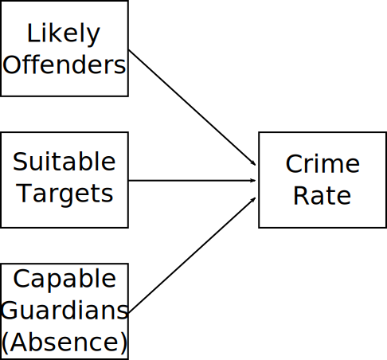
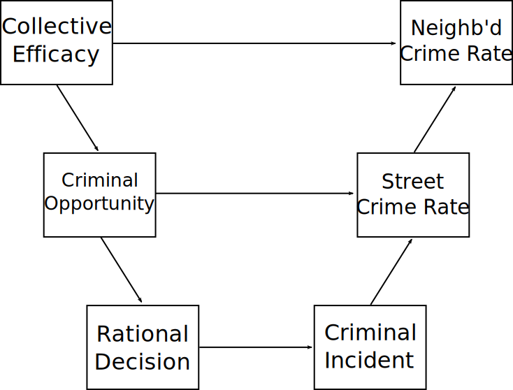

# Overview

1. Sherman & Berk (1984)

2. Routine Activities

3. Extensions

   * Behavioral Economics
   * Situational Opportunity

---
class: inverse
# Sherman & Berk (1984)

---
### Minneapolis Domestic Assault Experiment

Theoretical Framework

* Specific Deterrence: Arrest will reduce reoffending
* Labeling: Arrest will increase offending

???

Labeling says that once marked as an offender (primary deviance), you will alter self-image and increase offending (secondary deviance)

This is nice case where two theories predict opposite effects

--

Treatments

1. Separate
2. Advise or mediate dispute
3. Arrest offender

???

Officers had randomized color coded notepads; were to treat based on sheet color.

Nice setup as separation takes them out of home like arrest but without the actual arrest component

Have to do something so there's no untreated (e.g. do not respond)

--

Sample

* Misdemeanor assaults
* Victim and offender present
* Probable cause for recent assault

???

Limited to cases where they are sure something happened but not dangerous to pick random treatment

--

Measurement (Next six months)

* Re-arrest records
* Interviews with partners

???

Checked police records for re-arrest while simultaneously interviewing victims every two weeks

Nice because two ways of verifying; might deal with unwillingness to report in future after initial arrest

---
# Results

Arrest had specific deterrent effect

* Significantly reduced re-arrest and reported reoffending
* No evidence for labeling effect
* Does not appear to be incapacitation

???

About half as much recidivism under arrest as mediation

Confident not incapacitation as there was no immediate reoffending in any treatment

--

# Policy Implications

Mandatory arrest

* Arrest *required* if evidence of domestic violence
* ~ 19 states in some form
* Others *recommend* arrest
* Some mutual arrest

???

Evidence provided strong support for mandatory arrest--seemed to be consistently reducing reoffending

Policy enacted in many states subsequently, frequently citing this vein of research

In other states common for arrest to be default position; some require both parties to be arrested if both claim other contributed

---
# Issues

Departures from randomization

* Offenders refusing separation or mediation
* Victims demanding arrest

???

Could not always apply target treatment; sometimes offender uncooperative or victim insisting on arrest

This should be conservative bias, with arrest treatment disproportionately affecting most belligerent or severe; would expect weaker effect

--

Follow-Up

* Some victims could not be reached
* Reduction in response over time

???

Common issues with reaching a disadvantaged, vulnerable population

This is why they also used official records--self-report likely to catch everything but offense reports always obtainable

--

Labeling

* Most were past offenders already
* Process may be slow

???

Possible labeling effects already took place

Also possible takes longer for arrest to exert an effect

--

*Need for replication*

???

Pretty robust study but issues combined with single context mean you need replication

---
# NIJ Replications

**Spouse Assault Replication Program** (SARP)

Locations

* Omaha, NB
* Milwaukee, WI
* Dade County, FL
* Colorado Springs, CO
* Charlotte, NC

N = 4,032

???

NIJ funded replications in 1981-1991

Larger sample size allowed for additional controls and examination if interactions

Replication across many contexts increases generalizability

--

Randomization by Dispatcher (e.g. Milwaukee)

* Standard Arrest (held until morning or bail, ~ 11 hrs)
* Short Arrest (release on recognizance, ~ 3 hrs)
* Police Warning Only
???

Many randomizations, this is Milwaukee example. In total there were about 7 treatments.

---
# Replication Results

Effects

* Inconsistent deterrent effect
   + Modest (<30%) effect where present
* Prior records and age better predictors of reoffending
* Most had no reoffending regardless of treatment
   + Small number had very high repeat offending
   
???

Initial examination of experimental results looked very mixed: Half beneficial, half negative

When reanalyzed together with more power, careful statistical design, general moderate deterrent effect found

Other individual factors had stronger effect on recidivism

80% of DV concentrated in around a tenth of those studied; this is a common sort of Pareto or power law distribution you see throughout crime and many other phenomena

e.g. On average 80% of wealth in society is held by 20% of people

e.g. 80% of crime occurs in 20% of locations; Iron Law of Troublesome Places or Law of Crime Concentration

--

Conditional Hypotheses

* Arrest deters married and employed
* Arrest may increase offending for single and unemployed
* Proposition: More to lose if married or working

???

Some evidence in analysis of experiments that deterrent effect more relevant for these groups

This will come up when we talk about control theory

--

Mandatory arrest may be ineffective or counterproductive

* Other recent evidence seems to support this
* May be better to target serious offenders

---
class: inverse
# Routine Activities Theory

---
# Context

Through 1970s, most theories of crime focused on individual characteristics, socialization, and social structures

* Motivation and decision-making
* Social learning
* Subcultural theories
* Social organization of neighborhoods

--

These explain cross-sectional variation between individuals and groups well

They predict changes in nationwide and area crime trends poorly

???

To a large degree this is a limitation of data

More practical to study offenders and crime in specific locations and in cross-section

Analyzing large-scale trends is hard because you need to observe many places over long period of time

Effects may also have long lag--might be bad conditions a decade or more ago

--

Cohen & Felson: (Potential) offenders are only part of the story.

* Regardless of motivation, crime requires an **opportunity**

???

This is not a new insight--they note lots of work recognizing this for ages

Contribution here was creating an analytical framework that clarified how these things are related

So elegant it seems obvious; immensely impactful and one of the few conceptions in criminology that approaches a law

---
# Opportunity

Predatory crimes *require* elements to converge in time and location--criminogenic *situations*

???

Possible for things to overlap in location but not time, in time but not location; 

--

1. Motivated offenders

???

We know a lot about motivation of individuals and contexts that generate motivated offenders

--

2. Suitable targets

???

Suitable targets is often taken as given or unlimited in many theories

But suitability *varies*! Some things easier to take, worth more. And changes in society and technology impact this.

--

3. Absence of capable guardians

???

Obvious that crime doesn't occur when police are watching

But guardianship is complex and pervasive--we are guardians of our property but also targets ourselves of some crimes

Different contexts and behaviors facilitate or impede guardianship

--

*Aggregate* changes in these can explain crime rates

*Social and technological changes in routine behavior can produce drastic changes in crime*

???

Key insight here is that changes in *any* of these can change crime

--

* More high-value portable goods or conspicuous consumption

* Less time spent at home, more at night and at drinking venues

* Dual income households--less supervision of home, neighborhood, and children

---
# Routine Activities

.image-full[

]

---
# Levels of Explanation

Rational choice is micro-level

* Describes individuals
* Describes situations

--

Routine activities is macro-level

* Describes groups
* Describes trends

--

Rational choice is often used as individual-level foundation for routine activities

* In aggregate, people behave rationally
* More suitable targets means greater rewards
* Fewer guardians means lower costs

--

*Rational choice and routine activities suggest crime can increase without change in motivation or number of offenders*

---
# Policy: Hot Spots Policing

Crime requires offender, target, absence of guardians

* Hard to change motivation
* Hard to harden targets
* Police can be redirected easily

???

We've been trying to act on motivation forever--it is real hard, has structural roots

Hardening targets requires people to change their behavior. Sometimes works, but generally want to avoid putting burden on people.

--

Identify high crime areas, send police there

* Assumption: Police can act as capable guardians
* Assumption: Criminals will not relocate (displacement)

--

Effects

* Good evidence for crime reduction
* Not much evidence for displacement
   + High crime = high opportunity
   + Nearby locations may lack opportunity
* Long-term and large-scale effects uncertain

???

Experiments targeting high crime areas show substantial effects

There were worries crime would go up nearby--displacement, but not much evidence

Focusing on hot spots for long period might have declining effectiveness

Effect of targeting one hot spot won't be same as effect of targeting all at once--policy may not scale

---
class: inverse
# Rational Choice and Routine Activities

## Extensions

---
# Behavioral Economics

Pogarsky, Roche, & Pickett (2018) "Offender Decision-Making in Criminology"

???

Behavioral econ is about systematic departures from rationality

Emerged from cognitive psych contributions to econ research

--
* Bounded rationality

???

Short & Strodtbeck (1964) had handle on this; not really part of behavioral econ exactly

We often have very little information when acting; can't assume perfect info

Also rule out many possible decisions immediately and consider a few options

--

* Prospect Theory (Kahneman & Tversky)

   + People risk averse in gains, risk seeking in losses
   + Underweight highly likely, overweight unlikely events
   + Expectations matter

???

Strong evidence that gains/losses to crime are treated differently if a gain vs a loss

Nonlinearity in effects

Criminals likely to focus on easy guaranteed gains, but will prefer risk of larger loss to smaller certain loss, ex. resisting arrest

For same level of punishment, expectations shape later recidivism: Expecting worse, punishment deters less.

--

* Dual-Process Models

   + Much behavior is intuitive and rule (heuristic) based
   + Rational, deliberative behavior is costly
  
???

People generally like to avoid effort; rational choice thinking takes lots of effort

Most behavior is habitual and intuitive

If you want to act on rational choice, need to trigger deliberative system; evidence those using deliberation more are also averse to crime

--

* Heuristics and Biases

  + Shortcuts in uncertain environments
  + Replace hard question with easier one
  
???

May make large mistakes in reasoning by applying shortcuts to new situations

---
# Situational Opportunity

Routine activities focuses on aggregates

* Not concerned with what micro-level theory is used
* Suggests importance of opportunities to micro-level

???

Some theories take opportunity as a given--there's always some crime that can be committed

--

Situational opportunity is a "meso" theory of *places*

* Weisburd et al.'s *Criminology of Place*
* St. Jean's *Pockets of Crime*
* Crime Prevention Through Environmental Design (CPTED)
* Place Management Theory

???

These are approaches based on considering attributes of relatively small areas like intersections or street segments

Characteristics of places can have large influence on crime

Interaction between offenders, guardians, and places

Offenders want to use high opportunity places, may conflict with people who live or work there

--

Multi-level theory

* Micro-level behavioral theory (ex: rational choice)
* Meso-level place theory (ex: situational opportunity)
* Macro-level structural theory (ex: social disorganization)

???

Some approaches link theories at different levels together into micro-macro models

Lot of this emerges from Coleman's Foundations of Social Theory approach

---

.image-tall[

]

???

Example of a multilevel framework with rational choice model of individuals, situational opportunity model of places, social disorganization / CE model of neighborhoods

Neighb's influence place opportunities which influence individual actions

Crime rate for neighborhood is aggregate of street-level crime rates which are result of individual criminal actions

---
class: inverse
# Discussion

---
# Some Questions 1

"When looking at what changes in routine activities do to crime rates, Cohen and Felson only consider crime from the legalistic definition of crime like burglary and robbery. What might we expect their findings to look like when using a humanistic definition of crime, considering things that have an identifiable harm (like sexism or racism), specifically in the 1960s and 70s like they write about?"

--

Do you think that if family was more encouraged and daily time schedules were enforced, would crime rates drop? Or would that be a time that outside factors kick in and overpower home life factors?

--

"[Sherman & Berk's (1984)] whole experiment is based on women being abused and the police only slightly intervening. And they track the number of times the abuse happens again. How does this inaction relate to gender inequality in policy?"

--

"[With regard to Sherman & Berk (1984)] What if we spend police effort towards saving victims instead of arresting the offender? What do you think could be the pros and cons?"

---
# Some Questions 2

Cohen & Felson (1979) note that the routine activities of life that give us joy, independence, and prosperity also increase our victimization risks. How do we balance this? Is predatory fair price to pay for our lifestyles?

--

[Many questions about routine activities and COVID--its on the test!]

---
# Some Clarifications 1

"What did Cohen and Felson mean when they said that 'potential victims of predatory crime may take evasive actions which encourage offenders to pursue targets other than their own'?"

???

If you're being chased by a bear you don't need to be fastest, just not the slowest. Locking your bike isn't about preventing bikes from being stolen. It is about getting them to steal someone else's bike instead.

--

"Is there any true significance of the almost tripled rate of household victimization rates for one-person occupancies to 6 or more person occupancies? Does this have anything to do with the amount of items/valuables/personal items in the house?"

--

"Is there a chance that people/victims of domestic abuse are less likely to call the police because of the rarity of Police arrests? If so, what consequences would a family receive after a phone call that ended up not having the abuser arrested?"

???

May very well be the case. There's evidence people are, in general, less likely to call police when they think they will do nothing.

--

How does routine activities relate to disorganized neighborhoods?

???

Routine activities principles can be applied here to make sense of it. Informal social control is a guardianship element. There are countervailing factors, as there are less suitable targets for some crimes but fewer guardians.

---
# Some Clarifications 2

"Is it possible to conduct experiments that involve police discretion without unpacking the racial bias that seems to permeate every aspect of policing? How can scholars ethically say that they found no evidence of this kind of prejudice when the evidence clearly says otherwise?"

???

This is a good point. If discretion comes into play, biases likely do as well. It is problematic here, however, because they can't remove the discretion--there were likely cases where an arrest was needed over advising. This research design might not be able to address racial bias. The Knox, Lowe, and Mummolo paper is essentially the methods needed to address this sort of thing, except here all calls were initiated by others so no stop problem. Can probably measure it.

--

"Cohen et. al. mention the importance of control (offenders, targets and bystanders) and its impact in the crime rates of a given area. I would like clarification on whether the control is intrapersonal or reliant on communities and criminal justice systems."

???

Vast majority of social control is primary (family/friends), followed by parochial (groups/schools/local orgs), followed by formal (police). These are interrelated however. See the Systemic Model of Crime, Social Disorg, and Collective Efficacy. 

--

"Is domestic violence more prevalent in areas of higher crime? Are previous criminals more likely to commit domestic violence?"

???

There is an association between other forms of crime and domestic violence. Domestic violence is also higher in more disadvantaged areas but the mechanisms are complicated and unclear. Lot of compounding issues. DV is more common than other violent crimes among more affluent people though.

--

"How do schools and community centers change the structure of criminal activity and their routine activity?" And what about extracurricular activities, which affluent people send their children to but increase time away from home?

???

Lot of crime happens near schools but likely because youth congregate there--same concentration of youth without monitoring would be worse. Community centers appear to generally exert a protective effect, probably due to combination of monitoring of children and involvement in activities. With regard to activities, they keep kids busy so net negative to crime probably. Routine activities is less about behavior--e.g. time away from home increasing criminal behavior--than exposure--being out of home makes you vulnerable. Organized activities are very low vulnerability due to monitoring.

---
# Exam

* Exam will go out by noon tomorrow.

* Due 11:59 PM Friday

* Email if clarifications are needed

   + I may may forward clarifications to entire class

---
# For Next Time

* Blumstein, Alfred, and Jacqueline Cohen. 1987. “Characterizing Criminal Careers.” Science, 237:985-991

Things to pay attention to:

* Different insights gained from considering trajectory of individuals versus aggregate crime rates

* Participation vs. Frequency

   + Different factors may predict these!

* Difference between age-crime curve and criminal career trajectories   

???

This article is challenging and math heavy

Focus on insights, don't dwell heavily on the methods but do read them