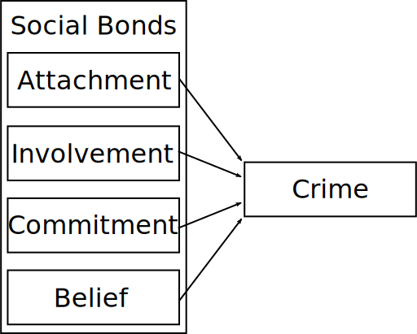
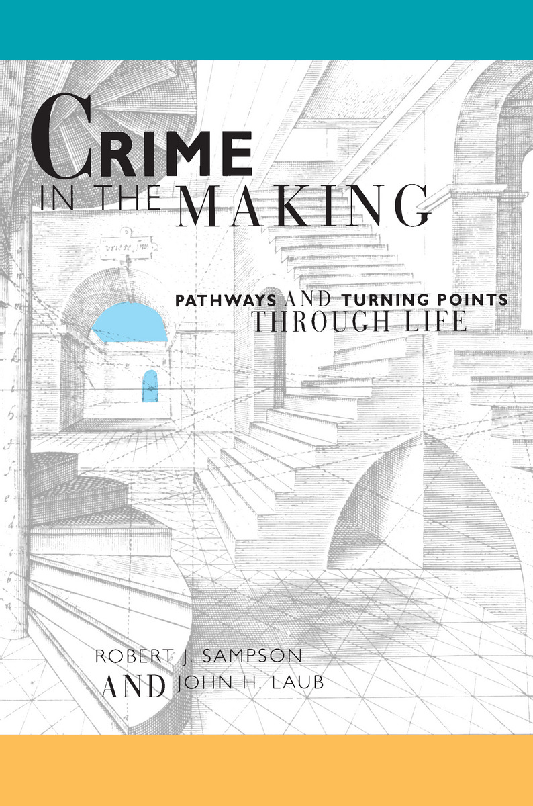
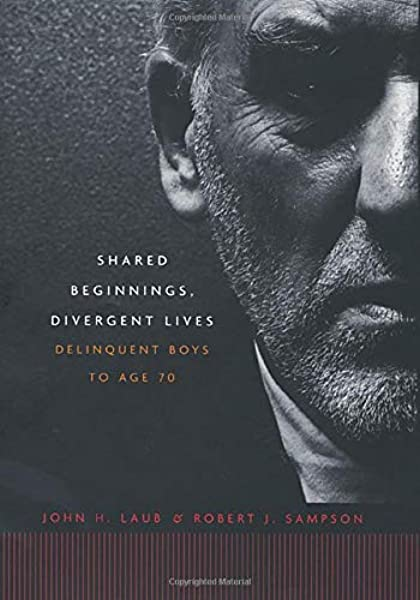
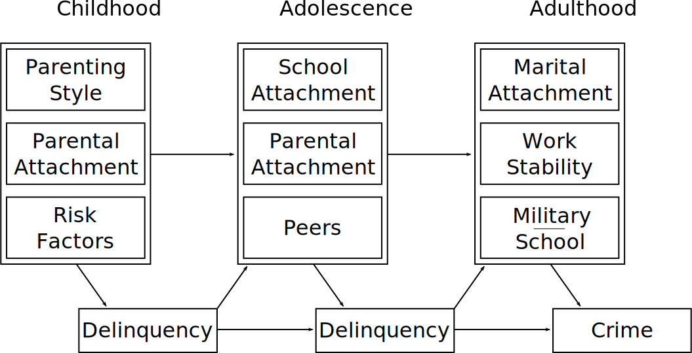

# Overview

Social Control Theory

* Context

* *Causes of Delinquency*

* Empirical Standing

Life Course Criminology

* Concepts

* Sampson & Laub (1993; 2003)

---
class: inverse
# Social Control Theory

---
# Origins

* Durkheim claimed as intellectual predecessor

   + Anomie and egoism as weak bonds (Hirschi 1969)

.smallish[

> The more weakened the groups to which the individual belongs, the less he depends on them, the more he consequently depends only on himself and recognizes no other rules of conduct than what are founded on his private interests. (Durkheim 1897)

]

???

Important to note here that strain or anomie theories claims durkheim as source

--

* Also rooted in Hobbes

.smallish[

> Given our natural tendency to pursue our short term private interests, how is society possible? The question does not assume that we are naturally evil. It assumes only that we have a tendency to act, and the ability to consider what will follow. (Hirschi, in Laub 2002)

]

--

* Consensus Perspective of Law

.smallish[

> We label behavior deviant to warn ourselves and others that such behavior is dangerous or imprudent. When you consider the longevity of good religious folk, you begin to see the wisdom of “moral” systems. So there is a rationality to them, no matter how stupid you think they are. (Hirschi, in Laub 2002)
]

---
# Theoretical Context

* Dominance of socialized theories of deviance

   + Strain theory
   
      + Delinquents share conventional cultural goals and norms
      + Deviance emerges from inability to attain these goals 
--

   + "Cultural Deviance" and Differential Association
   
      + Delinquents do not share conventional goals and norms
      + Deviance emerges from different (learned) goals and norms
      + *May be a bit of a strawman*

--

   + Shared assumptions: Cause of crime is located in social life.

--

* Neglect of key elements

   + Family
   + Agency
   + Conformity

???

Models of deviant learning and subcultures deemphasized role of family

Structural approaches also deemphasized agency and decision making

Theories often had difficulty grappling with reality that delinquents generally conform most of the time; though this less an issue for differential association

---
# Interrogating Assumptions

* Strain Theory

   + Most delinquent acts are minor and delinquents mostly conform
   + Social class is unrelated to self-reported delinquency
   + Higher aspirations don't predict delinquency
   + Other counter-evidence (Short & Strodtbeck 1965)

> Strain theory represents the horrors, the nightmares, of middle class people who imagine what it would be like to be shut out of the process of accumulation. (LAUGHTER) It's a terrible thing, but it has nothing to do with crime. (LAUGHTER) (Hirschi, in Laub 2002)

???

Hirschi rejected strain pretty hard and it is largely out of vogue; we won't be covering it in this course.

Others doing mixed methods work on ground--particularly with gangs--in the 1960s didn't find support for strain theories.

But there are better and more convincing strain theory works out there--check Crime and the American Dream by Messner and Rosenfeld.

--

* "Cultural Deviance" and Differential Association

   + Ambiguous assumptions
   + No evidence for deviant subcultures teaching pro-criminal norms (Costello & Laub 2020)
   + Criminals largely acknowledge conventional norms
   
???

Matsueda, Akers, and others argue these are straw man arguments; there's evidence for teaching criminal behaviors and techniques, and largely conventional norms are not problematic either.

We'll get into differential association later

---
# Hirschi's Offender

* Not integrated into family, school, or community

???

Hirschi's theory comes from a different perspective of offenders

--

* Little interest in education, work, conventional success

   + But no alternative value or reward system

???

Deviant is untethered rather than differentially tethered

--
   
* Unencumbered by restraints on deviant behavior

--

* No complex motivations
  
   + Deviance is easiest path to many ends

???

If nothing prevents you from taking the easy path, you will do so. In this way, quite compatible with rational choice conception.

--

* Psychopathy / personality disorder only a symptom or tautology

???

You may have caught Hirschi's rant about psychopathy. Psychopathy is nowadays antisocial personality disorder, often preceded by conduct disorder. The tautology occurs because the diagnosis is made based on the presence of antisocial behavior. Then that diagnosis is used to explain antisocial behavior. These disorders, absent others with neurochemical bases, have little evidence for being separable from general criminal behavior and people tend to age out of them. Many psychologists and most sociologists studying in the area are quite skeptical. Foucault and medical sociologists have a lot to say about medicalization of deviance.

---
# Control Theory

* Deviance is restrained by bonds to conventional society

???

Conventional society is, here, a shared normative perspective--what is deviant is generally agreed upon in society.

--

* Attachment
   
   + Emotional connections to others
   + Mainly parents, school, work

???

In particular, the fear that deviant behavior will lose respect and love of significant others

--

* Commitment
   
   + Investment in conventional paths of life
   + Education and work in particular

???

This is about practical costs: Individual has invested in their education or job, want to avoid losing it or wasting the effort.

--

* Involvement
   
   + Time spent in conventional activities
   + Primarily work, community

???

Can't commit crime when you're busy doing other things

--

* Belief
   
   + Belief in moral legitimacy of conformity

???

Individuals who believe the laws are legitimate and apply to them are less likely to break them

This one is a bit different than the others and critics have argued it just swallows up the main elements of what Hirschi calls cultural deviance

---
# Social Control Theory

.image-full[

]

---
# Causes of Delinquency

*A turning point in criminology*

The approach

* Clear conceptualizations
* Clear operationalizations
* Critical tests against competing theories
* Survey self-report data from Richmond Youth Project

???

Hirschi was here at UW when book was published; was his dissertation

The design of the book was novel in 1969--began with interrogation of theories, clearly conceptualized elements, set up competing hypotheses, tested with survey data.

This is now the model for many good works

--

Findings

* Broad support for theory
* Negative evidence for strain and cultural deviance1

.footnote[[1] Matsueda (1988; 1993) points out Hirschi's *belief* coopts differential association.]

---
# Empirical Standing

* Probably most empirically tested individual theory of crime

???

In large part because constructed to be very testable.

Assumption of universal criminal motivation is powerful, if in some ways problematic or questionable.

--
* Robust support

   + Attachment to Parents
   + Attachment to School
   + Commitment to Conventional Lines of Action

???

These factors are generally supported in their effect on crime in wide range of cases.

--

* Conditional support

   + Involvement in Conventional Activities

???

Hirschi found very limited support for involvement in his work, but later work has seen some effects.

Strong positive effect on crime of unstructured peer interaction--things that get you out of that will reduce crime.

---
# Continued Work

* Extensions and questions

   + Peer delinquency and selection
   + Sex, race, and discrimination
   + Justice system responses

???

Big problem in control theory is effect of peer delinquency; Hirschi claims birds of a feather--peers don't increase deviance, but deviance causes them to come together.

Control theory variables account for some but definitely not all peer effects.

Control theory doesn't speak specifically to sex and race differences, though some research indicates control elements explain most (but not all) variation.

Work that suggests discrimination or justice system responses increase crime can be considered in bonding terms.

--

* Critiques

   + Criminal learning and initiation
   + Criminal groups
   + Constant motivation

???

Control theory refutes that criminal behavior is learned, but substantial qualitative evidence exists for criminal learning in intimate groups; teaching and encouraging deviance is commonplace

It is also mute on the origins and diffusion of criminal behaviors

Control theory assumes away most of these questions by claiming motivation is invariant--in all places, in all times

This is problematic when you consider large variations in criminality across locations and times

Also problematic where empirical evidence indicates variation in motivation--Hirschi, it would seem, would argue apparent variation is actually due to bonds or self-control.

--

* Gottfredson & Hirschi's *A General Theory of Crime*

   + Crime = Low Self-Control + Opportunity
   + Self-control established in early childhood
   + [Burt (2020): "gloriously parsimonious but empirically invalid."](https://www.annualreviews.org/doi/10.1146/annurev-criminol-011419-041344)

???

Only thing that matters is essentially willingness to delay gratification; offenders are just myopic.

---
class: inverse
# Life Course Criminology

---
# Focus

* Risk factors

   + Early childhood
   + Family and neighborhood disadvantage

???

These are same considerations made by developmental and criminal career research: Importance is early experiences and traits

--

* Trajectories

   + Stability: crime predicts future crime
   + Risk factors initiate, but do not determine, trajectories

???

Also from criminal careers--people follow trajectories. But life course doesn't assume trajectories are fixed.

--

* Transitions

   + Major life events can alter trajectories
   + "Knifing-off"

???

Major departure from Moffitt and others is that major--but common--life events change trajectories

In particular those that represent strong breaks from past patterns

---
.pull-left[

#### Sampson & Laub (1993)

.image-full[

]
]

.pull-right[

#### Laub & Sampson (2003)

.image-full[

]
]

???

Two key works in life course criminology, working with the same sample but separated a decade.

You read work from the first book.

---
# Age-Graded Informal Control

* Informal controls shift and transform across age

   + Childhood: Parenting styles and attachment
   + Adolescence: School attachment and peers
   + Adulthood: Marital stability, military, employment

???

This theory recognizes that the nature of informal controls in life change as you age

These changes can be transformative

--

* *Domains age-graded but common in social connectivity over time*

???

All forms of control represent social ties to individuals and institutions--the common thread is relationships between the individual and those around them.

--

* Stability and change in crime

   + Traits and early experiences predict stability
         + Cumulative disadvantage
   + Later experiences redirect trajectories

???

Early experiences are important but they do not set one on a guaranteed path

Cumulative disadvantage occurs when delinquency harms social bonds, increasing future delinquency--self-reinforcing process

Trajectories are altered by meaningful life events--and a person's reaction to them.

---
# Age-Graded Control Theory

 

.image-90[

]

---
# The Follow-Up

*Laub & Sampson (2003): Shared Beginnings, Divergent Lives*

* "50-year update"

   + Criminal records
   + Death records
   + Personal interview

???

The longest running longitudinal study of individual crime

Official records of crime and deaths

--

* Interviews of 52 delinquent "Glueck men"

   + Sampling on trajectory variation
   + Self-identified turning points
   + Life-history calendars

???

Picked multiple Glueck men with every possible trajectory

Early and late desisters, persistent, late starters, zig-zaggers

Interviewed them in detail, discussed what caused their trajectories

Mapped life events to calendars to use in statistical analyses

---
# Findings

* Age and crime

   + Criminal careers partly right
      + High variation in shape of curve (peak and desistance)
      + Aggregate age-crime curve describes relatively few
   + But age also uniformly produces life-course desistance
      + Even for most persistent, offending drops with age

???

Partial truth to both the criminal careers researchers and the general theory of crime age invariance

--

* Mechanisms of Deterrence

   + Knifing off the past
   * Supervision, monitoring, structured routines
   * Social support and growth
   * Identity transformation

???

Knifing off occurs when a life event results in severing of old patterns and social contacts; military, reform school, moving, sometimes marriage.

Supervision and monitoring occurs in marriages, military, work

Social support and growth important in interpersonal relationships, community

Routines structured by family and work pull them out of unstructured peer time which is risky

Identity transformation--perception as a "tough" giving way to a provider or family man

Gott & Hirschi would say they are just selecting into turning points, but Sampson & Laub show desistant effects occur within individuals

--

* Typological Approaches

   + No "flat" life-course persistent group
   + Cannot prospectively identify persistent offenders

???

Basically refuting Moffitt completely. Everyone has an age-crime curve that looks the same, just wider or taller.

Even with absolute wealth of data, impossible to collect now, cannot at all predict persistent offenders prospectively.

---
# Agency and Choice

*Institutional and structural turning points are mediated by human perceptions and decision making* (Sampson & Laub 2005)

???

People are not static receivers of changes in conditions but react and reconstitute their lives with choices; interpretation and reaction to life events is what makes the events matter.

--

* Desisters and persisters were active participants in process

   + Reconstitution of self-perception
   + Decision to "go straight"
   + Attraction of crime and awareness of costs
   + Calculated and articulated resistance to authority

> individuals construct their own life course through the choices and actions they take within the opportunities and constraints of history and social circumstances. (Elder 1998)

???

Process of desisting often involved active reconception of self-image 

Other times they made commitment to go straight without really realizing it--but still by choosing marriage or work

Those persisting note the attraction of crime, awareness of costs

Many cited active resistance to unjust authority, disdain of and alienation from elites as motivation

--

* Individuals emphasized role of their choices over structure

> Not because of my mother and father. Because of me. I’m the one that made it shitty. (Glueck man, from Sampson & Laub 2005)

---
# Situated Choice

* Distinction from rational choice

  + Rational choice views agency and preferences as combination of static individual and age-driven change
  + Rational choice lacks recognition we choose preferences and actions jointly to discover and create new preferences (March 1978)
  + Cannot divorce agency from context--choice is situated

* Matsueda (2006)

  + Age-graded lifecourse compatible with a pragmatist view of actor

???

Classically, rational choice takes preferences as exogenous and preceding actions

Sampson & Laub see preferences as malleable and reciprocal: Our choices change our preferences and they're often determined simultaneously.

All choices are made while situated in the present of the individual and their context

Matsueda has noted that a pragmatist theory of action--which we'll see in his article on differential social organization--makes a good theory of agency for life course studies.

---
# Summary

* No evidence for typologies of offenders or ability to predict persistence

   + Even if we perfectly measured every risk factor, agency and randomness would confound us

???

Nothing that happens early in life creates a set trajectory

Random events and intentional action alter trajectories substantially and continually

--

* Persistence and desistance explainable by age-graded informal control

   + Social ties
   + Routine activities
   + Human agency

???

Crime is determined by combination of ties to people around them, the activities they involve themselves in, and the choices they make given these contexts.

--

* Individual action and social structures must align to produce and maintain behavioral change

> Choice alone without structures of support, or the offering of support alone absent a decision to desist, however inchoate, seems destined to fail. (Sampson & Laub 2005)

???

Agency is vital. No one desisted from crime without choosing to do so and doing so requires supporting structures.

---
class: inverse
# Questions
---
# For Next Time

* Sampson, Robert J., and W. Byron Groves. 1989. "Community Structure and Crime: Testing Social-Disorganization Theory." American Journal of Sociology 94(4):774-802

* Shaw and McKay, "Juvenile Delinquency and Urban Areas." Pp. 98-104 in *Criminological Theory: Past to Present, 4th Ed.* Edited by F.T. Cullen and R. Agnew. Oxford University Press: New York.

Things to pay attention to:

* Complexity of Shaw & McKay's (1942[1969]) original theory as compared to modern conception (Sampson & Groves 1989)

   + Focus on competing value systems and learning
   
* Links to control theory in Sampson & Groves (1989) which aren't apparent in Shaw & McKay (1942[1969])

???

The Shaw & McKay excerpt is tiny sliver out of very large, complex, influential book studying delinquency in Chicago. Wealth of evidence is incredible. Hand tabulated every official record of delinquency in Chicago, mapped to place of residence, and cross-referenced to see who was charged together. Also did life histories of delinquents. 

Came from the Chicago School of Sociology and was informed by contemporaries like Robert Park & Ernest Burgess, Edwin Sutherland, Frederic Thrasher. This school birthed symbolic interaction, subcultural theory, and human ecology approaches.

Sampson & Groves comes much later after social disorg largely abandoned until 1980s. Ruth Kornhauser (1978) reinterpreted social disorganization as a macro-level social control theory, simplifying it (but losing a lot of Shaw & McKay's insights).