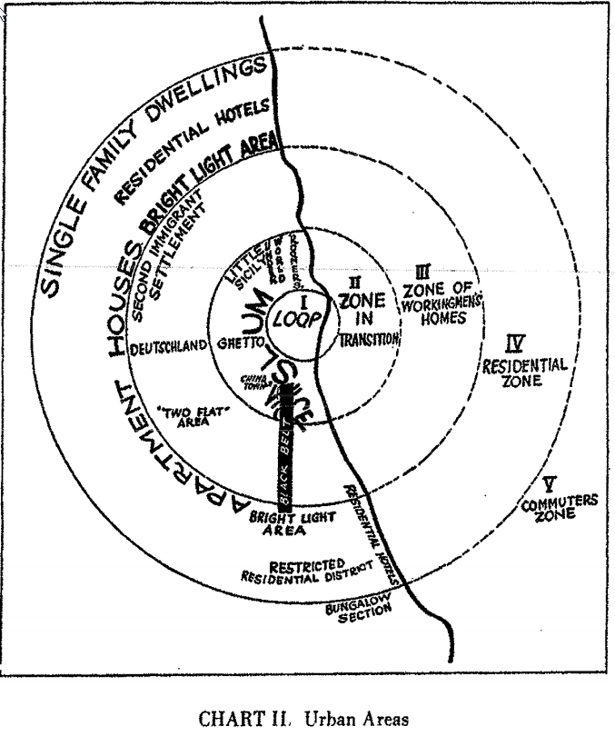
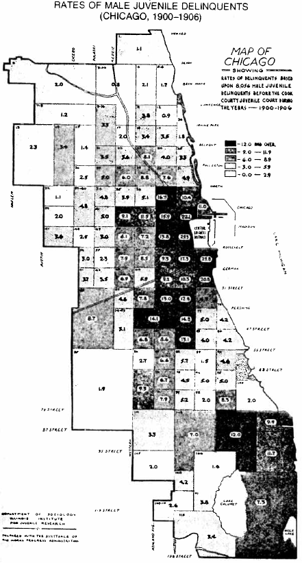
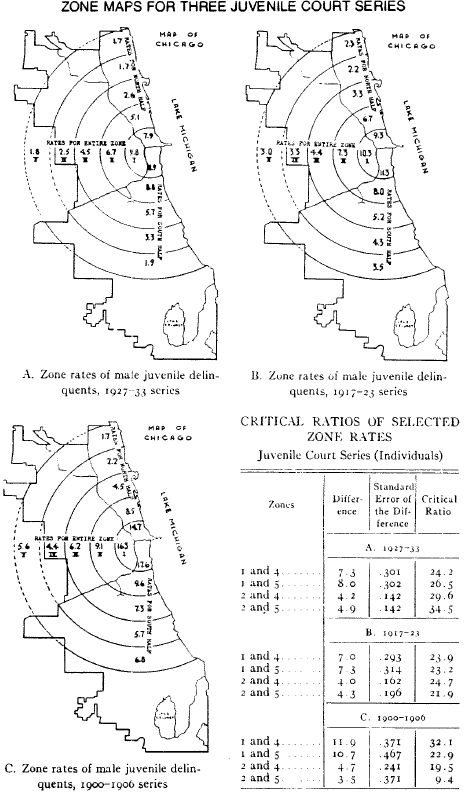
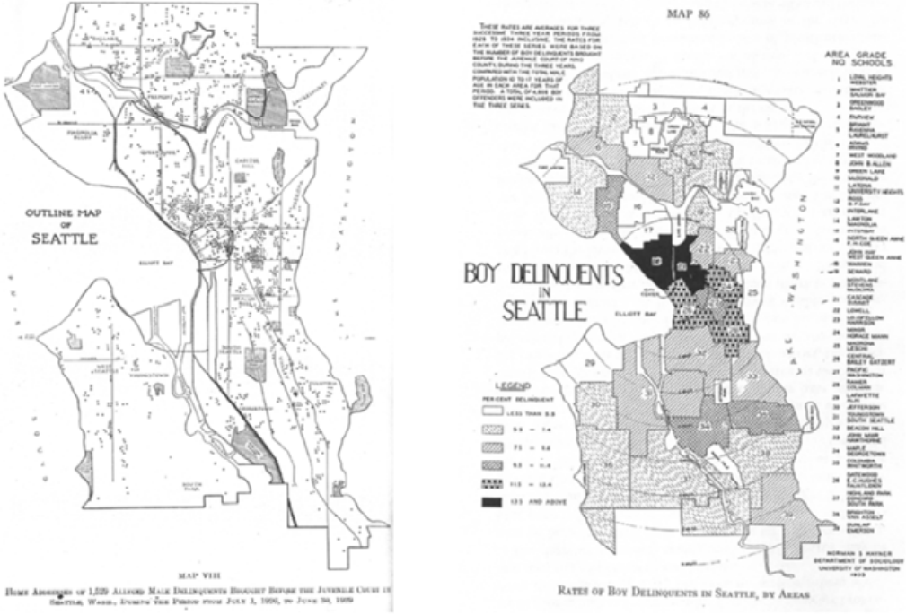

# Overview

* Context

   + Turn of the century urban life
   + The Chicago School
   + Concentric Zone Theory

* Juvenile Delinquency in Urban Areas

   + Empirical Observations
   + Social Disorganization
   + Cultural Transmission
   + Policy Implications

---
# Context

* Turn of century

???

Lot of transitions occurring in United States around this period

rural to urban transitions; Rise in concern over urban ills

Growth of positivism and extrapolations of Darwinian science into social realms

--

* Dominance of individualistic theories

   + Evolutionary and biological
   + Mental deficiency

???

Dominant theories in crim individualistic and many emphasize evolutionary and biological components

Innate criminality of genetics; biological determinism; rise of eugenics and race science in this period

Lombroso, for instance, was rejecting Beccaria to claim crime as innate rather than rational; the criminal had no choice--compelled by their biological predisposition

--

* Neglect of changing conditions of life

   + Urbanization
   + Mass migration and immigration
   + Inner city poverty and despair (e.g. Sinclair's *The Jungle*)

???

Massive migration into and within US--all into urban centers; different waves from Germany, Italy, Ireland, Eastern Europe

Terrible conditions in inner city slums; incredibly abusive conditions of unfettered capitalism; lot of these gave rise to socialist and communist movements

---
# Chicago School

* Dominant program of Sociology

???

19-teens through the 30's. Department was small, never more than 6, but single most influential department / period in Sociology. Through 1950, half the ASA presidents came from Chicago.

Faculty and students included Frederick Thrasher (The Gang), Louis Wirth (The Ghetto), Clifford Shaw (The Jackroller), Edwin Sutherland, George Herbert Mead, Herbert Blumer

Chicago school as a term usually refers specifically to the urban sociology side

--

* Theory

   + Symbolic Interaction
   + Subcultures
   + Urban Sociology in General

???

School produced foundation of modern urban sociology and urban studies. Symbolic interaction remains vital to sociology--about construction of meaning, role of meaning as motivation for behavior.

Focus on behavior and characteristics of people as product of their environment and interaction with it

--

* Methodology

   + Ethnography
   + Ecological Analysis
   + The City as Laboratory

???

Chicago school was highly empirical and positivist. Ethnographic work highly systematic--observe behavior and conditions of people, create abstract rules from this.

Also featured quantitative ecological analyses--social versions of biological approaches, with demography as well.

Idea was that cities--in particular Chicago--could be used as a laboratory to investigate civilization as a whole.

---
# Human Ecology School

* Logic of natural ecology 

   + Competition among groups
   + Niches in natural places
   + Social structure and environment, not genetics and traits

???

Chicago school looked to the logic of natural ecology and evolution--competition among groups of people for space and resources; people occupying ecological niches.

But they viewed humans as not tied to genetic or trait destiny; rather the structures of their natural built world were what is important.

--

* Urban processes

   + Invasion
   + Competition
   + Succession

???

Like in natural ecology, dynamic processes at work producing distribution of people

NAtural metaphor: New pops immigrate (either locally or from afar), do their best to succeed under constraints, eventually improve condition and move out, giving way to new groups

--

* Ernest Burgess's City

   + Continual outward growth
   + Concentric Zones
   + Zone(s) in transition

???

Succession model results in a particular form of growth in urban environments

Cities expand outward, resulting in qualitatively different zones radiating out from center of city

Industry and commerce sit in center

Residences for middle class sit outside

In between is a zone in transition where middle-class have left and industry is encroaching; housing is dilapidated but cheap as owners have ceased investing while waiting for it to be sold

New immigrants come here to work and live, but eventually plan to move outward when they can; this zone is constantly in transition, with high population turnover, poverty, and heterogeneity.

---
# Burgess's Concentric Zones

.image-full[

]

???

City core

Zone in transition

Working homes, residential, commuters

Note actual Chicago features

---
# Shaw & McKay

*Juvenile Delinquency in Urban Areas* (1942)

* Data

    * Juvenile court, truancy, and crime records
    * Life histories of delinquents

???

Incredible wealth of quantitative and qualitative data

In particular they did deep interviews with active delinquents to see how they perceived their trajectories in life

Complexity in their theory is largely because they had such rich, nuanced data

--

* Mapped spatial distribution of delinquency in Chicago

???

Incredibly involved process in the 1930s

Painstakingly mapping every court and truancy record to census tracts and neighborhoods, tallying and comparing, conducting statistical analyses by hand

--

* Theory of social disorganization and cultural transmission

* In part foundation for:
   
   * Differential association (via Sutherland)
   * Control theories (via Reckless, Reiss)

???

Book put forth social disorganization theory with a cultural transmission component.

This was very influential but became unpopular for mix of valid and questionable reasons in 1960s and into early 1980s

---
### Spatial Distribution of Delinquency

.pull-left[
.image-full[

]
]
.pull-right[
.image-full[

]
]

???

Spatial analyses remarkably sophisticated and tremendously laborious.

Thousands upon thousands of individual delinquent records hand mapped to locations.

Compiled massive demographic, social, and economic data; derived theory from this in combination with past theory, interview, and ethnographic evidence

True mixed methods!

---
### Delinquency in Seattle (Shaw & McKay)

.image-full[

]

???

In the second edition, 1969, they had reproduced their results using other cities including Seattle, which showed similar results.

---
# Key Findings

* High crime in zone in transition

   + Population turnover and heterogeneity
   + Economic disadvantage
   + Competing delinquent tradition

???

Burgess's zone in transition had highest delinquency rate--but also wide array of other ills, in particular absence of economic opportunity

While most folks are conforming and conventional, there is evidence of competing delinquent and criminal values and groups.

--

* Low crime in peripheral neighborhoods

   + Stable, more homogenous population
   + Middle and upper class
   + Absence of delinquent tradition

???

Outer areas more stable, affluent, with more opportunity.

Virtually everyone conforming and conventional--delinquency uncommon and spread out. No substantial competing value system.

--

* Remained high despite ethnic turnover

???

Key insight: Chicago's zone in transition had seen many different waves of ethnic groups. Irish, Italian, German, Southern Black internal migrants. Delinquency rate stayed the same regardless of who was there.

--

* Ethnic groups moving outward experienced low rates

   + *Place not race!*
   
???

When groups moved out of zone in transition and into periphery, crime rate went down the same regardless of ethnicity.

Considered this strong evidence it had nothing to do with the people and everything to do with the place.

---
## Social Disorganization Theory

#### Shaw & McKay (1942)

 

.image-100[

]

???

They developed a theory to accomodate these key empirical findings.

We'll return to diagram in a minute.

---
# Social Disorganization

*Inability of a community to solve its problems collectively or achieve collective values*

???

Later this would come to be known as informal social control: the ability of a group to regulate itself according consensual norms

--

* Weak and unlinked institutions with no sense of community

   + Family structure
   + Schools
   + Community groups

???

Poverty, heterogeneity, and turnover reduce direct controls of family, weaken controls of school, deprive community of effective local groups, and cause all of those to fail to coordinate.

Essentially, there is little sense of community and instead isolated undersupported pockets trying to independently regulate behavior

--

* Measures used by Shaw & McKay

   * Population loss
   * Proportion rentals vs. owned homes
   * Income
   * Physical deterioration
   * Percentage nonwhite

???

Used many ecological measures, but no clear separation between cause and consequence and no direct measures of the social structures--disorganization itself

The data just weren't there--but remember, they derived much of this from qualitative research; not absence of evidence

--

* Tautology problem: Causes and consequences social disorganization inseparable

???

While they envisioned social disorganization as a institutional problem, they evaluated it using characteristic symptoms

So physical deterioration, say, is evidence of disorganization--but it is also a symptom of disorganization

This apparent tautology was problematic for many researchers--but it was resolved by later conceptions directly measuring disorganization, and also Kornhauser's reformation we'll talk about next time

---
# Causes

* Poor economic conditions (poverty)

   + Reduced conventional opportunities
   + Lack of resources to address problems
   + Reliance on illegal or quasi-legal income

???

Most critical cause is economic: Youth see few opportunities for work or training, more opportunities in crime

No money to invest in upkeep, security, training, and people work long hours in hard jobs. Hard to monitor children.

Lack of money may make families reliant on illicit income

--

* Residential Instability

   + Constant disruption 
   + Impermanence 

???

Hard to build relations with others or institutions when everything is constantly changing

Folks have future orientation toward other communities--focus on enduring conditions here to move somewhere better, not fix up where they are.

--

* Ethnic/Racial Heterogeneity

   + Different norms and values (or at least perception of such)
   + Communication barriers
   + Shift to urban living

???

These hamper coordination between families and with other institutions

Ethnic heterogeneity in this time period is also a proxy for transitions to urban living; the ethnic groups here are European immigrants and black Americans from rural south

Urban living has very different issues for managing child social control

---
## Social Disorganization Theory

#### Shaw & McKay (1942)

 

.image-100[

]

???

Just showing it again

---
# Shaw & McKay (1942) on Race

*Racial differences in delinquency are attributable primarily to location of residence.*

> ... it cannot be said that [black delinquency rates] are higher than rates for white boys in comparable areas, since it is impossible to reproduce in white communities the circumstances under which Negro children live... it would not be possible to reproduce the effects of segregation and the barriers to upward mobility. (xxix)

 

> Clearly, one must beware of attaching social and economic significance to race or nativity. For, in the present social and economic system, it is the Negroes and the foreign born, or at least the newest immigrants, who have least access to the necessities of life and who are therefore least prepared for the competitive struggle. It is they who are forced to live in the worst slum areas and who are least able to organize against the effects of such living. (155)

???

Remarkably progressive and thoughtful consideration of race throughout the work.

Remember the first quote when you get to reading Divergent Social Worlds. It is still true today.

---
# Loss of Control Over Youth

* *The direct effect of social disorganization on delinquency*

* Social disorganization produces loss of informal social control

    + Parental supervision
    + Community controls

???

Parents not able to effectively supervise, community not regulating behavior

--

* Spontaneous, unsupervised play groups of children

    + Becomes vehicle for delinquency

???

Unmonitored children can join and form gangs, participate in delinquency; long had robust evidence for this.

---
# Cultural Transmission

* *The indirect effect of social disorganization on delinquency*

* Delinquent tradition transmitted across generations of youth groups

   * Older gangs transmit delinquency to younger play groups
   * Delinquent tradition
      + Values
      + Pressures
      + Rewards and sanctions
   * Transmission is learning of a culture

???

The mechanism Shaw & McKay proposed for stable delinquency across ethnic turnover was passing down of tradition from older, more experienced criminals and delinquents to the young

Older delinquents evidenced success in material and status; prevalent in community

Youth sensitive to positives, insensitive to possible risks; learn values by watching, interacting, and learning

Receive rewards, learn skills by assisting

--

* Delinquent traditions produce persistently high delinquency rates in a community or neighborhood

???

The presence of this tradition could keep delinquency high by transmitting it intergenerationally

When youth move to other places, absence of tradition and established criminals removes support structure (groups, values, rewards) necessary to keep it alive

--

* Empirical evidence

   + Age-spanning in official records
   + Role of older delinquents in life histories
   + Emulation and support of groups
   + Competition with conventional values

???

Some more modern work will claim Shaw & McKay assumed this based only on ecological data--this is false and they probably just never read it.

Ample evidence! Quantitatively connected young and old delinquents in primitive network study

Life histories include repeated descriptions of looking up to older offenders, learning techniques and values from them, receiving support

AT least 80% of official records indicate delinquency done in group--even more if you include pressure from others; group, not individual phenomenon!

Also evidence of value competition where delinquent groups compete with family over the youth: i.e. pressuring youth to steal from family

---
## Policy Implications: Chicago Area Project

* Help inner city residents prevent delinquency

???

Founded by Clifford Shaw in 1930s--talk about public Sociology

Idea here was not an outside intervention but rather try to build community capacity to solve issues

--

* Develop sense of community

    * Increase community participation
    * Strengthen and connect institutions 
    * Increase controls over children
    * Involve natural leaders--also gangs and delinquents

???

Idea is to get directly involved in community, elevating leaders, building institutions, and networking them; get people involved, talking, and supported.

Realizing power of gangs in communities, they involved them in process; included ex-convicts in prevention programs; reached out to parolees

--

* Interventions

   * Youth recreation
   * Physical disorder remediation
   * Guidance sessions, parole supervision, and school interventions
   
???

Had multipronged interventions. Built youth recreation to give alternative things for them to do

Cleaned up neighborhood physically

Had informal guidance sessions for delinquent youth--including with ex-convicts, involved community in youth parole supervision, community interventions for kids having trouble in school

--

* Evaluation: Not definitive--but prescient

???

Effects on crime remain somewhat uncertain, but it certainly had positive effect on community organization; programs are still running today

Many efforts look a lot like successful modern approaches. Incredibly prescient approach.

---
class: inverse
# Questions

---
# For Next Time

* Peterson, Ruth D., and Lauren J. Krivo. 2010. *Divergent Social Worlds.* Pp. 1-70

Things to pay attention to:

* Relationship between social disorganization and racial stratification

* Incomparability of neighborhoods across ethno-racial categories

* Depth and interrelated nature of structural causes

???

Key argument here is that system of ethno-racial stratification produced and is reproducing structural disadvantage

Black and white neighborhoods are literally incomparable: Worst off white folks live in better places than average black person

Issues are deep, structural, interrelated--they defy straightforward solutions

