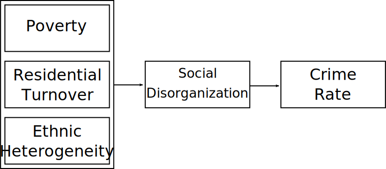
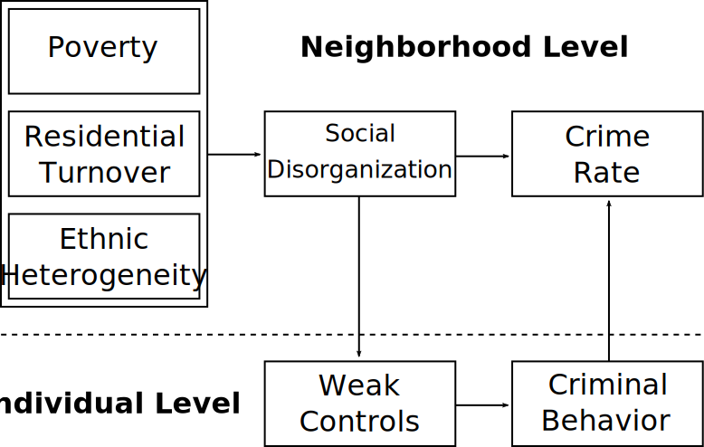

# Overview

* Context

* Social Control Model of Social Disorganization

   * Kornhauser's (1978) Critique
   * Sampson & Groves (1989)

* Systemic Model of Social Disorganization

   * Systemic Model
   * Levels of Social Control
   * Bursik & Grasmick (1993)

* Peterson & Krivo (2010)

???

Going to talk about three areas of work that revise and extend the classic social disorganization model

---
# Context

* Social disorganization out of favor

    * Whyte's (1943) *Street Corner Society*

???

Generally out of favor through 60s and 70s due to issues with tautology, difficulty applying it, inability to explain crime in some contexts; critiques from those finding highly organized social systems in poor and crime ridden neighborhoods

--

* Individual models of crime

???

Subcultural and strain models grew in popularity; so-so to weak support but persistently used to explain deficiencies in social disorg models while staying away from inherent criminality models that came before

--

* Resistance to social control

???

Evidence against monolithic value systems; ideological resistance to enforcement of conformity--belief in embracing differences in values

--

* Resistance to natural / ecological model of development

   * Logan & Molotch's (1987) *Urban Fortunes*

???

Layout and organization of cities is not natural, market-based, or product of residents but product of capitalist production and external political forces.

Logan & Molotch state neighborhood inequality persists because it profits the growth machine in collusion with public officials and businesses

---
class: inverse
# The Social Control Model

---
# Kornhauser's Critique

* No evidence for delinquent subcultures

???

Delinquents have conventional norms, just occupy disadvantaged position
   
Partly Hirschi's argument--delinquents and delinquent groups generally espouse conventional values but are weakly bound to them.

Disadvantaged position makes costs for delinquent low and gains relatively high

--

* Delinquent subculture incompatible with social disorganization

   * Delinquent subculture can't exist without disorganization
   * Disorganization produces delinquency absent subculture
   * Disorganization *does* produce cultural attenuation

???

Kornhauser basically says social disorganization's key idea is incompatible with deviant subculture. Delinquency can't be caused be an autonomous delinquent subculture if it is also caused by absence of controls. Control argument says if you removed everyone from community and replaced with new people, you'd have high delinquency due to institutions being gone. But subculture argument says you'd have no delinquency.

Her argument: Disorganization precedes and causes any apparent subculture and it is not self-sustaining--it is a symptom of controls. This is essentially using Hirschi's argument about control vs subcultural theories.

For Kornhauser, lack of controls makes delinquents and precedes any delinquent grouping.

Kornhauser does permit that disorganization may produce cultural attenuation: Disconnection between values and practical reality

--

* Recast social disorganization as pure social control model

   * Controls derived from stable, interconnected institutions

--

* Disorganization impedes internal and external controls

   * Socialization into cultural values
   * Supervision and surveillance
   * Stakes in conformity
   * Power of others to enforce role obligations

???

Enforcement of role obligations includes things like requirements of work, school, etc.

Kornhauser's approach is linked closely to Hirschi. There is a dominant set of cultural values, socialization is part of social control.

Social disorganization negatively impacts every element of bonds

---
## Kornhauser's Social Disorganization

 

.image-75[

]

???

This is a very simple looking model because it is just a macro control model. The control model is very simple! Social disorganization is just controls or bonds.

---
## Kornhauser's Multilevel Model

 

.image-75[

]

???

You can also make this a multilevel model.

The manner in which social disorganization impacts crime goes through controls on individuals.

Key critiques for Kornhauser's model are the same as for Hirschi's control model. Also criticized for misunderstanding and misrepresenting cultural transmission element of Shaw & McKay (as well as differential association and social learning crime theories)

---
# Sampson & Groves (1989)

* Problem: Shaw & McKay's *real* model never tested

   * No measures of disorganization
   * Survey data can get this

--

* Social disorganization as:

   * Friendship networks
   * Supervision of teen peer groups
   * Participation in voluntary organizations

???

Based on Shaw & McKay--but also Kornhauser--focus is on controlling youth.

Friends proxy for recognizing strangers and ability to engage in guardianship.

Voluntary orgs are problem solving capacity and institutional capacity; we'll get to role of orgs in systemic model shortly

Important thing is these all come before crime and delinquency. This eliminates tautologies.

--

* Social disorganization caused by usual three factors

???

Socieconomic disadvantage, residential instability, ethnic/racial heterogeneity

These have been mostly stable since Shaw & McKay

--

* No subcultural component--this is a control model

   * So Shaw & McKay's complete model *still not tested*

???

They mention youth delinquency may link to adult criminal careers but aren't studying it

This is fundamentally a version of Kornhauser's model

So core Shaw & McKay model is tested here but it completely leaves out the rich delinquent tradition component

I am not familiar with any modern social disorganization work which uses a delinquent tradition model at the lower level--might be out there

--

* Helped revitalize social disorganization theory

???

This paper was a major landmark bringing social disorganization back, especially in combination with important work from Bursik. Set stage for major work on neighborhoods over next three decades.

---
class: inverse

# The Systemic Model

???

A parallel vein of research on social control in communities was occurring at same time

---
# Kasarda & Janowitz (1974)

* What makes people invested in their neighborhood?

   * What matters is duration of residence--takes time to become embedded
   * Local social ties produce identification and sentiment
   * Behaviors to improve neighborhood come from investment

???

This is urban sociology work emerging from foundation in Chicago school, particularly Park & Burgess (of concentric zone fame)

Interested in using survey data to adjudicate between different models of people's relationship to urban space

Basically Wirth said population size and density makes people less attached to place, but Park and Burgess said that isn't it--it is time spent there and connections formed

--

* The systematic model:

>  The local community is viewed as a complex system of friendship and kinship networks and formal and informal associational ties rooted in family life and on-going socialization process.

???

The idea is communities are an interlocking system. Because they're based on ties, communities functon best when ties are many and stable.

--

* Janowitz:

   * Social control doesn't need universal norms
   * Control is about preventing behavior that interferes with group goals

???

Related to this, Janowitz was revitalizing classic social control theory

Gist is social control is not coercive--it is about groups regulating themselves to accomplish shared goals; imagine how mostly consensual rules of, say, classroom behavior facilitate learning.

This means moral component not vital: Consider the group, consider its goals. There may be a moral investment in the idea of learning or classroom but the rules are pragmatic not moral in nature.

Note it is also *not* socialization in the common sense--social control is group and goal specific.

---
### Forms of Social Control (Hunter 1985)

* Integration of systemic community model with social control

???

Hunter elaborated the connection between the system of ties in communities and social control.

--

* Three levels of networks for social control

   * Private: Family and friends
   
      * Based on giving/withholding sentiment, support, and esteem

???

Sentimental relationships

--
   * Parochial: Stores, schools, churches, voluntary orgs.
   
      * Based on informal sanctions and status

???

Relationships among neighbors without sentimental attachment

--
   * Public: Outside agencies and organizations
   
     * Allocation of resources to indigenous organizations
     * Relationship with police

???

Key element here is the ability to secure goods and services from outside agencies, such as getting the police to intervene or city to enforce something like zoning.

--

* High crime is caused by "disarticulation" between levels

???

Each level of social control deals with a different sphere of life and they have some overlap.

Higher crime may be result of weakness in some level but more likely to be due to disconnect or failure to coordinate.

For instance, community expects the government to regulate incivilities in public space but the government sees this as outside their bounds.

Must negotiate a solution that addresses it.

---
### Systemic Model of Social Disorganization

* Bursik & Grasmick (1993) *Neighborhoods and Crime*: Integrate systemic model with social disorganization.

   * Kasarda & Janowitz's (1974) community attachment
   * Kornhauser's (1978) control model
   * Hunter's (1985) three levels of control

???

In preceding articles and then the book, the authors wove together the threads into a cohesive model of systemic social disorganization

   
--

* Internal and external network connections are key

   * Networks among individuals and institutions
   * Networks with external actors, institutions, and agencies
      * Competition for resources (Logan & Molotch 1987)

???

Bursik & Grasmick say Shaw & McKay were too focused on immediate family socialization and social control to neglect of institutions and connections between them.

Also, importantly, ability to coordinate efforts locally and pull resources from outside

Neighborhoods may be in political competition for scarce resources; may be hierarchy on ability to make demands.

--

* Bursik assumption: Residents share goal of freedom from threat of crime.

   * Social control is regulation of residents and visitors to attain this.

???

This is taking Janowitz's conception of social control

Not about morality--about maintaining shared goal of basic safety; slight relaxation of Hirschi and Kornhauser universal morality argument; still underlying assumption of mostly universal motivation

--

* Fear of crime may produce withdrawal--reducing social control

   * May also reduce investment, business patronage
   
???

This is a novel component: Acknowledgement of feedback effects. Crime may be result of social control, but crime may also reduce social control by making people afraid.

We'll return to this when we talk about Broken Windows

---
## Systemic Social Disorganization

 

.image-100[

]

.footnote[Adapted from Bursik & Grasmick (1993:39)]

???

Wow, huge model!

Still simplified: Omits some feedback paths like crime destabilizing neighborhoods

---
# Empirical Evidence

* Support for the systemic model

   * Socioeconomic structure predicts ties
   * Various levels of ties predict crime
   * Evidence for feedback processes

???

There is general support for the systemic model; social structures mediate effects of socioeconomic structure

There's also good evidence for feedback processes: crime and fear of crime negatively impact social control and its antecedents

--
   
* Lingering issues

   * Dense ties exist in high crime areas
   * Some low crime areas have few dense ties
   * Low crime in absence of exercise of social control
   * Challenging to operationalize
 

???

Systemic model can't explain certain categories of neighborhoods

There are urban neighborhoods characterized by both high crime and pervasive dense networks and active organizations

There are also urban neighborhoods with very few ties, few organizations, and basically no crime

There are also neighborhoods with no evidence of exercised social control but little or no crime

The full systemic model is also difficult to operationalize: It has three levels of networks to measure and capturing actual social control behavior is difficult. Hard to also capture socialization.

---
# Divergent Social Worlds

* America's racial macro-context

   * Pervasive segregation
      * Massey & Denton (1993) *American Apartheid*
   * Conditions of life are racially structured
   * Race does not cause disadvantage--or crime

???

Only going to touch on this for a bit--still a lot to read.

So far they've set up the context: America has pervasive segregation which results in racial structuring of living conditions.

Key concept here is race doesn't cause these conditions--these conditions are a result of racialized policies and behaviors.

A key idea in Massey & Denton's work is nothing will be able to address socioeconomic problems of minority groups in US without dealing directly with discrimination and prejudice in housing markets.

--

* Segregation as a defining structural variable

   * Impedes competition for outside resources
   * Structures opportunities
   * Sustained by dynamic process of white flight

???

In their social disorganization model, one can imagine segregation as being a key factor which precedes the rest of the social disorganization model.

Racial composition conditions all structural variables. It also conditions later ones as racial composition alters how, for instance, agents of social control respond (or don't)

Peterson & Krivo do not have ability to measure the social structures with mediate the effect of segregation and socioeconomic factors on crime--one can imagine any of the forms of social disorganization model as working here.

---
class: inverse
# Questions

---
# For Next Time

* Sampson, Robert J., and William J. Wilson. 1994. “Race, Crime and Urban Inequality.” In *Crime and Inequality*. Edited by J. Hagan and R. Peterson. Stanford: Stanford University Press

* Sampson, Robert J. 2006. “Social Ecology and Collective Efficacy Theory.” In *The Essential Criminology Reader*. Edited by S. Henry and M.M. Lanier. Boulder, CO: Westview.

Things to pay attention to:

* Sampson & Wilson (1994):
   * Context: 1990s crime peak, looking back to 1970s
   * Reincorporation of cultural elements of social disorganization
   
* Sampson (2006)
   * Limitations of models based on dense social ties
   * Social capital conception of networks--ties are resources

