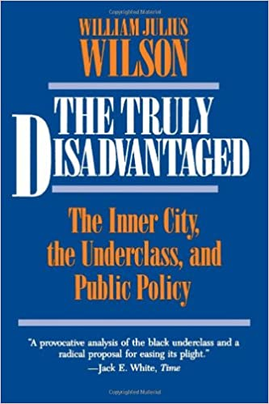

# Overview

* Urban underclass debate

   * Wilson
   * Massey
   * Quillian

* Urban Underclass and Social Disorganization

---
class: inverse
# Urban Underclass

---
# Moynihan Report

> Three centuries of injustice have brought about deep-seated structural distortions in the life of the Negro American. At this point, the present **tangle of pathology** is capable of perpetuating itself without assistance from the white world. The cycle can be broken only if these distortions are set right.

--

* Context: War on Poverty (1960s)

???

National poverty rate approaching 20%

Broad programs to address poverty in US

Moderate evidence for positive effects, especially for elderly which went via social security

Since poor are disproportionately minority, benefits concentrated there--led to backlash in 1970s as well-off whites perceived they were subsidizing poor inner blacks.

--

* Evidence:

   * Unemployment dropping but welfare increasing
   * Female-headed families: 25% of births out of wedlock (1965)

--

* Thesis: Legacy of slavery and Jim Crow disrupted family structure

   * Matriarchal structure out of line with mainstream

--

* *Civil rights alone will not produce racial equality*

   * Must restore family structure

???

Moynihan was labor secretary under LBJ--later served under other administrations and was professor at Harvard, New York Senator from 77 to 2001.

Also argument that black culture had become matriarchal, weakening ability of black men to be authority figures; not inherently problematic, but rather a problem because America is patriarchal.

A self-sustaining tangle of pathology created by centuries of subjugation--even if structural conditions producing it removed, it will self-perpetuate. Must intervene to rebuild the family.

---
# Competing Arguments

.pull-left[
### Culture of Poverty

* Legal equality achieved

* Culture and value system sustains poverty

* Underclass must lift itself up

* Welfare creates dependence

]

???

Poverty-sustaining value systems
   
Critique here is this seems to suggest people could just stop being poor by changing their values. Technically Moynihan wasn't saying this--it was a historical oppression argument. 

But conservative politicans latched on: civil rights made everyone equal, now only racial self-help can solve problem. 

Charles Murray and others associated with this thesis. 

Belief in culture of poverty can produce a logical next step of punitive crime policy.

--

.pull-right[
### Victim Blaming

* Diversion from racism

* Systematic racism maintains underclass

* No alternate culture or value system

* Unwillingness to engage with behavior

* Affirmative action and welfare address underclass

]

???

Obviously there was strong reaction to this--the actual origin of the popular use of "blaming the victim" was a response to Moynihan report

From the left it was seen as a diversion away from racism

At same time, unwillingness, as WJ. Wilson says, "to describe any behavior that could be construed as stigmatizing or unflattering to people of color."

The left focused on affirmative action and welfare policies to reduce inequality

---
# William Julius Wilson

.pull-left[
* Character of inner-city has changed since 1970

* Concentrated disadvantage:

   * Female-headed households
   * Poverty
   * Welfare
   * Violence and drugs

* An underclass

* Thesis: It's the economy!
]

.pull-right[
.image-full[

]
]

???

Wilson is one of most esteemed living sociologists. Focus is macrohistorical study of urban black disadvantage.

On the one hand, he acknowledges the existence of a black underclass in the inner city characterized by everything in Moynihan report--but rejects culture of poverty argument.

On the other, he questions how, if racism is driving everything, did things decline so much more rapidly since 1970 than they did prior during Jim Crow.

Underclass is heterogenous group of families and individuals outside mainstream occupation system, includng those engaged in street crime and deviance, and those exposed to long term poverty and welfare dependency--and all sharing the same social environment.

His thesis is macro structure of economy has changed depriving inner city of work

Directly engages with cultural behavior under concentrated disadvantage

Results in isolation from opportunity, irrelevance of conventional lines of behavior

Reliance on welfare and illegal gains for income; no work means no marriageable partners for women

---
# The Underclass

> Not only are children at risk because of the lack of informal social controls, they are also disadvantaged because the social interaction among neighbors tends to be confined to those whose skills, styles, orientations and habits are not as conductive to positive social outcomes (academic success, pro-social behavior, employment in the formal labor market, etc) as those in more stable neighborhoods. (Wilson 1987:484-485)

 
--

> Although the close interaction among neighbors in such areas may be useful in devising strategies, disseminating information and developing styles of behavior that are helpful in a ghetto milieu (teaching children to avoid eye-to-eye contact with strangers and to develop a tough demeanour in the public sphere for self protection), they may be less effective in promoting the welfare of children in the society at large. (Wilson 1987:485)

???

Culture of underclass is response to social structural constraints--particularly under conditions of absence of jobs.

We'll discuss the Code of the Street soon which elaborates these ideas

---
# Causes of Urban Underclass

* Great migration (1916-)

???

Southern African Americans from rural areas migrated en masse from Jim Crow south to northern cities for manufacturing work

Started around 1916, but a second larger wave during and after great depression

--

* Shift from manufacturing to service economy

   * Spatial mismatch
   * Economic / social isolation
   * Welfare and illicit economy
   * No marriageable partners

???

Main thesis here is changes in the structure of the economy have created inner-city conditions

Key driver to Wilson was massive shift from manufacturing to service economy in full swing during 1970s

Low-skill jobs in inner city greatly reduced, leaving jobs requiring advanced skills and education

Low skill work dispersing out to white suburbs; no appropriate jobs where black folk live

Spatial mismatch: Low-income households are not where suitable jobs exist due to residential segregation and shift to suburban employment.

Economic and social isolation means restricted job opportunities, limits access to informal job networks, reduces aspirations, and induces negative social dispositions.

Isolation, dependence, and limited opportunity induces perception of futility--inability to achieve societal goals due to experience with extreme economic marginality; they feel unprepared and world is hostile to their efforts.

Informal networks provide information on potential jobs, school, and training as well as support in applying for these opportunities

Higher and more consistent opportunities in illegal economy

--

* Legacy of discrimination

???

Historic racism created the ghetto and discrimination aggravates it--but larger problems are systematic and built into economy

--

* Middle-class blacks move to white suburbs: Role models exit

   * Absence of norms / patterns of steady work
   * Loss of key leaders
   * Collapse of institutions and organizations

???

Part of factors is departure of black middle class which destabilizes institutions as well as culture

No role models, no examples of mainstream success, no social connections one can leverage for opportunities

Policies recommended are broad universal social welfare and employment--tight labor market, higher wages, and general economic growth where accessible to urban blacks

???

---
# Massey's Counterpoint

* Urban underclass rooted in extreme residential segregation

???

Massey's argument is that it is primarily environmental and driven by racial discrimination

Black folk are concentrated in worst neighborhoods

--

* Segregation due to current discrimination

   * Mortgage lending, real estate, rentals
   * Racial preferences
   * Crime as code word for minority

???

Audit studies have continuously discovered biased practices in services that shape residential attainment

Racial preferences, particularly whites for homogenous communities, drive migration patterns

Description of neighborhoods as dangerous or high crime is really code for black residents

--
   
* Myth that middle class blacks moving to white neighborhoods

   * Segregation still high for well-off black families

???

Massey says middle class blacks are not departing; segregation is high regardless of race

Policies recommended here are dealing with racial residential segregation

---
# Quillian's Synthesis

* Must look at residential patterns over time

   * Middle class blacks moving to affluent neighborhoods
   * Whites moving out to other white neighborhoods

???

Quillian uses panel study of income dynamics data to track composition of neighborhoods and flows of people to and from them

Quillian's thesis is that both Wilson and Massey are right: middle class black folk are leaving but whites are fleeing the places those middle class black people go to.

--

* Results

   * Middle class blacks are in predominantly black neighborhoods
   * New impoverished neighborhoods left behind, increasingly black

???

This means middle class blacks end up in mainly black neighborhoods anyway; neighbs they leave behind are even more impoverished and increasingly black

--

* Later work: Three segregations

   * Racial segregation
   * Class segregation
   * Cross-race poverty segregation

> Policies that aim to provide broader housing choices may not deconcentrate poverty if blacks and Hispanics can only find places in the most disadvantaged desegregated neighborhoods.

???

Using demographic decompositions, Quillian shows three segregation processes going on. There's direct race segregation and segregation by class. But also, where minorities are not segregated--as is case for Latino pop--they are leaving near only poorest other-race neighbors. That is, where neighborhoods are integrated, it is mainly with poor whites.

---
# Wilson & Sampson (1994)

* Urban Underclass + Social Disorganization

> ... macrosocial patterns of residential inequality give rise to the social isolation and ecological concentration of the truly disadvantaged, which in turn leads to structural barriers and cultural adaptations that undermine social organization and hence the control of crime.

--

* Wilson's underclass thesis explains concentrated disadvantage

   * Overwhelming endorsement of mainstream values
   * Irrelevance in face of structural constraints
   * Cultural adaptation to constraints 

???

In general folks living in the ghetto believe in same values as those outside

The difference is living under very different constraints

Living under severe constraints results in social adaptations, some of which may appear to inhibit ability to take advantage of (scant) opportunities which do arise

We'll see the Code of the Street later for example

--

* Undermines local communities

   * Residents are unable to achieve collective values
   * Weak families (family structure impedes supervision)
   * Indifference or tolerance of crime

???

The mechanisms here are identical for whites and other groups, as well as in other countries

Wilson also notes this is all entangled with incredibly weak institutions in these neighborhoods which impede informal social control.

The result is high rates of crime and violence

The mechanisms described here may, for instance, be driving the patterns in Peterson & Krivo; question is the underlying mechanisms linking disadvantage and segregation to crime

---
class: inverse
# Discussion

---
# Some Questions

---
# Some Clarifications

---
# For Next Time

* Peterson, Ruth D., and Lauren J. Krivo. 2010. *Divergent Social Worlds*. Pp. 71-125

Things to pay attention to:
   