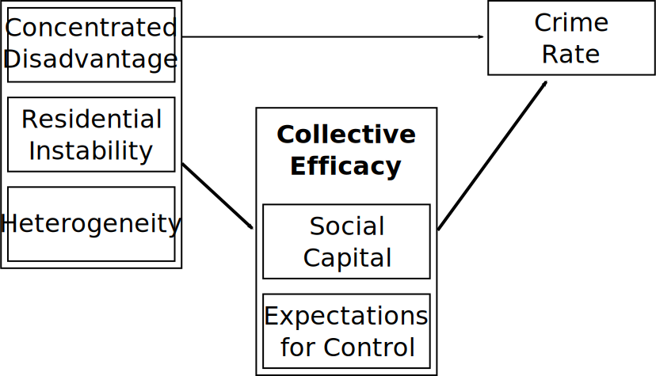

# Overview

* Social capital theory

   * Weak ties
   * Closure
   * Forms of social capital
   * Free-riding, sanctions, and zeal

* Collective efficacy and Community violence

* Seattle Neighborhoods and Crime Project

---
class: inverse
# Social Capital Theory

### *A bit of background*

---
# Capital

* Assets (stock) collected not for intrinsic value, but for producing other goods.

   * Not consumed by production (but may depreciate)
   * Can be produced

???

Capital increases your ability to produce goods, and those goods can often be used to acquire or produce more capital

--

* Forms of capital

   * Financial capital
   * Human capital
   * Social Capital
      * Modern conception: L.J. Hanifan (1916)
      * Key figures:
         * Pierre Bourdieu 
         * **James Coleman**
         * Robert Putnam 

???

Financial capital is obligations which can be liquidated--turned into money. This is stock value. Based on collective market perception of value.

Human capital is the collected skills, education, and productive capacity of individuals or groups of individuals.

Social capital is a bit different: It isn't an attribute of individuals at all, but an attribute of connections between people. I'll define it shortly.

Modern social capital theory in sociology (where it mainly emerged from) is associated with Bourdieu or Coleman. If you spend much time in Soc, you'll encounter both.

Putnam popularized it in greater society with Bowling Alone

We'll be focusing on Coleman-style social capital, as that sits at the roots of collective efficacy (Coleman overlapped at Chicago with Sampson).

---
# Social Capital

* Coleman: Aspects of social structure which facilitate individual *or collective* action.

???

This is broad!

--

* Inheres in social structure (network ties)

   * Attribute of collectives
   * Not possessed by individuals--but can be activated for gains

???

Social capital cannot exist without at least two people--and the more people that are involved, the more valuable it tends to be.


--

* Public good nature

   * Individuals invest
   * Whole network may benefit

???

Public goods are those that individuals can invest in but can't exclude others from using

Social capital between two people often benefits people outside that dyad--we'll get examples

--

* Examples:

   * Weak ties and bridges
   * Closure of social networks
       * Ex: Parents of other children

???

I'll discuss some examples, then get back to definitions.

---
# A Network

.image-100[

]

???

Networks are often simply drawn like this. This represents a group of people, most of whom know each other well--their ties are strong.

When a group of people all know each other well, they mostly have the same information and values. This can be good for getting some things done.


---
# Strength of Weak Ties

.image-100[

]

???

Weak ties are ties between acquaintances--members of other groups.

Often what is most useful to people or a group is new information from unfamiliar sources. Say info about a job in a different company or neighborhood.

Weak tie allows different kinds of information (e.g. job openings) to pass between Group A and Group B

The presence of a weak tie also makes the members of the groups which make that connection relatively more powerful and influential--they're brokers for information.

Mark Granovetter's influential work has shown how weak ties are vital for tasks like getting a job. People with more acquantainces acquire more novel information which can benefit them.

---
# Closure of Social Networks

.image-100[

]

???

Network structures like this can be directly relevant to crime control.

Consider two networks describing child friends and their parents.

If the parents know each other, they can share information to monitor and control their children

This is the classic "I'm going to call your mom" whupping-by-proxy

If they don't, the children have an information advantage--they can do things like tell each of their parents they will be at the others' house while they're out making trouble.

In criminology we call this intergenerational closure--and it is a predictor of delinquency!

Coleman hypothesizes that where individuals are weaker in a system--such as students vs. faculty or women vs. men--the individually disadvantaged parties are more likely to form tighter networks to generate social capital to level playing field. Example he gives is networks of women sharing reputations information about men they date. This info can facilitate generation of reputations--which can protect other women--or sanctioning via gossip and being close out of network.

---
# Types and Appropriation

* Types

   * Obligations, expectations, trust
   * Information
   * Norms and effective sanctions

???

Obligations, expectations, and trust are tremendously powerful; Coleman's classic example is Jewish diamond traders in New York. Diamonds are highly portable and valuable and difficult to determine exact value. Because of immense trust and interlocking connections of the community, they can entrust their goods to each other freely--making everyone able to work much more efficiently.

Another form combining obligations, expectations, and trust here reciprocated exchange. Things like loaning a neighbor tools. This creates future obligations--you can borrow from them in future. Favors breed more favors.

Norms and effective sanctions are social capital in Coleman's conception. Norms are expectations for behavior--which you can rely on to get things done.

Sanctions maintain norms and bring people in line with expectations.


--

* Social organization can be appropriated for other purposes

   * South Korean study groups
   * Friendship networks used to deal drugs

???

Social networks and capital can be used for purposes other than those for which they were created

A classic example of Coleman's is study groups of young South Korean radicals. Within high schools, churches, and small towns, existing social networks were appropriated to discuss radical political ideologies. These small cells operated effectively in secret and safety because of the pre-existing social capital--trust, personal knowledge, obligations. Only perhaps a single trusted member would ever contact other radical cells outside, limiting exposure.

Another example is drug dealing that occurs via friendship networks. The ties and cohesion facilitate trust necessary for efficient and safe drug sales and transmission of information. Having a friend who "knows a guy" is appropriation of social capital for a new purpose. Social capital is important for criminal networks!

---
# Externalities and Free-Riding

* Social capital requires individual investment

   * Investment is costly
   * Ex: Sanctioning (Norm enforcement)


???

To enforce anti-crime norms, you need people willing to intervene and do it. Intervention costs time and energy as well as risks of retaliation.

--

* Social capital is a public good

   * Benefits everyone in network
   * Ex: Anti-crime norms and expectations to intervene

???

Many forms of social capital, like norms backed by sanctions, benefit everyone in the network.

Even if you don't sanction, say, delinquent youth, you benefit from lower crime in neighborhood from others who do.

This makes it a public good--something you can't selectively exclude people from.

--

* Externalities

   * Benefits (costs) to others not considered when making choice
   * Generates under (over) investment

???

Public goods often suffer from underinvestment because a lot of the good produced by each individual benefits others; if they gained the full benefit, everyone would sanction.

Negative externalities are very common in markets. Pollution, for instance, may harm people living near a factory--the people in the area are paying a cost that should be born by the company instead. Many forms of regulation are to address externalities.

--

* Free-Riding

   * Incentive: Collect benefit, contribute nothing
   * System collapses if everyone does it
   * Second-order sanction problem

???

Primary collective action problem for social control is free-riding: You can just let everyone else take care of it.

But if everyone free-rides, there will be no social control at all. We have good evidence of this in psychology and microeconomic games.

Issue then is figuring out how to get people to intervene. Coleman notes this as a second-order sanction problem: You may need to sanction people for not sanctioning others!

Sanctions can be positive though--for instance, praising someone for intervening. Because praise is low cost to people praising, high value to receiver, it can generate a system that very strongly reinforces generation of the public good. Coleman calls this zeal.

---
class: inverse
# Sampson's Collective Efficacy

---
# Collective Efficacy

* Merge social disorganization with social capital theories

   * Informal social control reduces crime
   * Social capital facilitates informal control
   * Social ties generate social capital

--

* Collective efficacy is neighborhood capacity to achieve an intended effect

   * Intended Effect: Low crime and delinquency
   * Mechanism: (Child-centered) informal social control
   * Process translating latent social capital into action
   * Collective counterpart to Bandura's self-efficacy (individual agency)

???

Collective efficacy is a broad concept and can be used to explain many collective goals. Typically it is used to look at crime control, and mostly through child-centered social control (since most crime and deviance involves youth)

In this framework, social capital--trust and cohesion in particular--are passive resources; these are the classic ties in social disorganization

What matters is how these resources produce actual action--intervention against deviance

This is a framework about agency--how structure facilitates individual action; it is related to Bandura's framework which describes successful actions of individuals as the result of a combination of objective capability and subjective belief in ones ability.

--

* Collective efficacy inhibited by...

   * Heterogeneity through realization of common values
   * Disadvantage through deprivation of resources
   * Residential instability through disruption of social ties

???

Thus it looks a lot like the original social disorganization model!

---
## Social Capital & Collective Efficacy

* Neighborhood social capital (collective efficacy)

   * Intergenerational closure
   * Reciprocated exchange
   * Trust among neighbors
   * Kinship/friendship ties
   * Voluntary associations and activism

--

* Expectations for social control

   * Norms of intervention against deviance
   * Fostered by social capital (cohesion and trust)
      
???

Residents are likely to engage in social control when norms of appropriate behavior are clear and they feel a collective responsibility to enforce them

--

* Mechanisms

   * Direct intervention against deviance
   * Internalization produces deterrence or moral conformity


???


In high collective efficacy settings, these expectations of behavior are also internalized, producing a deterrent effect or moral basis for conformity

This means you can have a low crime neighborhood which stays that way because of high CE, but you may never see any social control actions

---
# Operationalization


* Collective efficacy is attribute of *place*

   * Interested in neighborhood capacity for social control
   * Not directly observable: Use individuals as informants

???

The key for CE is that it is an aspect of the neighborhood

It isn't directly observable either--crime can be inhibited by the capacity not the action! How do you measure this?

Survey individuals, but rather than asking about what they would do against crime, ask what they think neighbords in general would do

--

* Collective Efficacy

   * "If a group of neighborhood children were skipping school and hanging out on a street corner, how likely is it that your neighbors would do something about it?"
   * "If there was a fight in front of your house and someone was being beaten or threatened, how likely is it that your neighbors would break it up?
   

???

Two example items here, answer is in degree of agreement. Captures belief others would take action, which should be linked to both actual activity and normative expectations.

If you think people would intervene, you aren't likely to do something.


--

* Cohesion and Trust

   * "This is a close-knit neighborhood."
   * "People around here are willing to help their neighbors."
   * "People in this neighborhood share the same values."

???

This is capturing the necessary preconditions for CE. Assumption is that expectations arise in presence of social cohesion, trust, shared norms.

---
## Collective Efficacy and Crime

<br>

.image-90[

]


---

.image-100[

]

???

SNCS was a 2002-2003 stratified random sample of Seattle residents netting some 5000 respondents.

Included same CE measures as Sampson's PHDCN; were able to replicate much of the findings from Chicago in Seattle

Still building on these today

Our CE data are quite old--2003. Be nice to have more recent data but surveys are expensive.

---
# Pro-Social Behavior

* Collective efficacy is a general capacity to solve problems

   * Not just crime control
   * Health outcomes


--

* Correlates with many pro-social behaviors (Sampson 2012)

   * Voter turnout
   * Administration of CPR after cardiac arrest
   * Returning lost letters

???

In Great American City Sampson describes two forms of prosocial behavior strongly linked to collective efficacy

3,303 letters dropped across 343 Chicago NCs

--

* Updating collective efficacy using prosocial behavior

???


Because lost letter returns are highly correlated with collective efficacy, can use prosocial behavior to estimate more recent CE


---
## Seattle Lost Letter Experiment

Replication of [Milgram et al. (1965)](https://doi.org/10.1086/267344) and [Sampson (2012)](https://www.press.uchicago.edu/ucp/books/book/chicago/G/bo5514383.html).

--

2,938 letters were dropped on Seattle sidewalks for passersby to encounter.

???

This is a similar number of letters to Sampson but in a much smaller city--way higher density.

--

24 letters—8 per addressee—were dropped in each census tract:
  * Charles F. Landers Sr. (Personal)
  * Friends of Black Lives Matter (BLM)
  * American Neo-Nazi Party (Nazi)

???

Figured we could also test some hypotheses are same time. Vary the sender to see if it matters--this mimics Milgram, Mann, & Harter.

--

Mailed letters were received at a PO Box monitored by the research team.

Letters were numbered and geocoded to drop locations.

???

Receiving letters back at PO Box indicates they were mailed; also recorded condition of letter--sometimes things written on them and whatnot.

Geocoded where they were dropped so we know exact spot it came from; map this to the city.

---
# Lost Letter: Results

.smallish[

| *Study* (Letter Address)         | *Return Rate* | $\rho(CE)$ 
|:--------------------------------|--------|------------|
|*Milgram et al. (1965)*<sup>1</sup>         |        |            |
| &nbsp;&nbsp; Medical Research Associates    | 70%    |    --      |
| &nbsp;&nbsp; Friends of the Community Party | 70%    |    --      |
| &nbsp;&nbsp; Friends of the Nazi Party      | 25%    |    --      |
|*Sampson (2012)*<sup>2</sup>                | 33%    |    .41     |
|*SNCP* (2016)<sup>3</sup>                          |        |            |
| &nbsp;&nbsp; Charles F. Landers Sr.         | 79%    |    .35     |
| &nbsp;&nbsp; Friends of Black Lives Matter  | 71%    |    .32     |
| &nbsp;&nbsp; American Neo-Nazi Party        | 24%    |    .03     |

* Our results closely mimic Milgram et al. (1965).
* Collective efficacy does not predict Neo-Nazi letter returns.
]


.footnote[
[1] New Haven, CT; [2] Chicago, IL; [3] Seattle, WA
]

???

Study specifies which study and what specific letter addressee. Return rate is the overall proportion of letters returned of that type. The last column is the correlation between returns of that letter type and collective efficacy by neighborhood.

First thing is our experiment is remarkably close in results to Milgram's original--and Seattle has way higher return rate than the Windy City.

Next finding is we have similar but slightly lower correlation with collective efficacy--but this is because our CE data are rather old! In a follow-up simple model, we estimate we capture CE quite well. Can use our lost letter as an updated or alternative CE measure.

---

.image-100[

]

???

Here is a map of CE and mailed letter rates for Seattle. They map on pretty well!

Notice the university is missing on both and one area is gray on the right. We took no survey data from the University and did not do experiments in SoDo because it is weird.

---
# 2016 Election Turnout

.image-100[

]

???

As a supplement, here you can see every single letter of each type as a dot (mailed vs not) over a map of voter turnout. This is mostly to show off how many we dropped but if you're good at reading ugly maps you'll see mailback rates for BLM and personal letters map on to voter turnout quite well. We predict prosocial behavior!
   
---
## Evidence for Collective Efficacy

.pull-left[
.image-100[

]
]
.pull-right[

* Support in USA and internationally

* Strong evidence in cross-section

* Mixed evidence in longitudinal

* Still need more research

]

???

Evidence for collective efficacy's impact on crime is fairly strong

Strong evidence in cross-sectional studies across world, in particular US samples such as Chicago and US

Evidence in longitudinal studies is less strong, but is evident in Chicago and Stockholm; there's been negative evidence in panels in The Netherlands, rural North Carolina, and Australia--but those tests appear underpowered.

Basically what we need are strong, long time period, multi-city evaluations.

---
# Outstanding Issues

* What if expectations for control are based on observed crime?

   * Matsueda & Drakulich (2015)

* What is the mechanism by which child-centered social control impacts *serious* crime?

   * Is there really direct intervention?
   * Is it reputational?

* How do we build collective efficacy?

* How does opportunity relate to collective efficacy?

---
class: inverse
# Discussion

---
# Some Questions


* "Does the conclusion in Chapter 6 make you feel hopeful or hopeless? The authors convey that any change to this hierarchy will not come easily. Do you agree or disagree? Do you feel empowered with these facts to advocate for change or does it convince you there's no way you'll make a difference?" and "Do you think the US will implement [programs to combat the disadvantages African American and other minority communities face] with how the country is right now?"

--

* Did you grow up in or near a neighborhood you think had high (or low) collective efficacy? A place where you or others were likely to get watched carefully and scolded (or even have the police called on you) for misbehaving? What gave you that impression / how did you know?

--

* "The book states that 'disadvantage is one of the strongest and most consistent predictors of neighborhood violence'. What action can we take to [combat] disadvantage...?"

---
# One More

* "So, how can we improve collective efficacy within neighborhoods that rank very low on the scale? How can people agree on these shared expectations and social cohesion?"

---
# Some Clarifications

--

* How does collective efficacy account for people who commit crimes far away from where they live?

???

The mechanism by which collective efficacy operates is mildly ambiguous but is stated to include both actual intervention against crime and also awareness that people will intervene--which is essentially deterrence. Places high in CE regulate their own members and also strangers, in theory.


--

* Sampson: If community ties need to be "activated" in order to produce collective efficacy, but being close to places with low collective efficacy reduces this chance, how does the network of communities rely on one another and perhaps create a circular cycle of no one being able to achieve collective efficacy? What contributes to this cycle?

???

This is part of the concentration of disadvantage. Poor, segregated neighborhoods are near other poor segregated neighborhoods, and not only are they weakly organized with each other, they wouldn't be in a strong position to make demands if they were. Big contributors are segregation, concentration of economic and political power.

--

* "[D]oes the segregation between the two groups also correlate with the chance of employment in these same areas?"

???

It does! But most analyses control for employment differences as best as possible. One issue might be segregated areas have more people out of workforce. Have to use proper measures of employment.

--

* "Is there any practical way in which society can reduce gang violence?"

???

Yes! There's good evidence for a number of approaches to gang violence. Operation Ceasefire is a fairly famous example. Basically, successful approaches have targeted specific areas and known gang members, mixing social work community approaches with enhanced police attention. Approach generally called focused deterrence.

--

* "In terms of spatial influences and distribution, how does the physical clustering or physical distance between properties in neighborhoods affect social bonds and ultimately crime rates? Is it any different or any connection to the spatial distributions of race and class in neighborhood populations?"

???

It depends. Density doesn't always linearly relate to social ties. The qualitative structure of places can matter a lot. There are many more factors than just the spacing and layout of properties in rural places versus suburbs versus urban villages versus a high disadvantage core-city neighborhood. Density may just enhance or aggravate good or bad conditions.

---
# More Clarifications

* If nearby neighborhoods affect each other, what would happen to each of them if we put a high crime black neighborhood near a low crime white neighborhood? And if neighborhoods affect their neighbors, and then those neighbors affect their neighbors, doesn't this propagate forever?

???

Conditions in cities are dynamic processes and neighborhoods have histories. The dynamics of cities mean situations like this rarely exist, because as a neighborhood gets poorer and crime increases, whites leave nearby neighborhoods. But if you could plop them down, you'd see interesting things. There would probably be spillover of violence into the white area but it would be likely to provoke strong responses and demands for city action. Much more likely to see crime go down in the poor area more than it would go up in the white area. If situation persisted, you'd expect white folks to begin moving out.

As for the second part--kind of yes. It decays toward zero though. Imagine you start with a neighborhood with crime at 1 but neighbors receive 20% of that crime. By the neighborhood once removed, it is contributing only 4%, then 0.8% to the next order. Decays quite rapidly. Makes it hard to model properly though.

--

* "Can similar results be assumed [from Peterson & Krivo] when it comes to white collar crime?"

???

No, almost assuredly not. The interesting thing about white collar crime is that it doesn't cluster and is largely committed by better-off people. Social disorganization theory generally describes predatory crime and violence.

--

* "How does racial segregation in neighborhoods inhibit collective efficacy besides a 'lack of common local interests'?"

???

Segregation, for Peterson & Krivo, is sort of an underlying cause and magnifier of other problems. If disadvantage wasn't unevenly distributed by race, segregation would not cause the issues we see. The problem is segregation massively concentrates disadvantage, and socioeconomic disadvantage is the largest predictor of collective efficacy and crime.

--

* "Why is there lower crime in the South overall even though there is more gun violence, and a larger subculture of violence? Could this be a result of there being more collective efficacy in the South for various reasons?

???

The finding of lower crime in the South should be taken with caution. Their sample has no deep south cities where the crime is particularly high--likely because those police departments would not share data. The lower crime rate in South is also while, essentially, controlling for racial composition. This basically means the southern cities in their sample appear unusually lower crime than would be expected given their racial composition, segregation, employment, etc. So they do have high crime--just lower than what you'd expect.

---
# Two Last Ones

* "How do areas with larger immigrant characteristics have lower crime? How do immigrants improve the state of a neighborhood (in terms of crime rates)?"

???

Evidence for a protective effect of immigrants is somewhat mixed but relatively consistent in small neighborhood units. The exact reason isn't completely clear. Individual level data indicates foreign born immigrants are on average very much less likely to commit crime. In neighborhoods, the hypothesis is strong networks, since most clusters of immigrants are the result of chain migration--families and folks from the same cities or general areas all going to the same neighborhood. Due to language and culture, they cluster together and form tighter than usual groupings. The heterogeneity hypothesis of Shaw & McKay may not pan out in this regard.

--

* "What do Peterson and Krivo mean when they say 'higher deprivation is connected with less and less change in criminal violence'?"

```{r, echo=FALSE, fig.align="center", fig.height = 3.2, fig.width=6, dev='svg'}
plot(function(x){0.4*x - 0.2*(x^2)}, xlab = "Disadvantage", ylab = "Crime")
```


---
# For Next Time

* Wilson and Kelling. 1982. "Broken Windows: The Police and Neighborhood Safety." *The Atlantic Monthly*, March, pp. 29-38.

* Sampson, Robert J. and Stephen W. Raudenbush. 1999. "Systematic Social Observation of Public Spaces: A New Look at Disorder in Urban Neighborhoods." *American Journal of Sociology* 105(3): 603-651.

* Keizer, Kees, Siegwart Lindenberg, and Linda Steg. 2008. "The Spreading of Disorder." *Science* 322:1681-1685

Things to pay attention to:

* Assumptions and causal relationships (e.g. about disorder, fear, and crime) in Wilson & Kelling (1982)

* The relationship between broken windows and informal social control

* Contrast in findings between Keizer et al. (2008) and Sampson & Raudenbush (1999)

???

Wilson & Kelling's piece is the origin of broken windows theory--one of most influential pieces of public crim scholarship of all time. You may be familiar with broken windows or order maintenance policing. Consider whether it actually supports those policing strategies.

Sampson & Raudenbush is incredibly important AJS paper contrasting collective efficacy and broken windows. Methods are complex. Read them, but focus on theoretical setup and conclusions.

Kezier et al. is highly influential field experiment on broken windows. We've replicated it in Seattle many times and will chat about it next time.