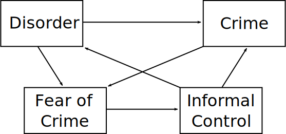
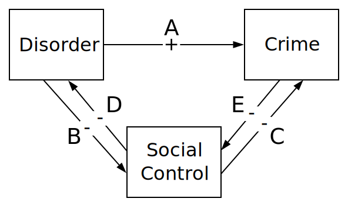
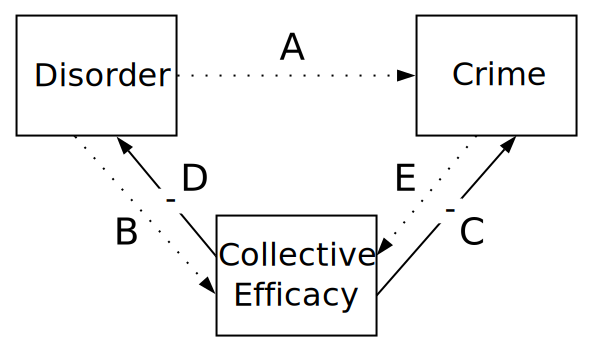
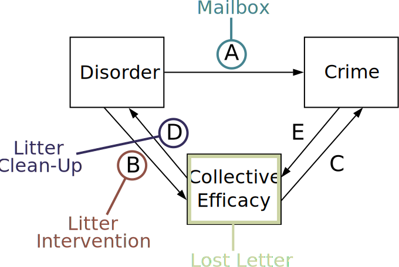
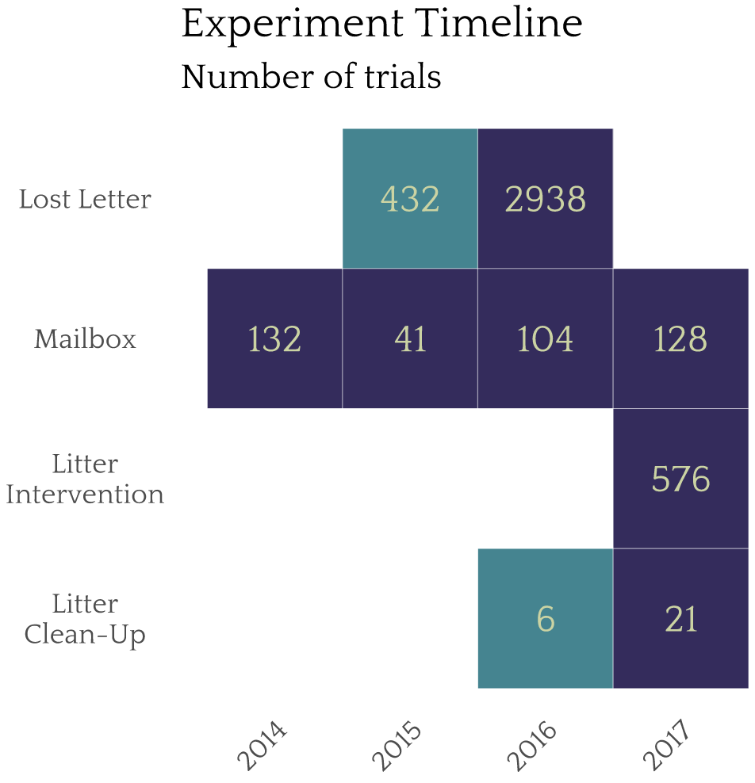
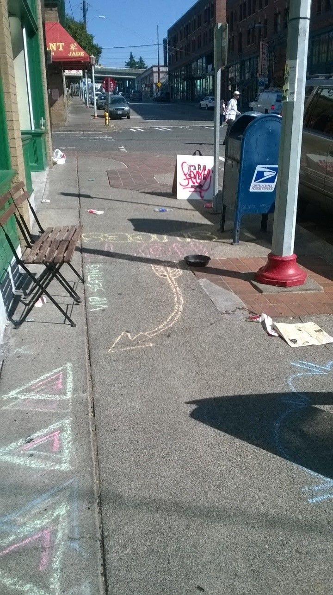
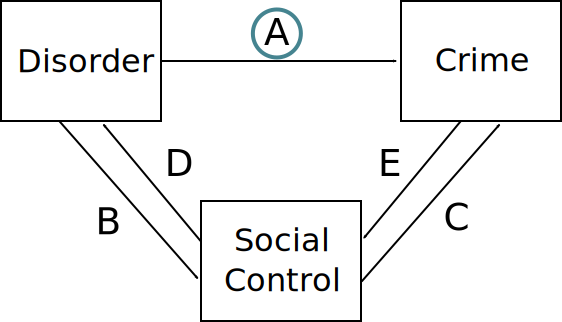
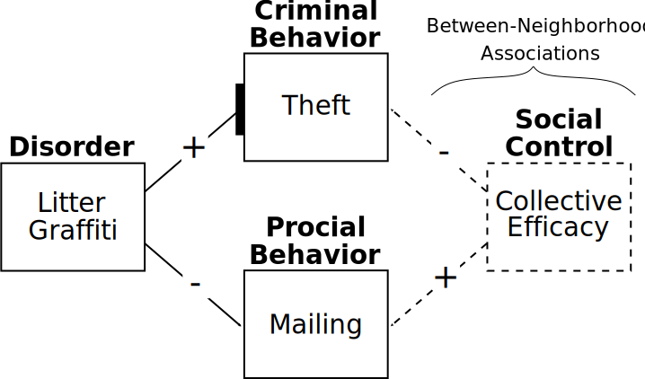

# Overview

* Broken Windows

   * Zero-Tolerance Policing

* Broken Windows versus Collective Efficacy

* Field Experiments

---
# Broken Windows (Wilson & Kelling)

* Physical and social disorder (incivilities)

   * Physical: Graffiti, dilapidated buildings
   * Social: Public intoxication, panhandling

--

* Disorder signals to criminals indifference to crime

   * Low probability of being seen, reported, arrested

--

* Disorder also undermines community controls

   * Signals neighborhood is out of control, creates fear
   * Mechanisms: Withdrawal from public life; residential mobility

--

* Key Idea: Disorder is not individually harmful but it accumulates

   * Intervene when problem is still small
   * Intervene where problem overwhelms community control capacity

---
# Broken Windows

 

.image-75[

]

---
# Order Maintenance Policing

* Residents worry more about low-level disorder than major crimes

   * Consensus on disorder
   * Goal: Stabilie informal control by reducing fear of crime (indirect path)

* Targeting disorder with policing (deterrence)

   * High certainty
   * Minor penalties
   * Ex: Fare evasion, public drinking
   * Mechanism: Deter offenders (direct path)

* New York: Bill Bratton, under Giuliani

   * Stop-and-frisk

---
## Evidence for Policing Disorder

* [Crime (Braga et al. 2015)](https://doi.org/10.1177/0022427815576576)

   * Modest reductions on crime
   * Aggressive order maintenance works poorly
   * Targeting specific places more effective
   
--

* [Fear of Crime (Weisburd et al. 2015)](https://doi.org/10.1177/0022427815577837)

   * No evidence for reduction of fear of crime
   * No evidence for improved informal social control

--

* Unintended consequences

   * Alienating communities from police
   * Increased racial disparities
   * Criminalization of homelessness and mental illness

---
# Fixing Broken Windows

*Rather than punish people for having broken windows, why not help repair them?*

Kondo et al. (2018) "Neighborhood Interventions to Reduce Violence*

---
class: inverse
# Broken Windows versus Collective Efficacy

---
# Broken Windows

[Wilson & Kelling (1982)](https://www.theatlantic.com/magazine/archive/1982/03/broken-windows/304465/) describe a system where community disorder (1) increases crime by 
signalling low social control to offenders and (2) decreases actual social control by reducing willingness to use public spaces.

--

.pull-left60[

]

.pull-right40[
* A: Disorder signals low guardianship which increases offending.

* B, E: Disorder and crime constrain social relations and impede control.

* C, D: Social control inhibits both disorder and crime.
]

.centernote[
*Bi-directional effects make testing this difficult.*
]

---
# Collective Efficacy

[Sampson & Raudenbush (1999)](https://doi.org/10.1086/210356) contend that disorder and crime are both manifestations of low collective efficacy—the community's capacity for informal social control.
--

.pull-left60[

]

.pull-right40[
* C, D: Disorder and crime are products of low collective efficacy (social control) which is exogenous (B, E).

* A: Disorder has no direct impact on crime.
]

.centernote[
*This is a simple model--and can test if A, B, or E paths exist*
]

---
# Field Experiments (Keizer et al. 2008 *Science*)

* Begin with broken windows hypothesis

* Mechanism: Norm violation weakens goal to act appropriately

* Descriptive norm violation (graffiti) inhibits injunctive norms (theft, littering)

* Conducted six experiments to examine cross-norm effects

* Note: Examining norm violations, not serious crimes

---
# Keizer et al. (2008)

Keizer et al. used disorder manipulations and recorded norm violation with field experiments in Grongingen, the Netherlands. 

Multiple interventions show a consistent positive relationship with norm violation.
--

.pull-left[

]

.pull-right[
* Powerful causal effect of disorder on multiple forms of norm violation (A).

* Single sites in one city: No examination of context, indirect pathways, or reciprocal effects.
]

*Can these be replicated in other locations? What is the influence of context?*

---
class: inverse
# The Seattle Experiments 

---
# Experiment Diagram

.image-75[

]

* Embed experiments in disparate Seattle neighborhoods
* Replicate and extend Keizer et al. (2008) and Sampson & Raudenbush (1999)

???

Paths E and C are hard to isolate

Can't use crime as an intervention

Crime is a rare event to observe

Sanctioning is difficult intervention

---

.image-75[

]

---

.image-90[

]

---

# Mailbox: Method

.pull-left[
.image-75[

]
]

* A letter containing a visible $5 bill is left near mailbox for passersby to encounter.

--

* Litter and a sign board with graffiti are introduced to manipulate disorder.

--

* Researchers record whether participants mail, steal, or ignore the envelope.1

.footnote[[1] Perceived sex, age, and group size of participants were also recorded to adjust for compositional differences of tracts.]

--

* We conducted 405 trials with 3,671 participants in 20 Seattle census tracts.

---
# Mailbox: Model

Objective: Causal test of direct effect of disorder on crime (A).

 

.image-62[

]

---

# Mailbox: Model

Our Experiment: Tests of causal direct effects of disorder on crime and prosocial behavior.
 

.image-75[

]

---

# Mailbox: Results

<table style="width:70%">
  <tr>
    <td style="font-size:115%" colspan="5">Mailbox: Participant Actions</td>
  </tr>
  <tr>
    <th>Condition</th>
    <th>Walk-By</th>
    <th>Mail</th>
    <th>Theft</th>
  </tr>
  <tr>
    <td rowspan="2">Control</td>
    <td>1629</td>
    <td>208</td>
    <td>33</td>
  </tr>
  <tr>
    <td>87.1%</td>
    <td><strong>11.1%</strong></td>
    <td><strong>1.8%</strong></td>
  </tr>
  <tr>
    <td rowspan="2">Treatment</td>
    <td>1637</td>
    <td>136</td>
    <td>28</td>
  </tr>
  <tr>
    <td>90.9%</td>
    <td><strong>7.6%</strong></td>
    <td><strong>1.6%</strong></td>
  </tr>
</table>

Key Findings:

* Disorder has no impact on theft.

???

No positive impact *anywhere* at all, even.

We had much lower rate of theft than seen in Keizer's experiments as well, even though we have higher property crime.

--

* Disorder reduces the likelihood of mailing—resulting in the letter remaining on the ground longer.

???

Also noteworthy that vast majority of people here walked by while Kezier said it almost never happened

--

* Collective efficacy is associated with lower theft, but not more mailing.

---
# Experiment Summary

* No disorder effect on theft (unable to replicate Keizer et al. 2008).

* Disorder attenuates mailing letters--low risk prosocial behavior (mailbox)
   * Perhaps disorder undermines informal social control--as suggested by Broken Windows.
   * *However, disorder had no effect on sanctioning--higher risk prosocial behavior (littering)*

* Context matters for prosocial behavior
   * Letter addresses affect mail back rates (lost letter)
   * *Race / gender of litterer effects sanctioning (littering)*
   
* Collective efficacy is associated with fewer thefts (mailbox)

* Collective efficacy is associated with mailing back letters (lost letter)

---
# Conclusions about Broken Windows

* May be a small effect of disorder on crime

   * Does not justify order maintenance policing
   * May be specific to some types of disorder
   
* Unanticipated negative consequences

   * Police dislike focusing on incivilities
   * Potential for racial profiling
   * Undermines citizen-police relations

* Better approaches

   * Building collective efficacy
   * Disorder remediation

---
class: inverse
# Discussion

---
# Some Questions

---
# Some Clarifications

---
# For Next Time
