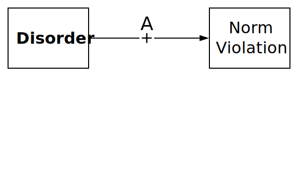
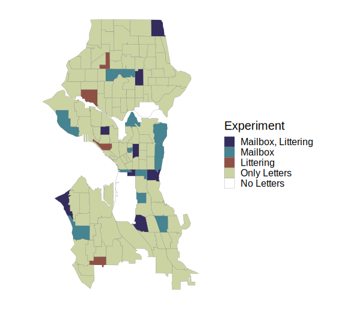

# Overview

* Broken Windows

   * Order Maintenance Policing
   * Disorder Remediation

* Broken Windows versus Collective Efficacy

   * Sampson & Keizer

* Seattle Experiments

   * Mailbox Experiment
   * Litter Clean-Up

---
# Broken Windows

* Physical and social disorder (incivilities)

   * Physical: Graffiti, dilapidated buildings
   * Social: Public intoxication, panhandling

???

All of these things are minor and do not directly harm individuals.

--

* Disorder signals to criminals indifference to crime

   * Low probability of being seen, reported, arrested

???

The direct mechanism is essentially based on deterrence. Potential offenders see no one intervenes against minor deviance, assume they can get away with more serious things.

Essentially it is an escalation argument as well--presence of minor violations gives way to more serious ones.

Folks really only paid attention to this direct effect.

--

* Disorder also undermines community controls

   * Signals neighborhood is out of control, creates fear
   * Mechanisms: Withdrawal from public life; residential mobility

???

The mechanism here is simple informal social control. Fewer eyes on street, people moving out, reduced willingness to intervene. This effect has been neglected in research, literature, and policy.

--

* Key Idea: Disorder is not individually harmful but it accumulates

   * Intervene when problem is still small
   * Intervene where problem overwhelms community control capacity

???

Wilson describes this as a conundrum: Individual incivilities are so minor it seems unjust to invoke police. But when they are pervasive, the harm can be substantial.

---
# Broken Windows

 

.image-75[

]

???

The model is actually fairly complicated if you sketch it out.

Two feedback loops. This is hard to test!

---
# Order Maintenance Policing

* Residents worry more about low-level disorder than major crimes

   * Assumption: Consensus on disorder
   * Goal: Stabilize informal control by reducing fear of crime (indirect path)

???

Surveys and interviews indicate residents often express more concern with and feel more fear from non-criminal disorder; order-maintenance about dealing with this.

Wilson & Kelling acknowledge that there are places with little disorder or crime and no need for police as a result--they have effective social control. Police are about bolstering informal control, not replacing it.

--

* Targeting disorder with policing (deterrence)

   * High certainty
   * Minor penalties
   * Ex: Fare evasion, public drinking
   * Mechanism: Deter offenders (direct path)

???

Basic idea is massively increasing certainty but not being severe in penalty. Problem is even what look like small fines really add up.

--

* New York: Bill Bratton, under Giuliani

   * Stop-and-frisk

???

These policies were first made big in public eye by Bratton under Giuliani in early 1990s New York. Stop-and-frisk went big. Bratton reeled it back in after his second term (Giuliani canned him supposedly because he was upset Bratton was getting credit for crime decline)

---
## Evidence for Policing Disorder

* [Crime (Braga et al. 2015)](https://doi.org/10.1177/0022427815576576)

   * Modest reductions on crime
   * Aggressive order maintenance works poorly
   * Targeting specific places more effective

???

Order maintenance doesn't show much crime reduction except where it is implemented as a hot spots strategy.

--

* [Fear of Crime (Weisburd et al. 2015)](https://doi.org/10.1177/0022427815577837)

   * No evidence for reduction of fear of crime
   * No evidence for improved informal social control

???

Not much evidence for it helping with fear of crime or social control.

--

* Unintended consequences

   * Alienating communities from police
   * Increased racial disparities
   * Criminalization of homelessness and mental illness

---
# Fixing Broken Windows

*Rather than punish broken windows, why not repair them?*1

.footnote[[1] Review: Kondo et al. (2018) "Neighborhood Interventions to Reduce Violence"]

???

May be symptomatic of country's perspective on crime, but remarkable we latched entirely on to punishing our way out of broken windows rather than trying to fix them.

Unlike order maintenance policing, substantial evidence for effectiveness of remediating disorder.

--

* Housing interventions

   * Demolish concentrated high-rise public housing
   * Build scattered public housing
   * Board up and improve appearance of vacant buildings

???

The physical structure of high-rise housing is conducive to crime. But scattered public housing has no effect on crime and greatly benefits those living there.

Vacant buildings are venues for drugs and crime, make people uncomfortable, and make neighborhoods unattractive for investment. Beautify or destroy.

--

* Vacant lot remediation

   * Clear debris and sight-blocking vegetation
   * Install parks to increase public use

???

Same with vacant lots. Lots provide venues for crime with cover, routes to flee from police. Clearing lots, even greening them shows large crime reductions in vicinity, reductions in fear, increases in use of public space. Many benefits.

--

* Address problem businesses and properties

   * Bars with overservice or other problems
   * Landlords neglecting properties

???

Another issue is occupied but problematic properties. City can help address or shut them down. Another issue is landlords neglecting repairs. Residents may fear eviction if they report. City interventions can be effective.

---
# Branas et al. (2018)

.image-100[

]

???

Examples of vacant lot greening in Philadelphia. Program say large declines in violence, fear of crime, increases in use of public space.

---
class: inverse
# Broken Windows versus Collective Efficacy

---
# Broken Windows

[Wilson & Kelling (1982)](https://www.theatlantic.com/magazine/archive/1982/03/broken-windows/304465/) describe a system where community disorder (1) increases crime by 
signalling low social control to offenders and (2) decreases actual social control by reducing willingness to use public spaces.

--

.pull-left60[

]

.pull-right40[
* A: Disorder signals low guardianship which increases offending.

* B, E: Disorder and crime constrain social relations and impede control.

* C, D: Social control inhibits both disorder and crime.
]

.centernote[
*Bi-directional effects make testing this difficult.*
]

???

Note you can just collapse fear of crime and social control together here and get the same basic model but easier to compare with CE

---
# Collective Efficacy

[Sampson & Raudenbush (1999)](https://doi.org/10.1086/210356) contend that disorder and crime are both manifestations of low collective efficacy—the community's capacity for informal social control.

???

The gist here is that disorder and crime appear in the same places because those places have low social control. Social control prevents both disorder and crime.

--

.pull-left60[

]

.pull-right40[
* C, D: Disorder and crime are products of low collective efficacy (social control) which is exogenous (B, E).

* A: Disorder has no direct impact on crime.
]

.centernote[
*This is a simple model--and can test if A, B, or E paths exist*
]

???

Important thing to note here is that Wilson & Kelling and Sampson & Raudenbush both agree that disorder and crime are products mainly of low informal social control. They disagree about the effects of disorder mainly. Sampson & Raud say disorder and crime are basically the same thing, doesn't make sense to say disorder causes crime, and if you separate them out it doesn't do anything. Wilson & Kelling say disorder is minor stuff police shouldn't ideally need to respond to, doesn't directly harm anyone, but hurts in large amounts through signalling and fear which generates a feedback loop of gradually accumulating disorder and crime.

In Sampson & Raudenbush's piece, they use novel data and pretty solid statistical methods to test this model.

They generally find no evidence for path A except for a modest robbery effect. They also find evidence for path E. They only use a crude test for path B and find nothing. Not accounting well for path B has led to some criticism.

---
# Keizer et al. (2008)

Keizer et al. used disorder manipulations and recorded norm violation with field experiments in Grongingen, the Netherlands. 

Multiple interventions show a consistent positive relationship with norm violation.

--

.pull-left[

]

.pull-right[
* Powerful causal effect of disorder on multiple forms of norm violation (A).

* Single sites in one city: No examination of context, indirect pathways, or reciprocal effects.
]

*Can these be replicated in other locations? What is the influence of context?*

???

Conducted six experiments to examine cross-norm inhibition--experiment allows them to ignore informal control (it is constant) and test only direct path.

Cross-norm inhibition is idea that descriptive norms--visible evidence that people violate a clear norm--reduce people's adherence to a completely different, possibly more serious norm proscribing some behavior--an injunctive norm.

e.g. Littering reduces inhibition against mail theft; Key here is different norms: lot of good work shows evidence violation of a norm weakens adherence to SAME norm.

Mechanism: Evidence of norm violations weaken general goal to act appropriately; question remains if this might apply to more serious things.

Advisor was intrigued and somewhat suspicious of this study--decided to replicate it in Seattle

Subsequently a few papers have pointed out methodological issues with the studies in question.

---
class: inverse
# The Seattle Experiments

---
# Experiment Diagram

.image-75[

]

* Embed experiments in disparate Seattle neighborhoods
* Replicate and extend Keizer et al. (2008) and Sampson & Raudenbush (1999)

???

Paths E and C are hard to isolate

Can't use crime as an intervention

Crime is a rare event to observe

Sanctioning is difficult intervention

Litter clean-up experiment failed hilariously--will cover; litter invention had complex results, won't cover today.

---

.image-75[

]

---

.image-90[

]

---

# Mailbox: Method

.pull-left[
.image-75[

]
]

* A letter containing a visible $5 bill is left near mailbox for passersby to encounter.

--

* Litter and a sign board with graffiti are introduced to manipulate disorder.

???

You can see them in this picture from the international district. That's World Pizza on the left; King st & 7th Ave--good Dim Sum at Jade Garden visible on next corner.

--

* Researchers record whether participants mail, steal, or ignore the envelope.1

.footnote[[1] Perceived sex, age, and group size of participants were also recorded to adjust for compositional differences of tracts.]

--

* We conducted 405 trials with 3,671 participants in 20 Seattle census tracts.

???

Big advantage here is massively larger sample size than Keizer and we can vary the location to see how context matters.

---
# Mailbox: Model

Objective: Causal test of direct effect of disorder on crime (A).

 

.image-62[

]

---

# Mailbox: Model

Our Experiment: Tests of causal direct effects of disorder on crime and prosocial behavior.
 

.image-75[

]

???

We're actually testing a couple things here. Effect of two types of disorder on either theft or mailing. Plus with 20 tracts, we can vary collective efficacy and see its separate association with those outcomes.

---

# Mailbox: Results

<table style="width:70%">
  <tr>
    <td style="font-size:115%" colspan="5">Mailbox: Participant Actions</td>
  </tr>
  <tr>
    <th>Condition</th>
    <th>Walk-By</th>
    <th>Mail</th>
    <th>Theft</th>
  </tr>
  <tr>
    <td rowspan="2">Control</td>
    <td>1629</td>
    <td>208</td>
    <td>33</td>
  </tr>
  <tr>
    <td>87.1%</td>
    <td><strong>11.1%</strong></td>
    <td><strong>1.8%</strong></td>
  </tr>
  <tr>
    <td rowspan="2">Treatment</td>
    <td>1637</td>
    <td>136</td>
    <td>28</td>
  </tr>
  <tr>
    <td>90.9%</td>
    <td><strong>7.6%</strong></td>
    <td><strong>1.6%</strong></td>
  </tr>
</table>

Key Findings:

* Disorder has no impact on theft.

???

No positive impact *anywhere* at all, even.

We had much lower rate of theft than seen in Keizer's experiments as well, even though we have higher property crime.

--

* Disorder reduces the likelihood of mailing—resulting in the letter remaining on the ground longer.

???

Also noteworthy that vast majority of people here walked by while Keizer said it almost never happened. Kind of suspicious.

--

* Collective efficacy is associated with lower theft, but not more mailing.

.centernote[*We fail to replicate Keizer et al. (2008)*]

???

If you ignored the walk-bys and only tabulated differences in theft and mailing, it would *appear* that thefts increased relatively like Keizer. But would be false.

---

# Litter Clean-Up: Method

.pull-left[
.image-full[

]
]

.pull-right[
* A variety of trash is dropped on a sidewalk.

]

---

# Litter Clean-Up: Method

.pull-left[
.image-full[

]
]

.pull-right[
* A variety of trash is dropped on a sidewalk.

* A magazine rack with concealed camera and motion detector records when the litter is cleaned up and how many people pass by.
]

---

# Litter Clean-Up: Method

.pull-left[
.image-full[

]
]

.pull-right[
* A variety of trash is dropped on a sidewalk.

* A magazine rack with concealed camera and motion detector records when the litter is cleaned up and how many people pass by.
   * This permits capturing the relationship between collective efficacy and time to remove disorder.

]

---

# Litter Clean-Up: Method

.pull-left[
.image-full[

]
]

.pull-right[
* A variety of trash is dropped on a sidewalk.

* A magazine rack with concealed camera and motion detector records when the litter is cleaned up and how many people pass by.
   * This permits capturing the relationship between collective efficacy and time to remove disorder.

* An alternate magazine rack defaced by graffiti and stickers is swapped in to manipulate disorder.
]

---
# Monitoring System

.pull-left[
.image-100[

]
]
.pull-right[
.image-100[

]
]

---
# Disorder Condition

.image-62[

]

---

# Litter Clean-Up: Results

.pull-left[
.image-full[

]
]

* The experiment was abandoned after a small number of trials.

---

# Litter Clean-Up: Results

.pull-left[
.image-full[

]
]

* The experiment was abandoned after a small number of trials.

* In Ravenna, residents reported the magazine racks on Nextdoor as an "eyesore".

--

* Two magazine racks had locks cut and were removed.

--

* Thus we were unable to continue experiment *because of collective efficacy* in an affluent neighborhood.

--

* In contrast, one rack was left *for an entire year* in Capitol Hill without issue.

???

Specifically, a person pointed them out on Nextdoor, then was encouraged by others to cut the locks and remove them.

The one in question disappeared immediately. Then a second one had its lock cut and was taken by a different person.

Posing as a student interested in using the magazine rack for my research--which was technically true--I recovered the second one.

I interpret this anecdote as evidence of Zeal. Someone suggested making an intervention against a norm violation. They were encouraged by others. They did so, and received praise.

---
# Experiment Summary

* No disorder effect on theft (unable to replicate Keizer et al. 2008).

--

* Disorder attenuates mailing letters--low risk prosocial behavior (mailbox)
   * Perhaps disorder undermines informal social control--as suggested by Broken Windows.
   * *However, disorder had no effect on sanctioning--higher risk prosocial behavior (littering)*

???

Disorder appears to reduce at least mailing. Mechanism is unclear. We did find in our other experiment that disorder had no effect on people sanctioning a litterer.

--

* Context matters for prosocial behavior
   * Letter addresses affect mail back rates (lost letter)
   * *Race / gender of litterer effects sanctioning (littering)*

???

Nazi letters much less likely to be mailed back

What did matter for littering was race and gender of person dropping it.

--

* Collective efficacy is associated with fewer thefts (mailbox)

--

* Collective efficacy is associated with mailing back letters (lost letter)

???

We did not, however find CE associated with sanctioning litterers.

---
## Broken Windows Summary

* Possible small effect of disorder on crime

   * Does not justify order maintenance policing
   * May be specific to some types of disorder
      * Effect of disorder may be through opportunity

--

* Unanticipated negative consequences

   * Police dislike focusing on incivilities
   * Potential for racial profiling
   * Undermines citizen-police relations

--

* Better approaches

   * Building collective efficacy
   * Disorder remediation

---
class: inverse
# Questions

---
# For Next Time

* Matsueda, Ross L. 2001. “Differential Association Theory,” In *Encyclopedia of Criminology and Deviant Behavior*, Vol.1, edited by Clifton D. Bryant. New York: Taylor and Francis.

* Anderson, Elijah. 1998. “The Social Ecology of Youth Violence.” Pp. 79-104 in *Youth Violence*. Edited by M. Tonry and M.H. Moore. Chicago: University of Chicago Press

* Matsueda, Ross L, Kevin Drakulich and Charis E. Kubrin. 2006. “Race and Neighborhood Codes of Violence.” Pp. 334-336 in *The Many Colors of Crime: Inequalities of Race, Ethnicity, and Crime in America*, edited by Peterson, Krivo, and Hagan. New York: NYU Press

Things to pay attention to:

* Assumptions of differential association theory: Definitions and their sources.

* Links between social disorganization and the Code of the Street