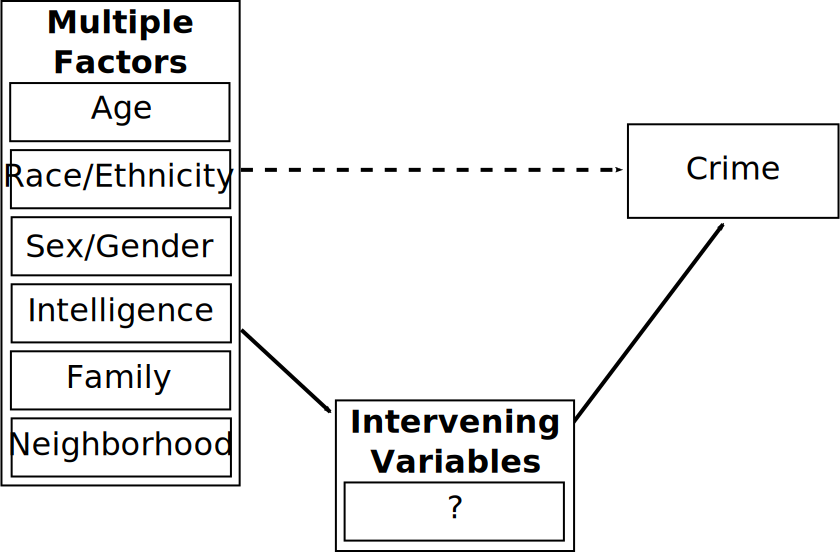
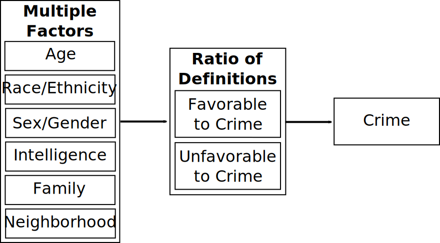

# Overview

* Sutherland

   * Context
   * Method
   * Foundation

* Differential Association
  
   * Techniques of Neutralization
   * Empirical Evidence
   

---
# Context

* Turn-of-century multiple factor models

???

Individual-level criminological research was dominated by essentially risk factor models

Things like race, employment, drug use--correlates of crime--lumped together to predict it, absent any strong theory

--

* Edwin Sutherland

   * *The Professional Thief* (1937)
   * White-collar crime (1939; Book in 1949)

???

Sutherland's prior research in professional and white-collar crime.

In the prof. thief, he presents life story of a prof. thief in own words, annotated and edited by Sutherland. Describes learning how to steal, highly organized society of thieves.

Created and identified the term white-collar crime, first used it in speech to ASA: "Crime committed by a person of respectability and high social status in course of their occupation."

Idea was controversial and subversive at time--strong assumptions about class and crime, image of the criminal. Publisher's of the book White Collar Crime (1949) were sued by major US corporations and successfully got all references to them removed from text. Wasn't reprinted in original form for over 30 years.

--

* Chicago School

   * Social disorganization
   * Symbolic interaction
   * Cultural conflict

???

Sutherland was U Chicago alumni of 1913, returned again in 1930.  Strongly influenced by Chicago perspectives.

Work links closely into Shaw & McKay's social disorg, symbolic interaction tradition of Mead, cultural conflict of Wirth

---
# Sutherland's Method

* Dissatisfaction with multiple factor theories

   * Correlation is not causation
   * Explain why factors related to crime
      * Must explain observable empirical evidence

???

Many factors correlated with crime but correlations tell us nothing about causes or mechanisms

Real interest is in why these things seem related; what definitively predicts crime

--
   
* General theory: Necessary and sufficient conditions for crime

???

Necessary conditions MUST be present for crime to occur

Sufficient conditions are those that, when present, will cause crime to always occur.

--

* Logical Abstraction

   * "What do males, young adults, African-Americans, and inner city residents have in common that causes them to commit crimes?"
   * What explains these correlations?
   * What are the intervening mechanisms?
   
???

Key here is that more of some groups commit crime, but not all. What is the mechanism connecting these to crime?

--

* **Situational** vs. **genetic** (historical) explanations of behavior

> a criminal act occurs when a situation appropriate for it, as defined by the person, is present.

???

Explanations can be either situational or genetic--genetic being historical and about predispositions.

Situational theory would be best explanation, but very challenging to study

Situational actions are rooted in interpetations of situations--such as perceiving an opportunity as such. 

These interpretations come from individual history--the genetic component.

---
# What Intervenes?

.image-90[

]

---
## Foundation: Normative Conflict

* Group conflict model of society

   * Segmentation of society
      * Conflict over values, attitudes, appropriate behavior.
   * Consensus is not a given, but must be achieved.

???

Underlying conception of society is heterogeneity in culture resulting from industrialization and urbanization

Different groups have different values; consensus can exist but takes time, work, stability

--

* Normative (Culture) Conflict

   * Some groups define laws as rules to be observed, others as rules to be broken.
   * Amount of crime in society is determined by normative conflict.

???

With regard to crime, key area is adherence to law

Differential association isn't exactly saying some groups obey all laws, other groups break all laws; rather there are group-level differences in how relationship to illegal behaviors is perceived.

Overall crime rate is determined by degree of conflict--if there was no conflict, there would be consensus on law and no violations.

--

.pull-left[
**Consensual societies**

* Low division of labor
* Uniform values
* Absence of conflict
]
.pull-right[
**Conflict-ridden societies**

* High division of labor
* Heterogeneous values
* Conflict]

???

Evokes a bit of Durkheim here, which is period appropriate. Ideal types of simple undifferentiated society vs. modern urban division of level.

---
class: inverse
# Differential Association

---
# Nine Propositions

???

With the foundation established, Sutherland made 9 core propositions which describe the theory.

--

1. Criminal behavior is learned
???

Not inherited; a person not trained in crime does not invent criminal behavior
--

2. It is learned in interaction with others in a process of communication.
???

Primarily verbal but also includes gestures and mimicry
--

3. Most of this learning occurs within intimate personal groups.
???

Other routes, such as media, play relatively unimportant role.

--

4. Learning includes techniques and motives, rationalizations, and attitudes.
--

5. The specific direction of motives and drives is learned from definitions of the legal codes as favorable or unfavorable.
???

Individuals surrounded by others who define legal codes as rules to be followed or to be violated; in modern society, typically experience both--there is cultural conflict about codes.

--

6. **Delinquency results from an excess of definitions favorable to crime over definitions unfavorable to crime**
???

Principle of differential association. Contact with criminal patterns and isolation from noncriminal patterns. People assimilate patterns from surrounding culture. Much learning is unrelated to crime and has no effect on it. 

--

7. Definitions may vary in frequency, duration, priority, and intensity
???

Priority just means early developments tend to persist. Intensity has to do with prestige of source, emotional reaction. Sutherland notes would be very hard to mathemitize this.

--

8. Process of learning definitions in favor of and against criminal behavior involves all mechanisms of any other learning.
???

All mechanisms of learning, not just imitation. One can learn from being a victim for instance

--

9. Although criminal behavior is expression of needs and values, it is not explained by those needs and values because noncriminal behavior is also an expression of those needs and values.
???

Likens to respiration: It is necessary to breathe to engage in any behavior but it doesn't differentiate criminal and noncriminal behavior.

---
## Differential Association Process

* Translates normative conflict in society into individual criminality

   * Based on exposure to definitions
   * Explains correlates of crime
      * Heterogeneity results from differential exposure

???

Differential assoc is process that explains how normative conflict results in individual crime

Depending on people and groups they encounter, individuals are exposed to different definitions

Classic correlates of crime like race and poverty are only related to crime because they're related to exposure to definitions

--

* Crime is learned in interaction in primary groups

   * Criminal techniques and skills
   * Definitions favorable and unfavorable to law violation
      * Motives, verbalizations, attitudes
   * Learning explains individual criminal behavior

???

Basic learning process in differential association is that crime is learned from intimate social interaction

Individuals learn skills to commit crime, but also motivations, attitudes etc.

All crime comes down to learning processes. This can be directly being taught, but also observing, reinforcement of behavior, etc. Akers later expanded the learning process in Social Learning Theory using first Skinner-style behaviorism then later Bandura-style social learning.

---
# Excesses of Definitions

*Criminal behavior occurs when a person has learned an excess of definitions favorable to crime*

--

* Definitions can be general or specific to crimes and contexts

???

Will give examples in a bit--but one might learn something as specific as "it is okay to steal bread at the end of the day before it is going to get thrown out" to broad ideas like "no one can tell me what to do!"

--

* Four modalities (weights)

   * Frequency
   * Duration
   * Priority
   * Intensity

???

Definitions are not all equally influential; influence depends on many factors.

Definitions encountered more often and in prolonged exposure likely to have more influence.

Those encountered earlier--particularly in early childhood--may be more influential; Sutherland said evidence was needed for this.

Intensity can be related feeling about source of definition or emotional reaction to it.

--

* Given an opportunity, if $\frac{\textit{Definitions Favorable}}{\textit{Definitions Unfavorable}} > 1.0$, crime *will* occur1

.footnote[
Note these are *weighted* definitions
]

???

Idea is basically a deterministic ratio. In modern applications we would move to probabilistic, and in neither the classic conception nor modern would we assume we can exactly measure all relevant definitions and their strength.

Like with rational choice, the idea is holding all else constant, exposure to new favorable definitions will increase criminality. We're looking at the margin!

---
# Conditions for Crime

Both necessary and sufficient:

1. Person has learned excess of weighted definitions favorable to crime

2. Person has learned necessary skills and techniques

3. Opportunity to commit crime is present

???

Most theories usually deal with tendencies: Crime is more likely when X. Differential association seeks to establish exact conditions under which crime always occurs or does not.

Necessary conditions are those that must exist for something to occur; sufficient are those that, if they're all present, a thing must happen.

--

* If you can find *one* person who refrains from crime when these conditions are present, the theory is wrong.

* If you can fine *one* person who commits a crime when these conditions are not all present, the theory is wrong.

???

In principle the theory is falsifiable based on thism, but challenge is in operationalizing it all. These days we tend not to work in these sort of terms because it isn't practical to test.

---
# Differential Association

.image-90[

]

???

For simplicity, have not depicted opportunity or skills here--may take those for granted in some situations.

---
## Definitions Unfavorable to Crime

* "Crime doesn't pay"
* "Marijuana causes brain damage and leads to cocaine and heroin use"
* "Turn the other cheek when insulted."
* "Always be a law abiding citizen and you'll be respected."
* "Don't drink and drive--you can hurt someone."
* "Don't throw your life away by breaking the law!"
* "Sinners will be damned for eternity."

---
## Definitions Favorable to Crime

* "The Justice Department should be going after real criminals, not me!"
* "I can drive after five beers, no problem."
* "If someone questions your manhood, you have to stand up for yourself."
* "Everyone cheats on their income taxes--it's not really a crime."
* "I was planning to give the money back after I solved my financial problem."
* "It's not a crime if no one gets hurt."
* "A sucker is born every minute."

---
# Techniques of Neutralization

Sykes & Matza (1957): Moral obligation to law must be neutralized

   * Rationalization of violation
   * "Drift" between legitimate and illegitimate lifestyle

???

Sykes and Matza worked on differential association in the 1950s, expanded on this in 1960s.

Evidence that delinquents hold conventional values, admire law-abiding people, have guilt about offenses, and are selective about targets.

Idea is that people have moral obligation to law that they feel. When committing crime, they use techniques to negate their perceived obligation.

This is in time of reign of subcultural theories. Like Hirschi later, they reject the idea that there is a different underlying moral code--instead they retain code but have learned to situationally neutralize it.

--

Forms of neutralization:

   * Denial of responsibility

???

Absence of culpability; environment acted on them. Not my fault!

--

   * Denial of injury

???

No one was actually hurt by it, so it isn't really crime. Alternatively, it did hurt them, but so little as to not matter, like stealing from a big corporation or wealthy person.

--

   * Denial of the victim

???

"he deserved it"--The target is not a victim but a deserving target

--

   * Condemnation of the condemners

???

Redirecting outrage at those who would punish or condemn the act. Invoking hypocrisy, or punishment/judgment coming out of spite.

--

   * Appeal to higher loyalties

???

Offense was done for the greater good, such as protecting friends or family.

These techniques can be seen as contextual / situational definitions favorable to crime.

---
# Empirical Evidence

Generally strong support for differential association

* [Pratt et al. (2010)](https://doi.org/10.1080/07418820903379610)

   * Definitions strong predictor of crime
   * Association with peers also strong
   * Later additions like differential reinforcement less predictive

* Compared to control theory

   * Peer association effects contradict control theory
   * Supported over control theory in some direct tests ([Matsueda 1982](https://doi.org/10.2307/2095837); [Matsueda & Heimer 1987](https://doi.org/10.2307/2095837))
   * Some counterpoints from prominent control advocates (e.g. B. Costello)

---
class: inverse
# Questions

---
# For Next Time

* Hagan, John, and Wenona Rymond-Richmond. 2009. *Darfur and the Crime of Genocide.* Cambridge, UK: Cambridge University Press, pp. 1-103

Things to pay attention to:

* Different measurement of mortality between public health and criminological approaches.

* Reasons for genocide being understudied as a criminological phenomenon

* The link between Sutherland's and Glueck's perspectives

???

Home stretch! Have the book to read and a single article.
