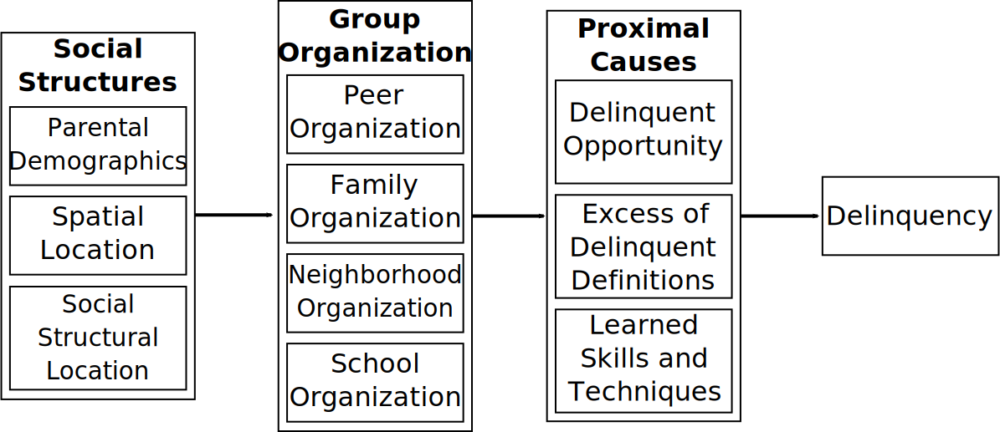

# Overview

---
# Differential Social (Group) Organization

* Explains how normative conflict causes group or societal rates of crime

   * The crime rate of a society (group) is determined by differential social (group) organization
   
* Differential social organization: The extent to which a society (group) is organized in favor of crime versus organized against crime.

* Important feature of social organization: How that org influences the group's defs favorable and unfavorable to crime.

---
# Differential Organization

.image-100[

]

---
# Crime Rates Predicted by Differential Social Organization

[CROSSTAB: Org against on left, org in favor on top.]

---
# Distribution of Defs of Crime: Linking DA to DSO

[IMAGE: Society 1: Tacoma; Society 2: Seattle. More defs favorable to crime on left.]

---
# Normative Conflict and Criminal Law

* Criminal laws are an expression of normative conflict
   * A politically powerful group organizes against behavior that violates one of their values or interests
   * Two groups are in normative conflict: The group that engages in the behavior vs the powerful group.
      * Note: Definitions for and against are neutral with respect to the law.
   * The powerful group succeeds in outlawing the behavior.

* Implications
   * Now definitions favorable to the behavior are pro-criminal definitions and definitions unfavorable to behavior are anti-criminal definitions.
   * The weaker group will have a higher rate of criminal behavior.

---
# Origins of Criminal Acts & Definitions Favorable to Crime

* They are present (as neutral definitions) before the behavior was outlawed.
* Imported from a different culture.
* Invented by modifying existing neutral (or criminal) definitions.

---
# Criticisms of Differential Association

* Assumes a deterministic model, which is unlikely to hold for social science
   * But we can translate the theory's propositions to a probabilistic model
* The social psychology hypothesis (ratio) is probably an oversimplification
* Need to incporate a situation decision-making model (e.g. rational choice)
* Differential social organization si underdeveloped: what is the theory of structure?
* Learning process needs to be specific more clearly (e.g. social learning theory)

---
class: inverse
# The Code of the Street

---
# Anderson's Code of the Street

* Build's on Wilson's underclass thesis and subcultural theories

* Add a cultural component to Wilson
   * How do young black men adapt to disadvantage?
   * Innovate a distinct status system based on violence

* Example of Differential Social Organization
   * Decent families: Organization against crime
   * Street youth (code of the street): Organization in favor of crime

---
# Structural Causes of the Code

* Structural disadvantage in labor market
   * WJ WIlson's concept of urban unerclass
   * Self-respect not derived conventionally
   * Result: Alienation

* Distrust of social institutions (police)

* Develop own system of justice and control
   * Organized system for resolving disputes and allocating respect & status
   * Based on violence: hypermasculinity

---
# Code of the Street: Content

* Status based on "rep" for violence, tougness
   * Quick to resort to violence
   * Skill as a fighter
   * "Go for bad," fearless, use a gun

* Never back down from a fight
   * Always come to aid of one's crew or intimates
   * Respond in kind to insults or threats

* Exact revenge
   * If a peer or family is insulted or preyed upon
   * If a girlfriend is insulted or violated

* Gain "juice" or rep by preying on the weak
   * Take their material possessions (jewelry, shoes)
   * Hit on their girlfriends
   * Assault, humiliate others

* Staring, stepping on toes are viewed as threats

---
# Social Organization of the Code of the Street

* Norms govern behavior on the street
   * Allocate respect and status
   * PRovides a way of resolving disputes

* Knowledge of the code allows one to avoid violence
   * Don't stare or otherwise threaten
   * Project a violent image, as tough, crazy, or not to be messed with

* Ideal types: Decent and street

* Decent people have to know the code or they'll be punked.

* Implication: Code is a system property of neighborhoods and not individuals

---
# SNCS

* Seattle: Metro area without extreme residential segregation or extreme concentrated diasdvantage

* Sampled 4,904 households in 123 tracts

* Disproportionate oversample of census blocks with high minority concentration

* Interviewed one adult in household (SBRI)

* Response rate around 50%

---
# Neighborhood Model of Race, Disadvantage, Police Efficacy, and Codes of Violence

[IMAGE: Structural model: Social disorg exog -> police eff -> codes of viol -> violence]

---
# Measures of Neighborhood Codes of Violence (a=.87)

In this neighborhood...

* Parents teach their kids to fight back if they are insulted or threatened.

* For young people to gain respect among their peers, they sometimes have to be willing to fight.

* If a loved one is disrespected, people retaliate even if it means resorting to violence.

* Young men who own guns are often looked up to and respected.

* Young men often project a tought or violent image to avoid being threatened with violence.

---
# Distribution of Neighborhood Codes Items

[IMAGE: No idea--bar chart of above?]

---
# Measures of Police Inefficacy Gauge (PIG) (a = .64)

* In this neighborhood, police just hassle residents, rather than being helpful.

* Racial profiling is a problem in this neighborhood

* The police are doing a good job in dealing with problems that really concern people in this neighborhood.

---
# Distribution of PIG items

[Image: Same deal]

---

[MAP: Neighborhood Codes and Proportion African-American]

---

[IMAGE: Model again]

---
class: inverse
# Discussion

---
# Some Questions

---
# For Next Time

Things to pay attention to:
