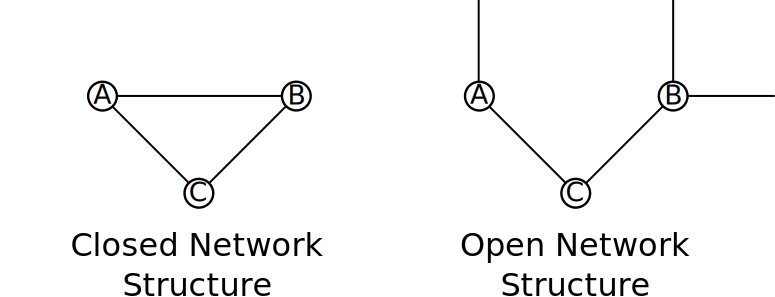
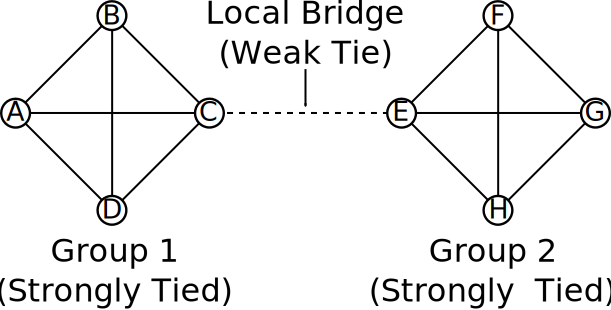
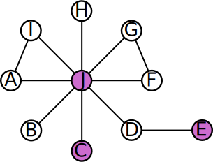

# Overview

* Differential Social Organization

   * Collective Action

* Ties and Social Efficacy

---
class: inverse
# Differential Social Organization

---
## Differential Social Organization

* Static view: 

   * Organization in favor of crime vs. organization against crime

???

Basic extension of social disorganization; imagine the social structure and group organization as something relatively static influencing crime rates across groups

--

* Dynamic view: 

   * Collective action (joint behavior)
   
      * Consensus over objective (for crime or against crime)
      * Consensus over means of attaining objective

???

In the dynamic view, group *processes* explain changes in crime rates over time. Group processes here are collective action, which is joint behavior among two or more interdependent individuals.

Collective action implies agreement on an objective for action and on the methods to accomplish that objective. For instance, collective efficacy's objective is typically control of delinquency in the neighborhood and the means are direct sanctioning and monitoring.

--

* Collective action in favor of crime vs. collective action against crime

???

This perspective alters differential social organization into a form conceivably as collective action for and against crime.

Can be unintuitive to think about crime as collective action, but most crime occurs in groups. Lot of continuity in repeated collective action too, such as gangs.

---
# Collective Action

* Grievance requiring a collective response

???

Basis for collective action is the perception a problem exists which cannot be addressed by an individual; often critical to generate perception that this problem exists and is shared.

--

* Social Structure (Resource Mobilization Theory)

   * Social network ties
   * Pre-existing organization
   * Political opportunities

???

Collective action is rooted in and facilitated by existing social structure; basic idea from Resource Mobilization Theory is that a grievance alone will not facilitate action--resources are required and must be mobilized. The organizational component is usually more important than resources.

--
   
* Collective Action Frames

   * Frame a grievance as calling for certain collective acts
   * Meanings and understandings of issues
   * Define a situation as calling for action
   * Fight over whose meaning of issues prevails--e.g. abortion, gay marriage, torture

???

A key to collective action is framing. Collective action frames are emergent beliefs and meanings that frame some problematic situation as demanding a solution via collective action.

These frames are ways of interpreting the world--meanings and understandings--which are produced jointly among those involved

One can imagine a gang fight emerging as the result of members framing a particular event as requiring a violent retaliation.

---
# Collective Action Frames

* Frame Alignment

   * Link individual interpretations to social movement organizations' interpretations
   * Use argumentative tactics to align frames

???

Because frames are produced jointly, they involve debate, argument, and struggle--whose meaning matters.

Goal of emerging social movements is to align the interpretations of individuals with those of the organization.

That is, young movements need to get people on board with the program.

--

* Effectiveness of frames

  * Problem and solution is defined collectively (not individually)
  * Defines antagonists as "us" versus "them"
  * Defines an injustice that can be corrected collectively

???

Effective collective action frames share some characteristics. Define both problem and solution as collective--involving entire group, as wide as possible.

Clear antagonists--the target of action, whether they are offenders or those in power who must be coerced into action

The problem in question must be conceived of as one that can be addressed with collective action of the aggrieved--a difference can be made if they act.

Think of last part as an issue of efficacy: If a task is perceived as impossible, folks won't make the attempt. So you have to frame it as a big enough problem that no one individual can handle it, but the group can do it together.

--

* Example: Civil Rights

---
### Dr. Martin Luther King Jr. "I Have a Dream"

> "There are those who are asking the devotees of civil rights, "When will you be satisfied?" We can never be satisfied as long as the Negro is the victim of the unspeakable horrors of police brutality... We cannot be satisfied as long as the negro's basic mobility is from a smaller ghetto to a larger one... We cannot be satisfied as long as a Negro in Mississippi cannot vote and a Negro in New York believes he has nothing for which to vote. No, no, we are not satisfied, and we will not be satisfied until "justice rolls down like waters, and righteousness like a mighty stream."

???

MLK's famous speech is excellent example of frame generation. Makes goals and grievances clear and hammers on them--links them to wide shared ideals of United States of freedom and equality. Highlight here grievances raised in 1963 which are no less sharp now.

--

 

> In the process of gaining our rightful place, we must not be guilty of wrongful deeds. Let us not seek to satisfy our thirst for freedom by drinking from the cup of bitterness and hatred. We must forever conduct our struggle on the high plane of dignity and discipline. We must not allow our creative protest to degenerate into physical violence. Again and again, we must rise to the majestic heights of meeting physical force with soul force.

???

Speech makes not only the goals but also the means clear. Must obtain these goals using non-violent means.

---
### Dr. Martin Luther King Jr. "I Have a Dream"

> The marvelous new militancy which has engulfed the Negro community must not lead us to a distrust of all white people, for many of our white brothers, as evidenced by their presence here today, have come to realize that their destiny is tied up with our destiny. And they have come to realize that their freedom is inextricably bound to our freedom.

???

Here and in other passages, he makes the specific us wider. While the struggle is against injustice for African Americans, the binding-up of destiny makes it an issue for everyone. This is widening the vested interests.

--

 

> I have a dream that one day, down in Alabama, with its vicious racists, with its governor having his lips dripping with the words of "interposition" and "nullification"...

???

While the primary "them" is historical and institutional, King places more specific others as well, even links it to language use--others who speak and do as they do are also "them".

---
class: inverse
# Social Ties and Social Efficacy

---
# Network Closure

.image-100[

]

 

* Increases ability of individuals to influence others

???

If we recall the section on social capital and closure from a few weeks ago, position in a network affects relative power of individuals. A closed network of parents and children makes it easier to monitor children--an open network makes the children able to evade monitoring and sanctions. These concepts apply in collective action

--

* Open Structure: C can influence A and B individually

???

On right: In this structure, all interactions involve only two people. If C is relatively powerful, this is may be advantageous to them--A and B cannot work together to influence them back.

--

* Closed structure: C and A can influence B

???

In the close structure, C and A can work together to influence B. They're more powerful here assuming they share beliefs. But in this structure now, if C is stronger than A or B, they could work together to influence C.

Note because of the relationship between ties and influence or power, actors have incentives to either create or prevent closure. If B doesn't want to be influenced by C, they have incentive to avoid ties with A.

---
# Strong and Weak Ties

.image-90[

]

* Strong ties to similar others provide similar information

???

Strong ties thus reinforce shared information. This provides strong norms and sanctions. But it also produces rigidity, inflexibility, resistance to change.

--

* Weak ties to dissimilar others provides different information

???

Groups with weak ties to others are better able to bring in new information. Without weak ties, a group is isolated. This makes it hard to create critical masses for a political movement. Need to be able to bridge and bring together different groups for mobilization--this is coalition building.

Matsueda hypothesizes that differences in weak ties may suppress the ability of poor neighborhoods to organize while their structural disadvantage inhibits the organizational benefits of their strong ties. Absent weak ties, it is difficult to get outside assistance and also little external information flows into neighborhood. This may promote maintenance of the code of the street.

---
## Social Efficacy vs. Collective Efficacy

* Collective Efficacy: A Neighborhood's capacity to resolve local problems collectively

   * Activation of capacity
   * Apply this to groups
   * Increased with strong social ties (network closure)

???

While similar terms, social efficacy and collective efficacy are different properties related to collective action.

Collective efficacy is a process of translating social structural resources into collective action against neighborhood problems. It is a group process, rooted in group structures.

It is facilitated by things like network closure to spread norms of intervention.

--

* Social efficacy: An individual's ability to create consensus over group objectives and procedures and translate procedures into action

   * Some individual are better able to create consensus and persuade others into collective action
   * Charismatic individuals (MLK)

???

Social efficacy is a property of individuals--a capacity for an individual to generate group consensus and translate it into action.

Some individuals, by virtue of charisma, prestige, skill, or talent are better able to foster consensus and put people over the threshold of taking action.

MLK is a commonly used example: Charisma, oratory skills, background all increased his social efficacy. But it is important to recognize that individual capability alone is insufficient.

---
## Social Efficacy and Network Position

.image-62[

]

 

* Central actor (J) is socially efficacious and in great structural position

???

J can leverage their social efficacy to get a lot done. They are effective bridge between many local residents--in position to transmit information and influence throughout. They are an anchor.

--

* C and E socially efficacious but weak structural positions

???

C and E are highly effective but isolated. C can only work through J, the central actor. E is only connected to D and then J. These actors could be much more influential if they were central to the network.

You can imagine then that collective action is much easier to facilitate when a socially efficacious actor is a hub of connection in a group.

---
class: inverse
# Questions

---
# For Next Time

* Hagan, John, and Wenona Rymond-Richmond. 2009. *Darfur and the Crime of Genocide.* Cambridge, UK: Cambridge University Press, pp. 103-218

Things to pay attention to:

* The differential social organization theoretical model.

* Parallels drawn between genocide in Darfur and racialized policies of exclusion in the Global North.